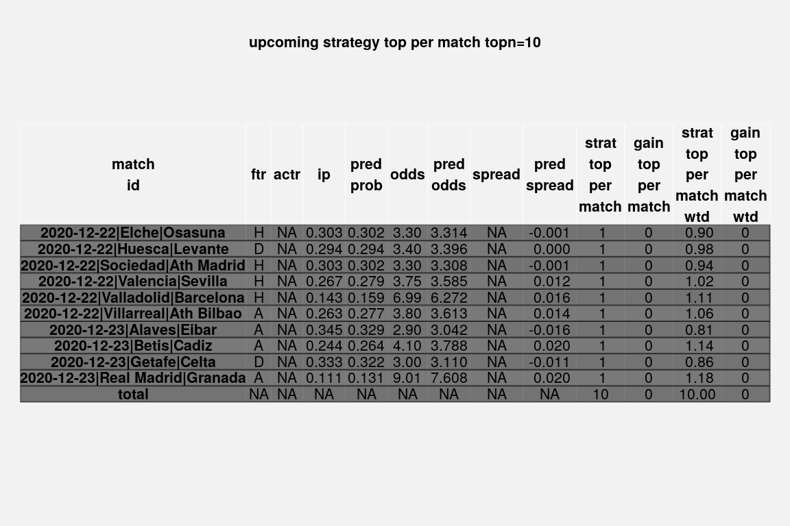

sodd
================
Conor Kearney
2020-12-23

``` r
  install.packages("devtools")
  devtools::install_github("ckear1989/sodd")
```

``` r
  leagues <- c("E0", "E1", "SP1", "SP2")
  suppressPackageStartupMessages(library("sodd"))
  dload_x_years(leagues, 3, quiet=TRUE, force=FALSE)
  dload_current_year(quiet=TRUE)
  dload_upcoming(quiet=TRUE)
  create.sodd.modeling.data(leagues, 3)
  todays.model <- build.sodd.model(format((Sys.Date()-7), '%Y-%m-%d'), "act", n.trees=10)
```

``` r
  document.sodd.model(todays.model)
```

    ## [1] "see model documentation in logs/model_2020-12-16_act.pdf"

``` r
  strat <- upcoming.strategy.sodd.model(todays.model)
  grid::grid.draw(strat)
```


