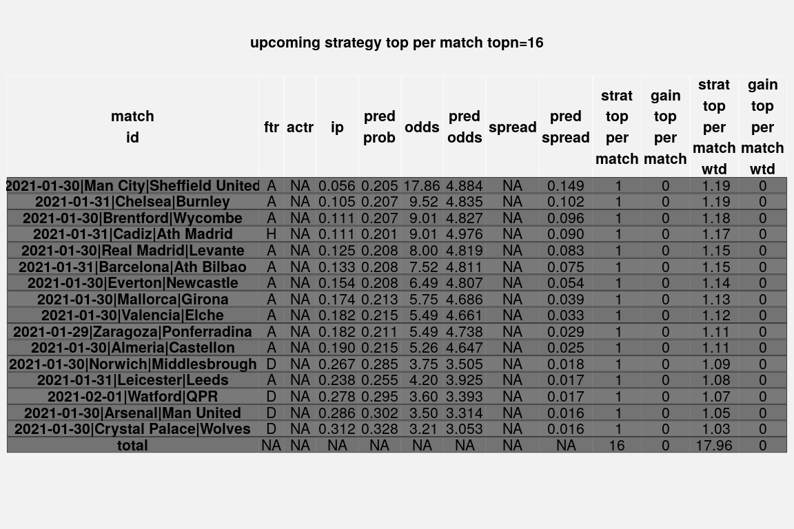

sodd
================
Conor Kearney
2021-01-02

# Install

``` r
## Not run:
# see instructions to create gmail credentials
# https://github.com/r-lib/gmailr
# https://developers.google.com/gmail/api/quickstart/python
Sys.setenv(GMAILR_APP="~/.gmail_credentials")
# if using 2fa with github, add access token at https://github.com/settings/tokens
Sys.setenv(GITHUB_PAT=readLines("~/.github_access_token"))
install.packages("devtools")
devtools::install_github("ckear1989/sodd")
## End(Not run)
```

``` r
suppressPackageStartupMessages(library("sodd"))
```

# Set Options

``` r
set.sodd.options(
  data.dir="~/sodd.data/", # where to save csv and rds files
  output.dir="~/sodd.output/", # where to save logs, pdfs etc.
  force.upcoming=TRUE, # simulate upcoming fixtures from test data if none available
  verbosity=2 # how much is output to logs 0=no output, 1=minimal, 2=all
)
```

# Create Modeling Data

``` r
leagues <- c("E0", "E1", "SP1", "SP2")
dload.sodd.modeling.data(leagues, 3, check=TRUE)
```

    ## FALSEFALSEFALSEFALSEFALSEFALSEFALSEFALSEFALSEFALSEFALSEFALSEFALSEFALSEFALSEFALSEFALSE
    ## FALSE

``` r
create.sodd.modeling.data(leagues, 3)
```

    ## /home/bort/sodd.data/2021/E0.csv/home/bort/sodd.data/1920/E0.csv/home/bort/sodd.data/1819/E0.csv/home/bort/sodd.data/2021/E1.csv/home/bort/sodd.data/1920/E1.csv/home/bort/sodd.data/1819/E1.csv/home/bort/sodd.data/2021/SP1.csv/home/bort/sodd.data/1920/SP1.csv/home/bort/sodd.data/1819/SP1.csv/home/bort/sodd.data/2021/SP2.csv/home/bort/sodd.data/1920/SP2.csv/home/bort/sodd.data/1819/SP2.csv
    ## na date count:0
    ## na date count:0
    ## na date count:0
    ## na date count:0
    ## na date count:0
    ## na date count:0
    ## na date count:0
    ## na date count:0
    ## na date count:0
    ## na date count:0
    ## na date count:0
    ## na date count:0
    ## divdatetimehometeamawayteamfthgftagftrhthghtaghtrrefereehsashstasthfafhcachyayhrarb365hb365db365abwhbwdbwaiwhiwdiwapshpsdpsawhhwhdwhavchvcdvcamaxhmaxdmaxaavghavgdavgab365>2.5b365<2.5p>2.5p<2.5max>2.5max<2.5avg>2.5avg<2.5ahhb365ahhb365ahapahhpahamaxahhmaxahaavgahhavgahab365chb365cdb365cabwchbwcdbwcaiwchiwcdiwcapschpscdpscawhchwhcdwhcavcchvccdvccamaxchmaxcdmaxcaavgchavgcdavgcab365c>2.5b365c<2.5pc>2.5pc<2.5maxc>2.5maxc<2.5avgc>2.5avgc<2.5ahchb365cahhb365cahapcahhpcahamaxcahhmaxcahaavgcahhavgcahaseasonmatch_idbb1x2bbmxhbbavhbbmxdbbavdbbmxabbavabboubbmx>2.5bbav>2.5bbmx<2.5bbav<2.5bbahbbahhbbmxahhbbavahhbbmxahabbavaha
    ## na date count:0
    ## divdatetimehometeamawayteamfthgftagftrhthghtaghtrrefereehsashstasthfafhcachyayhrarb365hb365db365abwhbwdbwaiwhiwdiwapshpsdpsawhhwhdwhavchvcdvcamaxhmaxdmaxaavghavgdavgab365>2.5b365<2.5p>2.5p<2.5max>2.5max<2.5avg>2.5avg<2.5ahhb365ahhb365ahapahhpahamaxahhmaxahaavgahhavgahab365chb365cdb365cabwchbwcdbwcaiwchiwcdiwcapschpscdpscawhchwhcdwhcavcchvccdvccamaxchmaxcdmaxcaavgchavgcdavgcab365c>2.5b365c<2.5pc>2.5pc<2.5maxc>2.5maxc<2.5avgc>2.5avgc<2.5ahchb365cahhb365cahapcahhpcahamaxcahhmaxcahaavgcahhavgcahaseasonmatch_idbb1x2bbmxhbbavhbbmxdbbavdbbmxabbavabboubbmx>2.5bbav>2.5bbmx<2.5bbav<2.5bbahbbahhbbmxahhbbavahhbbmxahabbavaha
    ##   E0 teams                
    ## ┌────────────────┬───────┐
    ## │ hometeam       │ count │
    ## ├────────────────┼───────┤
    ## │ Crystal Palace │    47 │
    ## ├────────────────┼───────┤
    ## │ Brighton       │    47 │
    ## ├────────────────┼───────┤
    ## │ Man United     │    47 │
    ## ├────────────────┼───────┤
    ## │ Southampton    │    47 │
    ## ├────────────────┼───────┤
    ## │ Newcastle      │    47 │
    ## └────────────────┴───────┘
    ##   E1 teams                
    ## ┌────────────────┬───────┐
    ## │ hometeam       │ count │
    ## ├────────────────┼───────┤
    ## │ Birmingham     │    58 │
    ## ├────────────────┼───────┤
    ## │ Preston        │    58 │
    ## ├────────────────┼───────┤
    ## │ Brentford      │    58 │
    ## ├────────────────┼───────┤
    ## │ Sheffield Weds │    58 │
    ## ├────────────────┼───────┤
    ## │ Swansea        │    58 │
    ## └────────────────┴───────┘
    ##   SP1 teams           
    ## ┌────────────┬───────┐
    ## │ hometeam   │ count │
    ## ├────────────┼───────┤
    ## │ Eibar      │    47 │
    ## ├────────────┼───────┤
    ## │ Alaves     │    47 │
    ## ├────────────┼───────┤
    ## │ Villarreal │    47 │
    ## ├────────────┼───────┤
    ## │ Valencia   │    47 │
    ## ├────────────┼───────┤
    ## │ Getafe     │    47 │
    ## └────────────┴───────┘
    ##   SP2 teams         
    ## ┌──────────┬───────┐
    ## │ hometeam │ count │
    ## ├──────────┼───────┤
    ## │ Oviedo   │    53 │
    ## ├──────────┼───────┤
    ## │ Sp Gijon │    52 │
    ## ├──────────┼───────┤
    ## │ Tenerife │    52 │
    ## ├──────────┼───────┤
    ## │ Alcorcon │    52 │
    ## ├──────────┼───────┤
    ## │ Lugo     │    52 │
    ## └──────────┴───────┘
    ## data summary
    ##   summary(a.dt)                      
    ## ┌────────────┬──────────────────────┐
    ## │ match_id   │ Length:4370          │
    ## ├────────────┼──────────────────────┤
    ## │ match_id   │ Class :character     │
    ## ├────────────┼──────────────────────┤
    ## │ match_id   │ Mode :character      │
    ## ├────────────┼──────────────────────┤
    ## │ match_id   │                      │
    ## ├────────────┼──────────────────────┤
    ## │ match_id   │                      │
    ## ├────────────┼──────────────────────┤
    ## │ match_id   │                      │
    ## ├────────────┼──────────────────────┤
    ## │ match_id   │                      │
    ## ├────────────┼──────────────────────┤
    ## │ div        │ Length:4370          │
    ## ├────────────┼──────────────────────┤
    ## │ div        │ Class :character     │
    ## ├────────────┼──────────────────────┤
    ## │ div        │ Mode :character      │
    ## ├────────────┼──────────────────────┤
    ## │ div        │                      │
    ## ├────────────┼──────────────────────┤
    ## │ div        │                      │
    ## ├────────────┼──────────────────────┤
    ## │ div        │                      │
    ## ├────────────┼──────────────────────┤
    ## │ div        │                      │
    ## ├────────────┼──────────────────────┤
    ## │ season     │ Length:4370          │
    ## ├────────────┼──────────────────────┤
    ## │ season     │ Class :character     │
    ## ├────────────┼──────────────────────┤
    ## │ season     │ Mode :character      │
    ## ├────────────┼──────────────────────┤
    ## │ season     │                      │
    ## ├────────────┼──────────────────────┤
    ## │ season     │                      │
    ## ├────────────┼──────────────────────┤
    ## │ season     │                      │
    ## ├────────────┼──────────────────────┤
    ## │ season     │                      │
    ## ├────────────┼──────────────────────┤
    ## │ hometeam   │ Length:4370          │
    ## ├────────────┼──────────────────────┤
    ## │ hometeam   │ Class :character     │
    ## ├────────────┼──────────────────────┤
    ## │ hometeam   │ Mode :character      │
    ## ├────────────┼──────────────────────┤
    ## │ hometeam   │                      │
    ## ├────────────┼──────────────────────┤
    ## │ hometeam   │                      │
    ## ├────────────┼──────────────────────┤
    ## │ hometeam   │                      │
    ## ├────────────┼──────────────────────┤
    ## │ hometeam   │                      │
    ## ├────────────┼──────────────────────┤
    ## │ awayteam   │ Length:4370          │
    ## ├────────────┼──────────────────────┤
    ## │ awayteam   │ Class :character     │
    ## ├────────────┼──────────────────────┤
    ## │ awayteam   │ Mode :character      │
    ## ├────────────┼──────────────────────┤
    ## │ awayteam   │                      │
    ## ├────────────┼──────────────────────┤
    ## │ awayteam   │                      │
    ## ├────────────┼──────────────────────┤
    ## │ awayteam   │                      │
    ## ├────────────┼──────────────────────┤
    ## │ awayteam   │                      │
    ## ├────────────┼──────────────────────┤
    ## │ date       │ Min.  :2018-08-03    │
    ## ├────────────┼──────────────────────┤
    ## │ date       │ 1st Qu.:2019-02-08   │
    ## ├────────────┼──────────────────────┤
    ## │ date       │ Median :2019-10-13   │
    ## ├────────────┼──────────────────────┤
    ## │ date       │ Mean :2019-10-11     │
    ## ├────────────┼──────────────────────┤
    ## │ date       │ 3rd Qu.:2020-06-30   │
    ## ├────────────┼──────────────────────┤
    ## │ date       │ Max.  :2021-01-04    │
    ## ├────────────┼──────────────────────┤
    ## │ date       │                      │
    ## ├────────────┼──────────────────────┤
    ## │ ftr        │ Length:4370          │
    ## ├────────────┼──────────────────────┤
    ## │ ftr        │ Class :character     │
    ## ├────────────┼──────────────────────┤
    ## │ ftr        │ Mode :character      │
    ## ├────────────┼──────────────────────┤
    ## │ ftr        │                      │
    ## ├────────────┼──────────────────────┤
    ## │ ftr        │                      │
    ## ├────────────┼──────────────────────┤
    ## │ ftr        │                      │
    ## ├────────────┼──────────────────────┤
    ## │ ftr        │                      │
    ## ├────────────┼──────────────────────┤
    ## │ fthg       │ Min.  :-1.000        │
    ## ├────────────┼──────────────────────┤
    ## │ fthg       │ 1st Qu.: 1.000       │
    ## ├────────────┼──────────────────────┤
    ## │ fthg       │ Median : 1.000       │
    ## ├────────────┼──────────────────────┤
    ## │ fthg       │ Mean : 1.371         │
    ## ├────────────┼──────────────────────┤
    ## │ fthg       │ 3rd Qu.: 2.000       │
    ## ├────────────┼──────────────────────┤
    ## │ fthg       │ Max.  : 8.000        │
    ## ├────────────┼──────────────────────┤
    ## │ fthg       │                      │
    ## ├────────────┼──────────────────────┤
    ## │ ftag       │ Min.  :-1.000        │
    ## ├────────────┼──────────────────────┤
    ## │ ftag       │ 1st Qu.: 0.000       │
    ## ├────────────┼──────────────────────┤
    ## │ ftag       │ Median : 1.000       │
    ## ├────────────┼──────────────────────┤
    ## │ ftag       │ Mean : 1.085         │
    ## ├────────────┼──────────────────────┤
    ## │ ftag       │ 3rd Qu.: 2.000       │
    ## ├────────────┼──────────────────────┤
    ## │ ftag       │ Max.  : 9.000        │
    ## ├────────────┼──────────────────────┤
    ## │ ftag       │                      │
    ## ├────────────┼──────────────────────┤
    ## │ b365h      │ Min.  : 0.00         │
    ## ├────────────┼──────────────────────┤
    ## │ b365h      │ 1st Qu.: 1.80        │
    ## ├────────────┼──────────────────────┤
    ## │ b365h      │ Median : 2.25        │
    ## ├────────────┼──────────────────────┤
    ## │ b365h      │ Mean : 2.59          │
    ## ├────────────┼──────────────────────┤
    ## │ b365h      │ 3rd Qu.: 2.80        │
    ## ├────────────┼──────────────────────┤
    ## │ b365h      │ Max.  :23.00         │
    ## ├────────────┼──────────────────────┤
    ## │ b365h      │ NA's :30             │
    ## ├────────────┼──────────────────────┤
    ## │ b365d      │ Min.  : 2.20         │
    ## ├────────────┼──────────────────────┤
    ## │ b365d      │ 1st Qu.: 3.20        │
    ## ├────────────┼──────────────────────┤
    ## │ b365d      │ Median : 3.40        │
    ## ├────────────┼──────────────────────┤
    ## │ b365d      │ Mean : 3.69          │
    ## ├────────────┼──────────────────────┤
    ## │ b365d      │ 3rd Qu.: 3.75        │
    ## ├────────────┼──────────────────────┤
    ## │ b365d      │ Max.  :17.00         │
    ## ├────────────┼──────────────────────┤
    ## │ b365d      │ NA's :30             │
    ## ├────────────┼──────────────────────┤
    ## │ b365a      │ Min.  : 1.120        │
    ## ├────────────┼──────────────────────┤
    ## │ b365a      │ 1st Qu.: 2.620       │
    ## ├────────────┼──────────────────────┤
    ## │ b365a      │ Median : 3.400       │
    ## ├────────────┼──────────────────────┤
    ## │ b365a      │ Mean : 4.212         │
    ## ├────────────┼──────────────────────┤
    ## │ b365a      │ 3rd Qu.: 4.750       │
    ## ├────────────┼──────────────────────┤
    ## │ b365a      │ Max.  :41.000        │
    ## ├────────────┼──────────────────────┤
    ## │ b365a      │ NA's :30             │
    ## └────────────┴──────────────────────┘
    ## data count with NA4370
    ## data count without NA4340
    ##  actr, ftr count 
    ## ┌────┬───┬──────┐
    ## │ A  │ H │ 1227 │
    ## ├────┼───┼──────┤
    ## │ H  │ H │ 1871 │
    ## ├────┼───┼──────┤
    ## │ D  │ H │ 1199 │
    ## ├────┼───┼──────┤
    ## │ A  │ D │ 1227 │
    ## ├────┼───┼──────┤
    ## │ H  │ D │ 1871 │
    ## ├────┼───┼──────┤
    ## │ D  │ D │ 1199 │
    ## ├────┼───┼──────┤
    ## │ A  │ A │ 1227 │
    ## ├────┼───┼──────┤
    ## │ H  │ A │ 1871 │
    ## ├────┼───┼──────┤
    ## │ D  │ A │ 1199 │
    ## ├────┼───┼──────┤
    ## │ NA │ H │   43 │
    ## ├────┼───┼──────┤
    ## │ NA │ D │   43 │
    ## ├────┼───┼──────┤
    ## │ NA │ A │   43 │
    ## └────┴───┴──────┘
    ## data transposed count with NA13020
    ## data transposed count13020
    ## team count99
    ## data count pre unique13020
    ## data count post unique13020
    ## home count pre unique4340
    ## home count post unique4340
    ## away count pre unique4340
    ## away count post unique4340
    ## data count pre merge13020
    ## data count post merge13020
    ## data count missing hpr141
    ## data count missing apr156
    ## data count missing hphr297
    ## data count missing apar297
    ## team count99
    ## data count pre unique13020
    ## data count post unique13020
    ## home count pre unique4340
    ## home count post unique4340
    ## away count pre unique4340
    ## away count post unique4340
    ## data count pre merge13020
    ## data count post merge13020
    ## data count missing hpr294
    ## data count missing apr300
    ## data count missing hphr594
    ## data count missing apar594
    ## team count99
    ## data count pre unique13020
    ## data count post unique13020
    ## home count pre unique4340
    ## home count post unique4340
    ## away count pre unique4340
    ## away count post unique4340
    ## data count pre merge13020
    ## data count post merge13020
    ## data count missing hpr441
    ## data count missing apr450
    ## data count missing hphr891
    ## data count missing apar891
    ## team count99
    ## data count pre unique13020
    ## data count post unique13020
    ## home count pre unique4340
    ## home count post unique4340
    ## away count pre unique4340
    ## away count post unique4340
    ## data count pre merge13020
    ## data count post merge13020
    ## data count missing hpr597
    ## data count missing apr591
    ## data count missing hphr1188
    ## data count missing apar1188
    ## team count99
    ## data count pre unique13020
    ## data count post unique13020
    ## home count pre unique4340
    ## home count post unique4340
    ## away count pre unique4340
    ## away count post unique4340
    ## data count pre merge13020
    ## data count post merge13020
    ## data count missing hpr744
    ## data count missing apr741
    ## data count missing hphr1485
    ## data count missing apar1485
    ##   summary(a.dt)                                
    ## ┌────────────────────┬────────────────────────┐
    ## │ date               │ Min.  :2018-08-03      │
    ## ├────────────────────┼────────────────────────┤
    ## │ date               │ 1st Qu.:2019-02-04     │
    ## ├────────────────────┼────────────────────────┤
    ## │ date               │ Median :2019-10-19     │
    ## ├────────────────────┼────────────────────────┤
    ## │ date               │ Mean :2019-10-11       │
    ## ├────────────────────┼────────────────────────┤
    ## │ date               │ 3rd Qu.:2020-06-30     │
    ## ├────────────────────┼────────────────────────┤
    ## │ date               │ Max.  :2021-01-04      │
    ## ├────────────────────┼────────────────────────┤
    ## │ date               │                        │
    ## ├────────────────────┼────────────────────────┤
    ## │ hometeam           │ Birmingham : 174       │
    ## ├────────────────────┼────────────────────────┤
    ## │ hometeam           │ Brentford : 174        │
    ## ├────────────────────┼────────────────────────┤
    ## │ hometeam           │ Preston : 174          │
    ## ├────────────────────┼────────────────────────┤
    ## │ hometeam           │ Sheffield Weds: 174    │
    ## ├────────────────────┼────────────────────────┤
    ## │ hometeam           │ Stoke : 174            │
    ## ├────────────────────┼────────────────────────┤
    ## │ hometeam           │ Swansea : 174          │
    ## ├────────────────────┼────────────────────────┤
    ## │ hometeam           │ (Other) :11976         │
    ## ├────────────────────┼────────────────────────┤
    ## │ awayteam           │ Blackburn : 174        │
    ## ├────────────────────┼────────────────────────┤
    ## │ awayteam           │ Bristol City : 174     │
    ## ├────────────────────┼────────────────────────┤
    ## │ awayteam           │ Middlesbrough: 174     │
    ## ├────────────────────┼────────────────────────┤
    ## │ awayteam           │ Nott'm Forest: 174     │
    ## ├────────────────────┼────────────────────────┤
    ## │ awayteam           │ QPR : 174              │
    ## ├────────────────────┼────────────────────────┤
    ## │ awayteam           │ Reading : 174          │
    ## ├────────────────────┼────────────────────────┤
    ## │ awayteam           │ (Other) :11976         │
    ## ├────────────────────┼────────────────────────┤
    ## │ match_id           │ Length:13020           │
    ## ├────────────────────┼────────────────────────┤
    ## │ match_id           │ Class :character       │
    ## ├────────────────────┼────────────────────────┤
    ## │ match_id           │ Mode :character        │
    ## ├────────────────────┼────────────────────────┤
    ## │ match_id           │                        │
    ## ├────────────────────┼────────────────────────┤
    ## │ match_id           │                        │
    ## ├────────────────────┼────────────────────────┤
    ## │ match_id           │                        │
    ## ├────────────────────┼────────────────────────┤
    ## │ match_id           │                        │
    ## ├────────────────────┼────────────────────────┤
    ## │ div                │ E0 :2775               │
    ## ├────────────────────┼────────────────────────┤
    ## │ div                │ E1 :4128               │
    ## ├────────────────────┼────────────────────────┤
    ## │ div                │ SP1:2775               │
    ## ├────────────────────┼────────────────────────┤
    ## │ div                │ SP2:3342               │
    ## ├────────────────────┼────────────────────────┤
    ## │ div                │                        │
    ## ├────────────────────┼────────────────────────┤
    ## │ div                │                        │
    ## ├────────────────────┼────────────────────────┤
    ## │ div                │                        │
    ## ├────────────────────┼────────────────────────┤
    ## │ season             │ 1819:5259              │
    ## ├────────────────────┼────────────────────────┤
    ## │ season             │ 1920:5316              │
    ## ├────────────────────┼────────────────────────┤
    ## │ season             │ 2021:2445              │
    ## ├────────────────────┼────────────────────────┤
    ## │ season             │                        │
    ## ├────────────────────┼────────────────────────┤
    ## │ season             │                        │
    ## ├────────────────────┼────────────────────────┤
    ## │ season             │                        │
    ## ├────────────────────┼────────────────────────┤
    ## │ season             │                        │
    ## ├────────────────────┼────────────────────────┤
    ## │ match_ip           │ Min.  :1.019           │
    ## ├────────────────────┼────────────────────────┤
    ## │ match_ip           │ 1st Qu.:1.048          │
    ## ├────────────────────┼────────────────────────┤
    ## │ match_ip           │ Median :1.053          │
    ## ├────────────────────┼────────────────────────┤
    ## │ match_ip           │ Mean : Inf             │
    ## ├────────────────────┼────────────────────────┤
    ## │ match_ip           │ 3rd Qu.:1.062          │
    ## ├────────────────────┼────────────────────────┤
    ## │ match_ip           │ Max.  : Inf            │
    ## ├────────────────────┼────────────────────────┤
    ## │ match_ip           │                        │
    ## ├────────────────────┼────────────────────────┤
    ## │ actr               │ Length:13020           │
    ## ├────────────────────┼────────────────────────┤
    ## │ actr               │ Class :character       │
    ## ├────────────────────┼────────────────────────┤
    ## │ actr               │ Mode :character        │
    ## ├────────────────────┼────────────────────────┤
    ## │ actr               │                        │
    ## ├────────────────────┼────────────────────────┤
    ## │ actr               │                        │
    ## ├────────────────────┼────────────────────────┤
    ## │ actr               │                        │
    ## ├────────────────────┼────────────────────────┤
    ## │ actr               │                        │
    ## ├────────────────────┼────────────────────────┤
    ## │ fthg               │ Min.  :-1.000          │
    ## ├────────────────────┼────────────────────────┤
    ## │ fthg               │ 1st Qu.: 1.000         │
    ## ├────────────────────┼────────────────────────┤
    ## │ fthg               │ Median : 1.000         │
    ## ├────────────────────┼────────────────────────┤
    ## │ fthg               │ Mean : 1.376           │
    ## ├────────────────────┼────────────────────────┤
    ## │ fthg               │ 3rd Qu.: 2.000         │
    ## ├────────────────────┼────────────────────────┤
    ## │ fthg               │ Max.  : 8.000          │
    ## ├────────────────────┼────────────────────────┤
    ## │ fthg               │                        │
    ## ├────────────────────┼────────────────────────┤
    ## │ ftag               │ Min.  :-1.000          │
    ## ├────────────────────┼────────────────────────┤
    ## │ ftag               │ 1st Qu.: 0.000         │
    ## ├────────────────────┼────────────────────────┤
    ## │ ftag               │ Median : 1.000         │
    ## ├────────────────────┼────────────────────────┤
    ## │ ftag               │ Mean : 1.088           │
    ## ├────────────────────┼────────────────────────┤
    ## │ ftag               │ 3rd Qu.: 2.000         │
    ## ├────────────────────┼────────────────────────┤
    ## │ ftag               │ Max.  : 9.000          │
    ## ├────────────────────┼────────────────────────┤
    ## │ ftag               │                        │
    ## ├────────────────────┼────────────────────────┤
    ## │ ip                 │ Min.  :0.024           │
    ## ├────────────────────┼────────────────────────┤
    ## │ ip                 │ 1st Qu.:0.263          │
    ## ├────────────────────┼────────────────────────┤
    ## │ ip                 │ Median :0.312          │
    ## ├────────────────────┼────────────────────────┤
    ## │ ip                 │ Mean : Inf             │
    ## ├────────────────────┼────────────────────────┤
    ## │ ip                 │ 3rd Qu.:0.422          │
    ## ├────────────────────┼────────────────────────┤
    ## │ ip                 │ Max.  : Inf            │
    ## ├────────────────────┼────────────────────────┤
    ## │ ip                 │                        │
    ## ├────────────────────┼────────────────────────┤
    ## │ act                │ Min.  :-1.0000         │
    ## ├────────────────────┼────────────────────────┤
    ## │ act                │ 1st Qu.: 0.0000        │
    ## ├────────────────────┼────────────────────────┤
    ## │ act                │ Median : 0.0000        │
    ## ├────────────────────┼────────────────────────┤
    ## │ act                │ Mean : 0.3201          │
    ## ├────────────────────┼────────────────────────┤
    ## │ act                │ 3rd Qu.: 1.0000        │
    ## ├────────────────────┼────────────────────────┤
    ## │ act                │ Max.  : 1.0000         │
    ## ├────────────────────┼────────────────────────┤
    ## │ act                │                        │
    ## ├────────────────────┼────────────────────────┤
    ## │ ftr                │ A:4340                 │
    ## ├────────────────────┼────────────────────────┤
    ## │ ftr                │ D:4340                 │
    ## ├────────────────────┼────────────────────────┤
    ## │ ftr                │ H:4340                 │
    ## ├────────────────────┼────────────────────────┤
    ## │ ftr                │                        │
    ## ├────────────────────┼────────────────────────┤
    ## │ ftr                │                        │
    ## ├────────────────────┼────────────────────────┤
    ## │ ftr                │                        │
    ## ├────────────────────┼────────────────────────┤
    ## │ ftr                │                        │
    ## ├────────────────────┼────────────────────────┤
    ## │ rn                 │ Min.  : 1              │
    ## ├────────────────────┼────────────────────────┤
    ## │ rn                 │ 1st Qu.: 3256          │
    ## ├────────────────────┼────────────────────────┤
    ## │ rn                 │ Median : 6510          │
    ## ├────────────────────┼────────────────────────┤
    ## │ rn                 │ Mean : 6510            │
    ## ├────────────────────┼────────────────────────┤
    ## │ rn                 │ 3rd Qu.: 9765          │
    ## ├────────────────────┼────────────────────────┤
    ## │ rn                 │ Max.  :13020           │
    ## ├────────────────────┼────────────────────────┤
    ## │ rn                 │                        │
    ## ├────────────────────┼────────────────────────┤
    ## │ hpr1               │ D :3672                │
    ## ├────────────────────┼────────────────────────┤
    ## │ hpr1               │ L :5163                │
    ## ├────────────────────┼────────────────────────┤
    ## │ hpr1               │ W :4044                │
    ## ├────────────────────┼────────────────────────┤
    ## │ hpr1               │ NA's: 141              │
    ## ├────────────────────┼────────────────────────┤
    ## │ hpr1               │                        │
    ## ├────────────────────┼────────────────────────┤
    ## │ hpr1               │                        │
    ## ├────────────────────┼────────────────────────┤
    ## │ hpr1               │                        │
    ## ├────────────────────┼────────────────────────┤
    ## │ hpd1               │ Min.  : 2.000          │
    ## ├────────────────────┼────────────────────────┤
    ## │ hpd1               │ 1st Qu.: 4.000         │
    ## ├────────────────────┼────────────────────────┤
    ## │ hpd1               │ Median : 7.000         │
    ## ├────────────────────┼────────────────────────┤
    ## │ hpd1               │ Mean : 8.671           │
    ## ├────────────────────┼────────────────────────┤
    ## │ hpd1               │ 3rd Qu.: 8.000         │
    ## ├────────────────────┼────────────────────────┤
    ## │ hpd1               │ Max.  :106.000         │
    ## ├────────────────────┼────────────────────────┤
    ## │ hpd1               │ NA's :141              │
    ## ├────────────────────┼────────────────────────┤
    ## │ hpv1               │ Length:13020           │
    ## ├────────────────────┼────────────────────────┤
    ## │ hpv1               │ Class :character       │
    ## ├────────────────────┼────────────────────────┤
    ## │ hpv1               │ Mode :character        │
    ## ├────────────────────┼────────────────────────┤
    ## │ hpv1               │                        │
    ## ├────────────────────┼────────────────────────┤
    ## │ hpv1               │                        │
    ## ├────────────────────┼────────────────────────┤
    ## │ hpv1               │                        │
    ## ├────────────────────┼────────────────────────┤
    ## │ hpv1               │                        │
    ## ├────────────────────┼────────────────────────┤
    ## │ hphr1              │ D :3537                │
    ## ├────────────────────┼────────────────────────┤
    ## │ hphr1              │ L :3645                │
    ## ├────────────────────┼────────────────────────┤
    ## │ hphr1              │ W :5541                │
    ## ├────────────────────┼────────────────────────┤
    ## │ hphr1              │ NA's: 297              │
    ## ├────────────────────┼────────────────────────┤
    ## │ hphr1              │                        │
    ## ├────────────────────┼────────────────────────┤
    ## │ hphr1              │                        │
    ## ├────────────────────┼────────────────────────┤
    ## │ hphr1              │                        │
    ## ├────────────────────┼────────────────────────┤
    ## │ hpgf1              │ Min.  :0.000           │
    ## ├────────────────────┼────────────────────────┤
    ## │ hpgf1              │ 1st Qu.:0.000          │
    ## ├────────────────────┼────────────────────────┤
    ## │ hpgf1              │ Median :1.000          │
    ## ├────────────────────┼────────────────────────┤
    ## │ hpgf1              │ Mean :1.162            │
    ## ├────────────────────┼────────────────────────┤
    ## │ hpgf1              │ 3rd Qu.:2.000          │
    ## ├────────────────────┼────────────────────────┤
    ## │ hpgf1              │ Max.  :7.000           │
    ## ├────────────────────┼────────────────────────┤
    ## │ hpgf1              │ NA's :141              │
    ## ├────────────────────┼────────────────────────┤
    ## │ hpga1              │ Min.  :0.00            │
    ## ├────────────────────┼────────────────────────┤
    ## │ hpga1              │ 1st Qu.:0.00           │
    ## ├────────────────────┼────────────────────────┤
    ## │ hpga1              │ Median :1.00           │
    ## ├────────────────────┼────────────────────────┤
    ## │ hpga1              │ Mean :1.33             │
    ## ├────────────────────┼────────────────────────┤
    ## │ hpga1              │ 3rd Qu.:2.00           │
    ## ├────────────────────┼────────────────────────┤
    ## │ hpga1              │ Max.  :8.00            │
    ## ├────────────────────┼────────────────────────┤
    ## │ hpga1              │ NA's :141              │
    ## ├────────────────────┼────────────────────────┤
    ## │ hphd1              │ Min.  : 3.00           │
    ## ├────────────────────┼────────────────────────┤
    ## │ hphd1              │ 1st Qu.: 9.00          │
    ## ├────────────────────┼────────────────────────┤
    ## │ hphd1              │ Median : 14.00         │
    ## ├────────────────────┼────────────────────────┤
    ## │ hphd1              │ Mean : 17.38           │
    ## ├────────────────────┼────────────────────────┤
    ## │ hphd1              │ 3rd Qu.: 18.00         │
    ## ├────────────────────┼────────────────────────┤
    ## │ hphd1              │ Max.  :503.00          │
    ## ├────────────────────┼────────────────────────┤
    ## │ hphd1              │ NA's :297              │
    ## ├────────────────────┼────────────────────────┤
    ## │ apr1               │ D :3513                │
    ## ├────────────────────┼────────────────────────┤
    ## │ apr1               │ L :4110                │
    ## ├────────────────────┼────────────────────────┤
    ## │ apr1               │ W :5241                │
    ## ├────────────────────┼────────────────────────┤
    ## │ apr1               │ NA's: 156              │
    ## ├────────────────────┼────────────────────────┤
    ## │ apr1               │                        │
    ## ├────────────────────┼────────────────────────┤
    ## │ apr1               │                        │
    ## ├────────────────────┼────────────────────────┤
    ## │ apr1               │                        │
    ## ├────────────────────┼────────────────────────┤
    ## │ apd1               │ Min.  : 2.000          │
    ## ├────────────────────┼────────────────────────┤
    ## │ apd1               │ 1st Qu.: 4.000         │
    ## ├────────────────────┼────────────────────────┤
    ## │ apd1               │ Median : 7.000         │
    ## ├────────────────────┼────────────────────────┤
    ## │ apd1               │ Mean : 8.709           │
    ## ├────────────────────┼────────────────────────┤
    ## │ apd1               │ 3rd Qu.: 8.000         │
    ## ├────────────────────┼────────────────────────┤
    ## │ apd1               │ Max.  :496.000         │
    ## ├────────────────────┼────────────────────────┤
    ## │ apd1               │ NA's :156              │
    ## ├────────────────────┼────────────────────────┤
    ## │ apv1               │ Length:13020           │
    ## ├────────────────────┼────────────────────────┤
    ## │ apv1               │ Class :character       │
    ## ├────────────────────┼────────────────────────┤
    ## │ apv1               │ Mode :character        │
    ## ├────────────────────┼────────────────────────┤
    ## │ apv1               │                        │
    ## ├────────────────────┼────────────────────────┤
    ## │ apv1               │                        │
    ## ├────────────────────┼────────────────────────┤
    ## │ apv1               │                        │
    ## ├────────────────────┼────────────────────────┤
    ## │ apv1               │                        │
    ## ├────────────────────┼────────────────────────┤
    ## │ apar1              │ D :3549                │
    ## ├────────────────────┼────────────────────────┤
    ## │ apar1              │ L :5523                │
    ## ├────────────────────┼────────────────────────┤
    ## │ apar1              │ W :3651                │
    ## ├────────────────────┼────────────────────────┤
    ## │ apar1              │ NA's: 297              │
    ## ├────────────────────┼────────────────────────┤
    ## │ apar1              │                        │
    ## ├────────────────────┼────────────────────────┤
    ## │ apar1              │                        │
    ## ├────────────────────┼────────────────────────┤
    ## │ apar1              │                        │
    ## ├────────────────────┼────────────────────────┤
    ## │ apgf1              │ Min.  :0.000           │
    ## ├────────────────────┼────────────────────────┤
    ## │ apgf1              │ 1st Qu.:0.000          │
    ## ├────────────────────┼────────────────────────┤
    ## │ apgf1              │ Median :1.000          │
    ## ├────────────────────┼────────────────────────┤
    ## │ apgf1              │ Mean :1.347            │
    ## ├────────────────────┼────────────────────────┤
    ## │ apgf1              │ 3rd Qu.:2.000          │
    ## ├────────────────────┼────────────────────────┤
    ## │ apgf1              │ Max.  :9.000           │
    ## ├────────────────────┼────────────────────────┤
    ## │ apgf1              │ NA's :156              │
    ## ├────────────────────┼────────────────────────┤
    ## │ apga1              │ Min.  :0.000           │
    ## ├────────────────────┼────────────────────────┤
    ## │ apga1              │ 1st Qu.:0.000          │
    ## ├────────────────────┼────────────────────────┤
    ## │ apga1              │ Median :1.000          │
    ## ├────────────────────┼────────────────────────┤
    ## │ apga1              │ Mean :1.176            │
    ## ├────────────────────┼────────────────────────┤
    ## │ apga1              │ 3rd Qu.:2.000          │
    ## ├────────────────────┼────────────────────────┤
    ## │ apga1              │ Max.  :9.000           │
    ## ├────────────────────┼────────────────────────┤
    ## │ apga1              │ NA's :156              │
    ## ├────────────────────┼────────────────────────┤
    ## │ apad1              │ Min.  : 3.00           │
    ## ├────────────────────┼────────────────────────┤
    ## │ apad1              │ 1st Qu.: 9.00          │
    ## ├────────────────────┼────────────────────────┤
    ## │ apad1              │ Median : 14.00         │
    ## ├────────────────────┼────────────────────────┤
    ## │ apad1              │ Mean : 17.39           │
    ## ├────────────────────┼────────────────────────┤
    ## │ apad1              │ 3rd Qu.: 17.00         │
    ## ├────────────────────┼────────────────────────┤
    ## │ apad1              │ Max.  :504.00          │
    ## ├────────────────────┼────────────────────────┤
    ## │ apad1              │ NA's :297              │
    ## ├────────────────────┼────────────────────────┤
    ## │ hpp1               │ Min.  :-1.000          │
    ## ├────────────────────┼────────────────────────┤
    ## │ hpp1               │ 1st Qu.: 0.000         │
    ## ├────────────────────┼────────────────────────┤
    ## │ hpp1               │ Median : 1.000         │
    ## ├────────────────────┼────────────────────────┤
    ## │ hpp1               │ Mean : 1.203           │
    ## ├────────────────────┼────────────────────────┤
    ## │ hpp1               │ 3rd Qu.: 3.000         │
    ## ├────────────────────┼────────────────────────┤
    ## │ hpp1               │ Max.  : 3.000          │
    ## ├────────────────────┼────────────────────────┤
    ## │ hpp1               │                        │
    ## ├────────────────────┼────────────────────────┤
    ## │ app1               │ Min.  :-1.000          │
    ## ├────────────────────┼────────────────────────┤
    ## │ app1               │ 1st Qu.: 0.000         │
    ## ├────────────────────┼────────────────────────┤
    ## │ app1               │ Median : 1.000         │
    ## ├────────────────────┼────────────────────────┤
    ## │ app1               │ Mean : 1.465           │
    ## ├────────────────────┼────────────────────────┤
    ## │ app1               │ 3rd Qu.: 3.000         │
    ## ├────────────────────┼────────────────────────┤
    ## │ app1               │ Max.  : 3.000          │
    ## ├────────────────────┼────────────────────────┤
    ## │ app1               │                        │
    ## ├────────────────────┼────────────────────────┤
    ## │ hphp1              │ Min.  :-1.000          │
    ## ├────────────────────┼────────────────────────┤
    ## │ hphp1              │ 1st Qu.: 0.000         │
    ## ├────────────────────┼────────────────────────┤
    ## │ hphp1              │ Median : 1.000         │
    ## ├────────────────────┼────────────────────────┤
    ## │ hphp1              │ Mean : 1.526           │
    ## ├────────────────────┼────────────────────────┤
    ## │ hphp1              │ 3rd Qu.: 3.000         │
    ## ├────────────────────┼────────────────────────┤
    ## │ hphp1              │ Max.  : 3.000          │
    ## ├────────────────────┼────────────────────────┤
    ## │ hphp1              │                        │
    ## ├────────────────────┼────────────────────────┤
    ## │ apap1              │ Min.  :-1.000          │
    ## ├────────────────────┼────────────────────────┤
    ## │ apap1              │ 1st Qu.: 0.000         │
    ## ├────────────────────┼────────────────────────┤
    ## │ apap1              │ Median : 1.000         │
    ## ├────────────────────┼────────────────────────┤
    ## │ apap1              │ Mean : 1.091           │
    ## ├────────────────────┼────────────────────────┤
    ## │ apap1              │ 3rd Qu.: 3.000         │
    ## ├────────────────────┼────────────────────────┤
    ## │ apap1              │ Max.  : 3.000          │
    ## ├────────────────────┼────────────────────────┤
    ## │ apap1              │                        │
    ## ├────────────────────┼────────────────────────┤
    ## │ hpr2               │ D :3498                │
    ## ├────────────────────┼────────────────────────┤
    ## │ hpr2               │ L :4368                │
    ## ├────────────────────┼────────────────────────┤
    ## │ hpr2               │ W :4860                │
    ## ├────────────────────┼────────────────────────┤
    ## │ hpr2               │ NA's: 294              │
    ## ├────────────────────┼────────────────────────┤
    ## │ hpr2               │                        │
    ## ├────────────────────┼────────────────────────┤
    ## │ hpr2               │                        │
    ## ├────────────────────┼────────────────────────┤
    ## │ hpr2               │                        │
    ## ├────────────────────┼────────────────────────┤
    ## │ hpd2               │ Min.  : 5.00           │
    ## ├────────────────────┼────────────────────────┤
    ## │ hpd2               │ 1st Qu.: 10.00         │
    ## ├────────────────────┼────────────────────────┤
    ## │ hpd2               │ Median : 14.00         │
    ## ├────────────────────┼────────────────────────┤
    ## │ hpd2               │ Mean : 17.45           │
    ## ├────────────────────┼────────────────────────┤
    ## │ hpd2               │ 3rd Qu.: 17.00         │
    ## ├────────────────────┼────────────────────────┤
    ## │ hpd2               │ Max.  :503.00          │
    ## ├────────────────────┼────────────────────────┤
    ## │ hpd2               │ NA's :294              │
    ## ├────────────────────┼────────────────────────┤
    ## │ hpv2               │ Length:13020           │
    ## ├────────────────────┼────────────────────────┤
    ## │ hpv2               │ Class :character       │
    ## ├────────────────────┼────────────────────────┤
    ## │ hpv2               │ Mode :character        │
    ## ├────────────────────┼────────────────────────┤
    ## │ hpv2               │                        │
    ## ├────────────────────┼────────────────────────┤
    ## │ hpv2               │                        │
    ## ├────────────────────┼────────────────────────┤
    ## │ hpv2               │                        │
    ## ├────────────────────┼────────────────────────┤
    ## │ hpv2               │                        │
    ## ├────────────────────┼────────────────────────┤
    ## │ hphr2              │ D :3450                │
    ## ├────────────────────┼────────────────────────┤
    ## │ hphr2              │ L :3561                │
    ## ├────────────────────┼────────────────────────┤
    ## │ hphr2              │ W :5415                │
    ## ├────────────────────┼────────────────────────┤
    ## │ hphr2              │ NA's: 594              │
    ## ├────────────────────┼────────────────────────┤
    ## │ hphr2              │                        │
    ## ├────────────────────┼────────────────────────┤
    ## │ hphr2              │                        │
    ## ├────────────────────┼────────────────────────┤
    ## │ hphr2              │                        │
    ## ├────────────────────┼────────────────────────┤
    ## │ hpgf2              │ Min.  :0.000           │
    ## ├────────────────────┼────────────────────────┤
    ## │ hpgf2              │ 1st Qu.:0.000          │
    ## ├────────────────────┼────────────────────────┤
    ## │ hpgf2              │ Median :1.000          │
    ## ├────────────────────┼────────────────────────┤
    ## │ hpgf2              │ Mean :1.305            │
    ## ├────────────────────┼────────────────────────┤
    ## │ hpgf2              │ 3rd Qu.:2.000          │
    ## ├────────────────────┼────────────────────────┤
    ## │ hpgf2              │ Max.  :9.000           │
    ## ├────────────────────┼────────────────────────┤
    ## │ hpgf2              │ NA's :294              │
    ## ├────────────────────┼────────────────────────┤
    ## │ hpga2              │ Min.  :0.000           │
    ## ├────────────────────┼────────────────────────┤
    ## │ hpga2              │ 1st Qu.:0.000          │
    ## ├────────────────────┼────────────────────────┤
    ## │ hpga2              │ Median :1.000          │
    ## ├────────────────────┼────────────────────────┤
    ## │ hpga2              │ Mean :1.223            │
    ## ├────────────────────┼────────────────────────┤
    ## │ hpga2              │ 3rd Qu.:2.000          │
    ## ├────────────────────┼────────────────────────┤
    ## │ hpga2              │ Max.  :9.000           │
    ## ├────────────────────┼────────────────────────┤
    ## │ hpga2              │ NA's :294              │
    ## ├────────────────────┼────────────────────────┤
    ## │ hphd2              │ Min.  : 6.00           │
    ## ├────────────────────┼────────────────────────┤
    ## │ hphd2              │ 1st Qu.: 21.00         │
    ## ├────────────────────┼────────────────────────┤
    ## │ hphd2              │ Median : 28.00         │
    ## ├────────────────────┼────────────────────────┤
    ## │ hphd2              │ Mean : 35.01           │
    ## ├────────────────────┼────────────────────────┤
    ## │ hphd2              │ 3rd Qu.: 35.00         │
    ## ├────────────────────┼────────────────────────┤
    ## │ hphd2              │ Max.  :517.00          │
    ## ├────────────────────┼────────────────────────┤
    ## │ hphd2              │ NA's :594              │
    ## ├────────────────────┼────────────────────────┤
    ## │ apr2               │ D :3585                │
    ## ├────────────────────┼────────────────────────┤
    ## │ apr2               │ L :4806                │
    ## ├────────────────────┼────────────────────────┤
    ## │ apr2               │ W :4329                │
    ## ├────────────────────┼────────────────────────┤
    ## │ apr2               │ NA's: 300              │
    ## ├────────────────────┼────────────────────────┤
    ## │ apr2               │                        │
    ## ├────────────────────┼────────────────────────┤
    ## │ apr2               │                        │
    ## ├────────────────────┼────────────────────────┤
    ## │ apr2               │                        │
    ## ├────────────────────┼────────────────────────┤
    ## │ apd2               │ Min.  : 5.00           │
    ## ├────────────────────┼────────────────────────┤
    ## │ apd2               │ 1st Qu.: 10.00         │
    ## ├────────────────────┼────────────────────────┤
    ## │ apd2               │ Median : 14.00         │
    ## ├────────────────────┼────────────────────────┤
    ## │ apd2               │ Mean : 17.39           │
    ## ├────────────────────┼────────────────────────┤
    ## │ apd2               │ 3rd Qu.: 17.00         │
    ## ├────────────────────┼────────────────────────┤
    ## │ apd2               │ Max.  :504.00          │
    ## ├────────────────────┼────────────────────────┤
    ## │ apd2               │ NA's :300              │
    ## ├────────────────────┼────────────────────────┤
    ## │ apv2               │ Length:13020           │
    ## ├────────────────────┼────────────────────────┤
    ## │ apv2               │ Class :character       │
    ## ├────────────────────┼────────────────────────┤
    ## │ apv2               │ Mode :character        │
    ## ├────────────────────┼────────────────────────┤
    ## │ apv2               │                        │
    ## ├────────────────────┼────────────────────────┤
    ## │ apv2               │                        │
    ## ├────────────────────┼────────────────────────┤
    ## │ apv2               │                        │
    ## ├────────────────────┼────────────────────────┤
    ## │ apv2               │                        │
    ## ├────────────────────┼────────────────────────┤
    ## │ apar2              │ D :3465                │
    ## ├────────────────────┼────────────────────────┤
    ## │ apar2              │ L :5379                │
    ## ├────────────────────┼────────────────────────┤
    ## │ apar2              │ W :3582                │
    ## ├────────────────────┼────────────────────────┤
    ## │ apar2              │ NA's: 594              │
    ## ├────────────────────┼────────────────────────┤
    ## │ apar2              │                        │
    ## ├────────────────────┼────────────────────────┤
    ## │ apar2              │                        │
    ## ├────────────────────┼────────────────────────┤
    ## │ apar2              │                        │
    ## ├────────────────────┼────────────────────────┤
    ## │ apgf2              │ Min.  :0.000           │
    ## ├────────────────────┼────────────────────────┤
    ## │ apgf2              │ 1st Qu.:0.000          │
    ## ├────────────────────┼────────────────────────┤
    ## │ apgf2              │ Median :1.000          │
    ## ├────────────────────┼────────────────────────┤
    ## │ apgf2              │ Mean :1.209            │
    ## ├────────────────────┼────────────────────────┤
    ## │ apgf2              │ 3rd Qu.:2.000          │
    ## ├────────────────────┼────────────────────────┤
    ## │ apgf2              │ Max.  :7.000           │
    ## ├────────────────────┼────────────────────────┤
    ## │ apgf2              │ NA's :300              │
    ## ├────────────────────┼────────────────────────┤
    ## │ apga2              │ Min.  :0.000           │
    ## ├────────────────────┼────────────────────────┤
    ## │ apga2              │ 1st Qu.:0.000          │
    ## ├────────────────────┼────────────────────────┤
    ## │ apga2              │ Median :1.000          │
    ## ├────────────────────┼────────────────────────┤
    ## │ apga2              │ Mean :1.287            │
    ## ├────────────────────┼────────────────────────┤
    ## │ apga2              │ 3rd Qu.:2.000          │
    ## ├────────────────────┼────────────────────────┤
    ## │ apga2              │ Max.  :8.000           │
    ## ├────────────────────┼────────────────────────┤
    ## │ apga2              │ NA's :300              │
    ## ├────────────────────┼────────────────────────┤
    ## │ apad2              │ Min.  : 7.00           │
    ## ├────────────────────┼────────────────────────┤
    ## │ apad2              │ 1st Qu.: 21.00         │
    ## ├────────────────────┼────────────────────────┤
    ## │ apad2              │ Median : 28.00         │
    ## ├────────────────────┼────────────────────────┤
    ## │ apad2              │ Mean : 35.01           │
    ## ├────────────────────┼────────────────────────┤
    ## │ apad2              │ 3rd Qu.: 35.00         │
    ## ├────────────────────┼────────────────────────┤
    ## │ apad2              │ Max.  :518.00          │
    ## ├────────────────────┼────────────────────────┤
    ## │ apad2              │ NA's :594              │
    ## ├────────────────────┼────────────────────────┤
    ## │ hpp2               │ Min.  :-1.000          │
    ## ├────────────────────┼────────────────────────┤
    ## │ hpp2               │ 1st Qu.: 0.000         │
    ## ├────────────────────┼────────────────────────┤
    ## │ hpp2               │ Median : 1.000         │
    ## ├────────────────────┼────────────────────────┤
    ## │ hpp2               │ Mean : 1.366           │
    ## ├────────────────────┼────────────────────────┤
    ## │ hpp2               │ 3rd Qu.: 3.000         │
    ## ├────────────────────┼────────────────────────┤
    ## │ hpp2               │ Max.  : 3.000          │
    ## ├────────────────────┼────────────────────────┤
    ## │ hpp2               │                        │
    ## ├────────────────────┼────────────────────────┤
    ## │ app2               │ Min.  :-1.00           │
    ## ├────────────────────┼────────────────────────┤
    ## │ app2               │ 1st Qu.: 0.00          │
    ## ├────────────────────┼────────────────────────┤
    ## │ app2               │ Median : 1.00          │
    ## ├────────────────────┼────────────────────────┤
    ## │ app2               │ Mean : 1.25            │
    ## ├────────────────────┼────────────────────────┤
    ## │ app2               │ 3rd Qu.: 3.00          │
    ## ├────────────────────┼────────────────────────┤
    ## │ app2               │ Max.  : 3.00           │
    ## ├────────────────────┼────────────────────────┤
    ## │ app2               │                        │
    ## ├────────────────────┼────────────────────────┤
    ## │ hphp2              │ Min.  :-1.000          │
    ## ├────────────────────┼────────────────────────┤
    ## │ hphp2              │ 1st Qu.: 0.000         │
    ## ├────────────────────┼────────────────────────┤
    ## │ hphp2              │ Median : 1.000         │
    ## ├────────────────────┼────────────────────────┤
    ## │ hphp2              │ Mean : 1.467           │
    ## ├────────────────────┼────────────────────────┤
    ## │ hphp2              │ 3rd Qu.: 3.000         │
    ## ├────────────────────┼────────────────────────┤
    ## │ hphp2              │ Max.  : 3.000          │
    ## ├────────────────────┼────────────────────────┤
    ## │ hphp2              │                        │
    ## ├────────────────────┼────────────────────────┤
    ## │ apap2              │ Min.  :-1.000          │
    ## ├────────────────────┼────────────────────────┤
    ## │ apap2              │ 1st Qu.: 0.000         │
    ## ├────────────────────┼────────────────────────┤
    ## │ apap2              │ Median : 1.000         │
    ## ├────────────────────┼────────────────────────┤
    ## │ apap2              │ Mean : 1.046           │
    ## ├────────────────────┼────────────────────────┤
    ## │ apap2              │ 3rd Qu.: 3.000         │
    ## ├────────────────────┼────────────────────────┤
    ## │ apap2              │ Max.  : 3.000          │
    ## ├────────────────────┼────────────────────────┤
    ## │ apap2              │                        │
    ## ├────────────────────┼────────────────────────┤
    ## │ hpr3               │ D :3504                │
    ## ├────────────────────┼────────────────────────┤
    ## │ hpr3               │ L :4641                │
    ## ├────────────────────┼────────────────────────┤
    ## │ hpr3               │ W :4434                │
    ## ├────────────────────┼────────────────────────┤
    ## │ hpr3               │ NA's: 441              │
    ## ├────────────────────┼────────────────────────┤
    ## │ hpr3               │                        │
    ## ├────────────────────┼────────────────────────┤
    ## │ hpr3               │                        │
    ## ├────────────────────┼────────────────────────┤
    ## │ hpr3               │                        │
    ## ├────────────────────┼────────────────────────┤
    ## │ hpd3               │ Min.  : 9.00           │
    ## ├────────────────────┼────────────────────────┤
    ## │ hpd3               │ 1st Qu.: 14.00         │
    ## ├────────────────────┼────────────────────────┤
    ## │ hpd3               │ Median : 21.00         │
    ## ├────────────────────┼────────────────────────┤
    ## │ hpd3               │ Mean : 26.14           │
    ## ├────────────────────┼────────────────────────┤
    ## │ hpd3               │ 3rd Qu.: 27.00         │
    ## ├────────────────────┼────────────────────────┤
    ## │ hpd3               │ Max.  :511.00          │
    ## ├────────────────────┼────────────────────────┤
    ## │ hpd3               │ NA's :441              │
    ## ├────────────────────┼────────────────────────┤
    ## │ hpv3               │ Length:13020           │
    ## ├────────────────────┼────────────────────────┤
    ## │ hpv3               │ Class :character       │
    ## ├────────────────────┼────────────────────────┤
    ## │ hpv3               │ Mode :character        │
    ## ├────────────────────┼────────────────────────┤
    ## │ hpv3               │                        │
    ## ├────────────────────┼────────────────────────┤
    ## │ hpv3               │                        │
    ## ├────────────────────┼────────────────────────┤
    ## │ hpv3               │                        │
    ## ├────────────────────┼────────────────────────┤
    ## │ hpv3               │                        │
    ## ├────────────────────┼────────────────────────┤
    ## │ hphr3              │ D :3384                │
    ## ├────────────────────┼────────────────────────┤
    ## │ hphr3              │ L :3465                │
    ## ├────────────────────┼────────────────────────┤
    ## │ hphr3              │ W :5280                │
    ## ├────────────────────┼────────────────────────┤
    ## │ hphr3              │ NA's: 891              │
    ## ├────────────────────┼────────────────────────┤
    ## │ hphr3              │                        │
    ## ├────────────────────┼────────────────────────┤
    ## │ hphr3              │                        │
    ## ├────────────────────┼────────────────────────┤
    ## │ hphr3              │                        │
    ## ├────────────────────┼────────────────────────┤
    ## │ hpgf3              │ Min.  :0.000           │
    ## ├────────────────────┼────────────────────────┤
    ## │ hpgf3              │ 1st Qu.:0.000          │
    ## ├────────────────────┼────────────────────────┤
    ## │ hpgf3              │ Median :1.000          │
    ## ├────────────────────┼────────────────────────┤
    ## │ hpgf3              │ Mean :1.239            │
    ## ├────────────────────┼────────────────────────┤
    ## │ hpgf3              │ 3rd Qu.:2.000          │
    ## ├────────────────────┼────────────────────────┤
    ## │ hpgf3              │ Max.  :7.000           │
    ## ├────────────────────┼────────────────────────┤
    ## │ hpgf3              │ NA's :441              │
    ## ├────────────────────┼────────────────────────┤
    ## │ hpga3              │ Min.  :0.00            │
    ## ├────────────────────┼────────────────────────┤
    ## │ hpga3              │ 1st Qu.:0.00           │
    ## ├────────────────────┼────────────────────────┤
    ## │ hpga3              │ Median :1.00           │
    ## ├────────────────────┼────────────────────────┤
    ## │ hpga3              │ Mean :1.27             │
    ## ├────────────────────┼────────────────────────┤
    ## │ hpga3              │ 3rd Qu.:2.00           │
    ## ├────────────────────┼────────────────────────┤
    ## │ hpga3              │ Max.  :7.00            │
    ## ├────────────────────┼────────────────────────┤
    ## │ hpga3              │ NA's :441              │
    ## ├────────────────────┼────────────────────────┤
    ## │ hphd3              │ Min.  : 13.00          │
    ## ├────────────────────┼────────────────────────┤
    ## │ hphd3              │ 1st Qu.: 35.00         │
    ## ├────────────────────┼────────────────────────┤
    ## │ hphd3              │ Median : 42.00         │
    ## ├────────────────────┼────────────────────────┤
    ## │ hphd3              │ Mean : 52.91           │
    ## ├────────────────────┼────────────────────────┤
    ## │ hphd3              │ 3rd Qu.: 55.00         │
    ## ├────────────────────┼────────────────────────┤
    ## │ hphd3              │ Max.  :531.00          │
    ## ├────────────────────┼────────────────────────┤
    ## │ hphd3              │ NA's :891              │
    ## ├────────────────────┼────────────────────────┤
    ## │ apr3               │ D :3486                │
    ## ├────────────────────┼────────────────────────┤
    ## │ apr3               │ L :4422                │
    ## ├────────────────────┼────────────────────────┤
    ## │ apr3               │ W :4662                │
    ## ├────────────────────┼────────────────────────┤
    ## │ apr3               │ NA's: 450              │
    ## ├────────────────────┼────────────────────────┤
    ## │ apr3               │                        │
    ## ├────────────────────┼────────────────────────┤
    ## │ apr3               │                        │
    ## ├────────────────────┼────────────────────────┤
    ## │ apr3               │                        │
    ## ├────────────────────┼────────────────────────┤
    ## │ apd3               │ Min.  : 9.00           │
    ## ├────────────────────┼────────────────────────┤
    ## │ apd3               │ 1st Qu.: 14.00         │
    ## ├────────────────────┼────────────────────────┤
    ## │ apd3               │ Median : 21.00         │
    ## ├────────────────────┼────────────────────────┤
    ## │ apd3               │ Mean : 26.28           │
    ## ├────────────────────┼────────────────────────┤
    ## │ apd3               │ 3rd Qu.: 27.00         │
    ## ├────────────────────┼────────────────────────┤
    ## │ apd3               │ Max.  :510.00          │
    ## ├────────────────────┼────────────────────────┤
    ## │ apd3               │ NA's :450              │
    ## ├────────────────────┼────────────────────────┤
    ## │ apv3               │ Length:13020           │
    ## ├────────────────────┼────────────────────────┤
    ## │ apv3               │ Class :character       │
    ## ├────────────────────┼────────────────────────┤
    ## │ apv3               │ Mode :character        │
    ## ├────────────────────┼────────────────────────┤
    ## │ apv3               │                        │
    ## ├────────────────────┼────────────────────────┤
    ## │ apv3               │                        │
    ## ├────────────────────┼────────────────────────┤
    ## │ apv3               │                        │
    ## ├────────────────────┼────────────────────────┤
    ## │ apv3               │                        │
    ## ├────────────────────┼────────────────────────┤
    ## │ apar3              │ D :3387                │
    ## ├────────────────────┼────────────────────────┤
    ## │ apar3              │ L :5241                │
    ## ├────────────────────┼────────────────────────┤
    ## │ apar3              │ W :3501                │
    ## ├────────────────────┼────────────────────────┤
    ## │ apar3              │ NA's: 891              │
    ## ├────────────────────┼────────────────────────┤
    ## │ apar3              │                        │
    ## ├────────────────────┼────────────────────────┤
    ## │ apar3              │                        │
    ## ├────────────────────┼────────────────────────┤
    ## │ apar3              │                        │
    ## ├────────────────────┼────────────────────────┤
    ## │ apgf3              │ Min.  :0.000           │
    ## ├────────────────────┼────────────────────────┤
    ## │ apgf3              │ 1st Qu.:0.000          │
    ## ├────────────────────┼────────────────────────┤
    ## │ apgf3              │ Median :1.000          │
    ## ├────────────────────┼────────────────────────┤
    ## │ apgf3              │ Mean :1.278            │
    ## ├────────────────────┼────────────────────────┤
    ## │ apgf3              │ 3rd Qu.:2.000          │
    ## ├────────────────────┼────────────────────────┤
    ## │ apgf3              │ Max.  :9.000           │
    ## ├────────────────────┼────────────────────────┤
    ## │ apgf3              │ NA's :450              │
    ## ├────────────────────┼────────────────────────┤
    ## │ apga3              │ Min.  :0.000           │
    ## ├────────────────────┼────────────────────────┤
    ## │ apga3              │ 1st Qu.:0.000          │
    ## ├────────────────────┼────────────────────────┤
    ## │ apga3              │ Median :1.000          │
    ## ├────────────────────┼────────────────────────┤
    ## │ apga3              │ Mean :1.243            │
    ## ├────────────────────┼────────────────────────┤
    ## │ apga3              │ 3rd Qu.:2.000          │
    ## ├────────────────────┼────────────────────────┤
    ## │ apga3              │ Max.  :9.000           │
    ## ├────────────────────┼────────────────────────┤
    ## │ apga3              │ NA's :450              │
    ## ├────────────────────┼────────────────────────┤
    ## │ apad3              │ Min.  : 14.00          │
    ## ├────────────────────┼────────────────────────┤
    ## │ apad3              │ 1st Qu.: 35.00         │
    ## ├────────────────────┼────────────────────────┤
    ## │ apad3              │ Median : 42.00         │
    ## ├────────────────────┼────────────────────────┤
    ## │ apad3              │ Mean : 52.93           │
    ## ├────────────────────┼────────────────────────┤
    ## │ apad3              │ 3rd Qu.: 55.00         │
    ## ├────────────────────┼────────────────────────┤
    ## │ apad3              │ Max.  :542.00          │
    ## ├────────────────────┼────────────────────────┤
    ## │ apad3              │ NA's :891              │
    ## ├────────────────────┼────────────────────────┤
    ## │ hpp3               │ Min.  :-1.000          │
    ## ├────────────────────┼────────────────────────┤
    ## │ hpp3               │ 1st Qu.: 0.000         │
    ## ├────────────────────┼────────────────────────┤
    ## │ hpp3               │ Median : 1.000         │
    ## ├────────────────────┼────────────────────────┤
    ## │ hpp3               │ Mean : 1.257           │
    ## ├────────────────────┼────────────────────────┤
    ## │ hpp3               │ 3rd Qu.: 3.000         │
    ## ├────────────────────┼────────────────────────┤
    ## │ hpp3               │ Max.  : 3.000          │
    ## ├────────────────────┼────────────────────────┤
    ## │ hpp3               │                        │
    ## ├────────────────────┼────────────────────────┤
    ## │ app3               │ Min.  :-1.000          │
    ## ├────────────────────┼────────────────────────┤
    ## │ app3               │ 1st Qu.: 0.000         │
    ## ├────────────────────┼────────────────────────┤
    ## │ app3               │ Median : 1.000         │
    ## ├────────────────────┼────────────────────────┤
    ## │ app3               │ Mean : 1.307           │
    ## ├────────────────────┼────────────────────────┤
    ## │ app3               │ 3rd Qu.: 3.000         │
    ## ├────────────────────┼────────────────────────┤
    ## │ app3               │ Max.  : 3.000          │
    ## ├────────────────────┼────────────────────────┤
    ## │ app3               │                        │
    ## ├────────────────────┼────────────────────────┤
    ## │ hphp3              │ Min.  :-1.000          │
    ## ├────────────────────┼────────────────────────┤
    ## │ hphp3              │ 1st Qu.: 0.000         │
    ## ├────────────────────┼────────────────────────┤
    ## │ hphp3              │ Median : 1.000         │
    ## ├────────────────────┼────────────────────────┤
    ## │ hphp3              │ Mean : 1.408           │
    ## ├────────────────────┼────────────────────────┤
    ## │ hphp3              │ 3rd Qu.: 3.000         │
    ## ├────────────────────┼────────────────────────┤
    ## │ hphp3              │ Max.  : 3.000          │
    ## ├────────────────────┼────────────────────────┤
    ## │ hphp3              │                        │
    ## ├────────────────────┼────────────────────────┤
    ## │ apap3              │ Min.  :-1.0000         │
    ## ├────────────────────┼────────────────────────┤
    ## │ apap3              │ 1st Qu.: 0.0000        │
    ## ├────────────────────┼────────────────────────┤
    ## │ apap3              │ Median : 1.0000        │
    ## ├────────────────────┼────────────────────────┤
    ## │ apap3              │ Mean : 0.9984          │
    ## ├────────────────────┼────────────────────────┤
    ## │ apap3              │ 3rd Qu.: 3.0000        │
    ## ├────────────────────┼────────────────────────┤
    ## │ apap3              │ Max.  : 3.0000         │
    ## ├────────────────────┼────────────────────────┤
    ## │ apap3              │                        │
    ## ├────────────────────┼────────────────────────┤
    ## │ hpr4               │ D :3423                │
    ## ├────────────────────┼────────────────────────┤
    ## │ hpr4               │ L :4506                │
    ## ├────────────────────┼────────────────────────┤
    ## │ hpr4               │ W :4494                │
    ## ├────────────────────┼────────────────────────┤
    ## │ hpr4               │ NA's: 597              │
    ## ├────────────────────┼────────────────────────┤
    ## │ hpr4               │                        │
    ## ├────────────────────┼────────────────────────┤
    ## │ hpr4               │                        │
    ## ├────────────────────┼────────────────────────┤
    ## │ hpr4               │                        │
    ## ├────────────────────┼────────────────────────┤
    ## │ hpd4               │ Min.  : 12.00          │
    ## ├────────────────────┼────────────────────────┤
    ## │ hpd4               │ 1st Qu.: 21.00         │
    ## ├────────────────────┼────────────────────────┤
    ## │ hpd4               │ Median : 28.00         │
    ## ├────────────────────┼────────────────────────┤
    ## │ hpd4               │ Mean : 35.04           │
    ## ├────────────────────┼────────────────────────┤
    ## │ hpd4               │ 3rd Qu.: 35.00         │
    ## ├────────────────────┼────────────────────────┤
    ## │ hpd4               │ Max.  :517.00          │
    ## ├────────────────────┼────────────────────────┤
    ## │ hpd4               │ NA's :597              │
    ## ├────────────────────┼────────────────────────┤
    ## │ hpv4               │ Length:13020           │
    ## ├────────────────────┼────────────────────────┤
    ## │ hpv4               │ Class :character       │
    ## ├────────────────────┼────────────────────────┤
    ## │ hpv4               │ Mode :character        │
    ## ├────────────────────┼────────────────────────┤
    ## │ hpv4               │                        │
    ## ├────────────────────┼────────────────────────┤
    ## │ hpv4               │                        │
    ## ├────────────────────┼────────────────────────┤
    ## │ hpv4               │                        │
    ## ├────────────────────┼────────────────────────┤
    ## │ hpv4               │                        │
    ## ├────────────────────┼────────────────────────┤
    ## │ hphr4              │ D :3309                │
    ## ├────────────────────┼────────────────────────┤
    ## │ hphr4              │ L :3342                │
    ## ├────────────────────┼────────────────────────┤
    ## │ hphr4              │ W :5181                │
    ## ├────────────────────┼────────────────────────┤
    ## │ hphr4              │ NA's:1188              │
    ## ├────────────────────┼────────────────────────┤
    ## │ hphr4              │                        │
    ## ├────────────────────┼────────────────────────┤
    ## │ hphr4              │                        │
    ## ├────────────────────┼────────────────────────┤
    ## │ hphr4              │                        │
    ## ├────────────────────┼────────────────────────┤
    ## │ hpgf4              │ Min.  :0.000           │
    ## ├────────────────────┼────────────────────────┤
    ## │ hpgf4              │ 1st Qu.:0.000          │
    ## ├────────────────────┼────────────────────────┤
    ## │ hpgf4              │ Median :1.000          │
    ## ├────────────────────┼────────────────────────┤
    ## │ hpgf4              │ Mean :1.267            │
    ## ├────────────────────┼────────────────────────┤
    ## │ hpgf4              │ 3rd Qu.:2.000          │
    ## ├────────────────────┼────────────────────────┤
    ## │ hpgf4              │ Max.  :9.000           │
    ## ├────────────────────┼────────────────────────┤
    ## │ hpgf4              │ NA's :597              │
    ## ├────────────────────┼────────────────────────┤
    ## │ hpga4              │ Min.  :0.00            │
    ## ├────────────────────┼────────────────────────┤
    ## │ hpga4              │ 1st Qu.:0.00           │
    ## ├────────────────────┼────────────────────────┤
    ## │ hpga4              │ Median :1.00           │
    ## ├────────────────────┼────────────────────────┤
    ## │ hpga4              │ Mean :1.26             │
    ## ├────────────────────┼────────────────────────┤
    ## │ hpga4              │ 3rd Qu.:2.00           │
    ## ├────────────────────┼────────────────────────┤
    ## │ hpga4              │ Max.  :9.00            │
    ## ├────────────────────┼────────────────────────┤
    ## │ hpga4              │ NA's :597              │
    ## ├────────────────────┼────────────────────────┤
    ## │ hphd4              │ Min.  : 24.0           │
    ## ├────────────────────┼────────────────────────┤
    ## │ hphd4              │ 1st Qu.: 49.0          │
    ## ├────────────────────┼────────────────────────┤
    ## │ hphd4              │ Median : 58.0          │
    ## ├────────────────────┼────────────────────────┤
    ## │ hphd4              │ Mean : 71.1            │
    ## ├────────────────────┼────────────────────────┤
    ## │ hphd4              │ 3rd Qu.: 78.0          │
    ## ├────────────────────┼────────────────────────┤
    ## │ hphd4              │ Max.  :544.0           │
    ## ├────────────────────┼────────────────────────┤
    ## │ hphd4              │ NA's :1188             │
    ## ├────────────────────┼────────────────────────┤
    ## │ apr4               │ D :3495                │
    ## ├────────────────────┼────────────────────────┤
    ## │ apr4               │ L :4437                │
    ## ├────────────────────┼────────────────────────┤
    ## │ apr4               │ W :4497                │
    ## ├────────────────────┼────────────────────────┤
    ## │ apr4               │ NA's: 591              │
    ## ├────────────────────┼────────────────────────┤
    ## │ apr4               │                        │
    ## ├────────────────────┼────────────────────────┤
    ## │ apr4               │                        │
    ## ├────────────────────┼────────────────────────┤
    ## │ apr4               │                        │
    ## ├────────────────────┼────────────────────────┤
    ## │ apd4               │ Min.  : 12.00          │
    ## ├────────────────────┼────────────────────────┤
    ## │ apd4               │ 1st Qu.: 21.00         │
    ## ├────────────────────┼────────────────────────┤
    ## │ apd4               │ Median : 28.00         │
    ## ├────────────────────┼────────────────────────┤
    ## │ apd4               │ Mean : 35.06           │
    ## ├────────────────────┼────────────────────────┤
    ## │ apd4               │ 3rd Qu.: 35.00         │
    ## ├────────────────────┼────────────────────────┤
    ## │ apd4               │ Max.  :518.00          │
    ## ├────────────────────┼────────────────────────┤
    ## │ apd4               │ NA's :591              │
    ## ├────────────────────┼────────────────────────┤
    ## │ apv4               │ Length:13020           │
    ## ├────────────────────┼────────────────────────┤
    ## │ apv4               │ Class :character       │
    ## ├────────────────────┼────────────────────────┤
    ## │ apv4               │ Mode :character        │
    ## ├────────────────────┼────────────────────────┤
    ## │ apv4               │                        │
    ## ├────────────────────┼────────────────────────┤
    ## │ apv4               │                        │
    ## ├────────────────────┼────────────────────────┤
    ## │ apv4               │                        │
    ## ├────────────────────┼────────────────────────┤
    ## │ apv4               │                        │
    ## ├────────────────────┼────────────────────────┤
    ## │ apar4              │ D :3309                │
    ## ├────────────────────┼────────────────────────┤
    ## │ apar4              │ L :5121                │
    ## ├────────────────────┼────────────────────────┤
    ## │ apar4              │ W :3402                │
    ## ├────────────────────┼────────────────────────┤
    ## │ apar4              │ NA's:1188              │
    ## ├────────────────────┼────────────────────────┤
    ## │ apar4              │                        │
    ## ├────────────────────┼────────────────────────┤
    ## │ apar4              │                        │
    ## ├────────────────────┼────────────────────────┤
    ## │ apar4              │                        │
    ## ├────────────────────┼────────────────────────┤
    ## │ apgf4              │ Min.  :0.000           │
    ## ├────────────────────┼────────────────────────┤
    ## │ apgf4              │ 1st Qu.:0.000          │
    ## ├────────────────────┼────────────────────────┤
    ## │ apgf4              │ Median :1.000          │
    ## ├────────────────────┼────────────────────────┤
    ## │ apgf4              │ Mean :1.252            │
    ## ├────────────────────┼────────────────────────┤
    ## │ apgf4              │ 3rd Qu.:2.000          │
    ## ├────────────────────┼────────────────────────┤
    ## │ apgf4              │ Max.  :7.000           │
    ## ├────────────────────┼────────────────────────┤
    ## │ apgf4              │ NA's :591              │
    ## ├────────────────────┼────────────────────────┤
    ## │ apga4              │ Min.  :0.000           │
    ## ├────────────────────┼────────────────────────┤
    ## │ apga4              │ 1st Qu.:0.000          │
    ## ├────────────────────┼────────────────────────┤
    ## │ apga4              │ Median :1.000          │
    ## ├────────────────────┼────────────────────────┤
    ## │ apga4              │ Mean :1.252            │
    ## ├────────────────────┼────────────────────────┤
    ## │ apga4              │ 3rd Qu.:2.000          │
    ## ├────────────────────┼────────────────────────┤
    ## │ apga4              │ Max.  :7.000           │
    ## ├────────────────────┼────────────────────────┤
    ## │ apga4              │ NA's :591              │
    ## ├────────────────────┼────────────────────────┤
    ## │ apad4              │ Min.  : 21.00          │
    ## ├────────────────────┼────────────────────────┤
    ## │ apad4              │ 1st Qu.: 49.00         │
    ## ├────────────────────┼────────────────────────┤
    ## │ apad4              │ Median : 58.00         │
    ## ├────────────────────┼────────────────────────┤
    ## │ apad4              │ Mean : 71.11           │
    ## ├────────────────────┼────────────────────────┤
    ## │ apad4              │ 3rd Qu.: 78.25         │
    ## ├────────────────────┼────────────────────────┤
    ## │ apad4              │ Max.  :550.00          │
    ## ├────────────────────┼────────────────────────┤
    ## │ apad4              │ NA's :1188             │
    ## ├────────────────────┼────────────────────────┤
    ## │ hpp4               │ Min.  :-1.000          │
    ## ├────────────────────┼────────────────────────┤
    ## │ hpp4               │ 1st Qu.: 0.000         │
    ## ├────────────────────┼────────────────────────┤
    ## │ hpp4               │ Median : 1.000         │
    ## ├────────────────────┼────────────────────────┤
    ## │ hpp4               │ Mean : 1.253           │
    ## ├────────────────────┼────────────────────────┤
    ## │ hpp4               │ 3rd Qu.: 3.000         │
    ## ├────────────────────┼────────────────────────┤
    ## │ hpp4               │ Max.  : 3.000          │
    ## ├────────────────────┼────────────────────────┤
    ## │ hpp4               │                        │
    ## ├────────────────────┼────────────────────────┤
    ## │ app4               │ Min.  :-1.000          │
    ## ├────────────────────┼────────────────────────┤
    ## │ app4               │ 1st Qu.: 0.000         │
    ## ├────────────────────┼────────────────────────┤
    ## │ app4               │ Median : 1.000         │
    ## ├────────────────────┼────────────────────────┤
    ## │ app4               │ Mean : 1.259           │
    ## ├────────────────────┼────────────────────────┤
    ## │ app4               │ 3rd Qu.: 3.000         │
    ## ├────────────────────┼────────────────────────┤
    ## │ app4               │ Max.  : 3.000          │
    ## ├────────────────────┼────────────────────────┤
    ## │ app4               │                        │
    ## ├────────────────────┼────────────────────────┤
    ## │ hphp4              │ Min.  :-1.000          │
    ## ├────────────────────┼────────────────────────┤
    ## │ hphp4              │ 1st Qu.: 0.000         │
    ## ├────────────────────┼────────────────────────┤
    ## │ hphp4              │ Median : 1.000         │
    ## ├────────────────────┼────────────────────────┤
    ## │ hphp4              │ Mean : 1.357           │
    ## ├────────────────────┼────────────────────────┤
    ## │ hphp4              │ 3rd Qu.: 3.000         │
    ## ├────────────────────┼────────────────────────┤
    ## │ hphp4              │ Max.  : 3.000          │
    ## ├────────────────────┼────────────────────────┤
    ## │ hphp4              │                        │
    ## ├────────────────────┼────────────────────────┤
    ## │ apap4              │ Min.  :-1.0000         │
    ## ├────────────────────┼────────────────────────┤
    ## │ apap4              │ 1st Qu.: 0.0000        │
    ## ├────────────────────┼────────────────────────┤
    ## │ apap4              │ Median : 1.0000        │
    ## ├────────────────────┼────────────────────────┤
    ## │ apap4              │ Mean : 0.9468          │
    ## ├────────────────────┼────────────────────────┤
    ## │ apap4              │ 3rd Qu.: 3.0000        │
    ## ├────────────────────┼────────────────────────┤
    ## │ apap4              │ Max.  : 3.0000         │
    ## ├────────────────────┼────────────────────────┤
    ## │ apap4              │                        │
    ## ├────────────────────┼────────────────────────┤
    ## │ hpr5               │ D :3429                │
    ## ├────────────────────┼────────────────────────┤
    ## │ hpr5               │ L :4452                │
    ## ├────────────────────┼────────────────────────┤
    ## │ hpr5               │ W :4395                │
    ## ├────────────────────┼────────────────────────┤
    ## │ hpr5               │ NA's: 744              │
    ## ├────────────────────┼────────────────────────┤
    ## │ hpr5               │                        │
    ## ├────────────────────┼────────────────────────┤
    ## │ hpr5               │                        │
    ## ├────────────────────┼────────────────────────┤
    ## │ hpr5               │                        │
    ## ├────────────────────┼────────────────────────┤
    ## │ hpd5               │ Min.  : 16             │
    ## ├────────────────────┼────────────────────────┤
    ## │ hpd5               │ 1st Qu.: 28            │
    ## ├────────────────────┼────────────────────────┤
    ## │ hpd5               │ Median : 35            │
    ## ├────────────────────┼────────────────────────┤
    ## │ hpd5               │ Mean : 44              │
    ## ├────────────────────┼────────────────────────┤
    ## │ hpd5               │ 3rd Qu.: 42            │
    ## ├────────────────────┼────────────────────────┤
    ## │ hpd5               │ Max.  :531             │
    ## ├────────────────────┼────────────────────────┤
    ## │ hpd5               │ NA's :744              │
    ## ├────────────────────┼────────────────────────┤
    ## │ hpv5               │ Length:13020           │
    ## ├────────────────────┼────────────────────────┤
    ## │ hpv5               │ Class :character       │
    ## ├────────────────────┼────────────────────────┤
    ## │ hpv5               │ Mode :character        │
    ## ├────────────────────┼────────────────────────┤
    ## │ hpv5               │                        │
    ## ├────────────────────┼────────────────────────┤
    ## │ hpv5               │                        │
    ## ├────────────────────┼────────────────────────┤
    ## │ hpv5               │                        │
    ## ├────────────────────┼────────────────────────┤
    ## │ hpv5               │                        │
    ## ├────────────────────┼────────────────────────┤
    ## │ hphr5              │ D :3237                │
    ## ├────────────────────┼────────────────────────┤
    ## │ hphr5              │ L :3252                │
    ## ├────────────────────┼────────────────────────┤
    ## │ hphr5              │ W :5046                │
    ## ├────────────────────┼────────────────────────┤
    ## │ hphr5              │ NA's:1485              │
    ## ├────────────────────┼────────────────────────┤
    ## │ hphr5              │                        │
    ## ├────────────────────┼────────────────────────┤
    ## │ hphr5              │                        │
    ## ├────────────────────┼────────────────────────┤
    ## │ hphr5              │                        │
    ## ├────────────────────┼────────────────────────┤
    ## │ hpgf5              │ Min.  :0.000           │
    ## ├────────────────────┼────────────────────────┤
    ## │ hpgf5              │ 1st Qu.:0.000          │
    ## ├────────────────────┼────────────────────────┤
    ## │ hpgf5              │ Median :1.000          │
    ## ├────────────────────┼────────────────────────┤
    ## │ hpgf5              │ Mean :1.245            │
    ## ├────────────────────┼────────────────────────┤
    ## │ hpgf5              │ 3rd Qu.:2.000          │
    ## ├────────────────────┼────────────────────────┤
    ## │ hpgf5              │ Max.  :9.000           │
    ## ├────────────────────┼────────────────────────┤
    ## │ hpgf5              │ NA's :744              │
    ## ├────────────────────┼────────────────────────┤
    ## │ hpga5              │ Min.  :0.000           │
    ## ├────────────────────┼────────────────────────┤
    ## │ hpga5              │ 1st Qu.:0.000          │
    ## ├────────────────────┼────────────────────────┤
    ## │ hpga5              │ Median :1.000          │
    ## ├────────────────────┼────────────────────────┤
    ## │ hpga5              │ Mean :1.264            │
    ## ├────────────────────┼────────────────────────┤
    ## │ hpga5              │ 3rd Qu.:2.000          │
    ## ├────────────────────┼────────────────────────┤
    ## │ hpga5              │ Max.  :9.000           │
    ## ├────────────────────┼────────────────────────┤
    ## │ hpga5              │ NA's :744              │
    ## ├────────────────────┼────────────────────────┤
    ## │ hphd5              │ Min.  : 29.00          │
    ## ├────────────────────┼────────────────────────┤
    ## │ hphd5              │ 1st Qu.: 63.00         │
    ## ├────────────────────┼────────────────────────┤
    ## │ hphd5              │ Median : 76.00         │
    ## ├────────────────────┼────────────────────────┤
    ## │ hphd5              │ Mean : 89.45           │
    ## ├────────────────────┼────────────────────────┤
    ## │ hphd5              │ 3rd Qu.:108.00         │
    ## ├────────────────────┼────────────────────────┤
    ## │ hphd5              │ Max.  :556.00          │
    ## ├────────────────────┼────────────────────────┤
    ## │ hphd5              │ NA's :1485             │
    ## ├────────────────────┼────────────────────────┤
    ## │ apr5               │ D :3411                │
    ## ├────────────────────┼────────────────────────┤
    ## │ apr5               │ L :4377                │
    ## ├────────────────────┼────────────────────────┤
    ## │ apr5               │ W :4491                │
    ## ├────────────────────┼────────────────────────┤
    ## │ apr5               │ NA's: 741              │
    ## ├────────────────────┼────────────────────────┤
    ## │ apr5               │                        │
    ## ├────────────────────┼────────────────────────┤
    ## │ apr5               │                        │
    ## ├────────────────────┼────────────────────────┤
    ## │ apr5               │                        │
    ## ├────────────────────┼────────────────────────┤
    ## │ apd5               │ Min.  : 16.00          │
    ## ├────────────────────┼────────────────────────┤
    ## │ apd5               │ 1st Qu.: 28.00         │
    ## ├────────────────────┼────────────────────────┤
    ## │ apd5               │ Median : 35.00         │
    ## ├────────────────────┼────────────────────────┤
    ## │ apd5               │ Mean : 43.93           │
    ## ├────────────────────┼────────────────────────┤
    ## │ apd5               │ 3rd Qu.: 42.00         │
    ## ├────────────────────┼────────────────────────┤
    ## │ apd5               │ Max.  :523.00          │
    ## ├────────────────────┼────────────────────────┤
    ## │ apd5               │ NA's :741              │
    ## ├────────────────────┼────────────────────────┤
    ## │ apv5               │ Length:13020           │
    ## ├────────────────────┼────────────────────────┤
    ## │ apv5               │ Class :character       │
    ## ├────────────────────┼────────────────────────┤
    ## │ apv5               │ Mode :character        │
    ## ├────────────────────┼────────────────────────┤
    ## │ apv5               │                        │
    ## ├────────────────────┼────────────────────────┤
    ## │ apv5               │                        │
    ## ├────────────────────┼────────────────────────┤
    ## │ apv5               │                        │
    ## ├────────────────────┼────────────────────────┤
    ## │ apv5               │                        │
    ## ├────────────────────┼────────────────────────┤
    ## │ apar5              │ D :3219                │
    ## ├────────────────────┼────────────────────────┤
    ## │ apar5              │ L :4998                │
    ## ├────────────────────┼────────────────────────┤
    ## │ apar5              │ W :3318                │
    ## ├────────────────────┼────────────────────────┤
    ## │ apar5              │ NA's:1485              │
    ## ├────────────────────┼────────────────────────┤
    ## │ apar5              │                        │
    ## ├────────────────────┼────────────────────────┤
    ## │ apar5              │                        │
    ## ├────────────────────┼────────────────────────┤
    ## │ apar5              │                        │
    ## ├────────────────────┼────────────────────────┤
    ## │ apgf5              │ Min.  :0.000           │
    ## ├────────────────────┼────────────────────────┤
    ## │ apgf5              │ 1st Qu.:0.000          │
    ## ├────────────────────┼────────────────────────┤
    ## │ apgf5              │ Median :1.000          │
    ## ├────────────────────┼────────────────────────┤
    ## │ apgf5              │ Mean :1.276            │
    ## ├────────────────────┼────────────────────────┤
    ## │ apgf5              │ 3rd Qu.:2.000          │
    ## ├────────────────────┼────────────────────────┤
    ## │ apgf5              │ Max.  :8.000           │
    ## ├────────────────────┼────────────────────────┤
    ## │ apgf5              │ NA's :741              │
    ## ├────────────────────┼────────────────────────┤
    ## │ apga5              │ Min.  :0.00            │
    ## ├────────────────────┼────────────────────────┤
    ## │ apga5              │ 1st Qu.:0.00           │
    ## ├────────────────────┼────────────────────────┤
    ## │ apga5              │ Median :1.00           │
    ## ├────────────────────┼────────────────────────┤
    ## │ apga5              │ Mean :1.25             │
    ## ├────────────────────┼────────────────────────┤
    ## │ apga5              │ 3rd Qu.:2.00           │
    ## ├────────────────────┼────────────────────────┤
    ## │ apga5              │ Max.  :8.00            │
    ## ├────────────────────┼────────────────────────┤
    ## │ apga5              │ NA's :741              │
    ## ├────────────────────┼────────────────────────┤
    ## │ apad5              │ Min.  : 30.00          │
    ## ├────────────────────┼────────────────────────┤
    ## │ apad5              │ 1st Qu.: 63.00         │
    ## ├────────────────────┼────────────────────────┤
    ## │ apad5              │ Median : 76.00         │
    ## ├────────────────────┼────────────────────────┤
    ## │ apad5              │ Mean : 89.47           │
    ## ├────────────────────┼────────────────────────┤
    ## │ apad5              │ 3rd Qu.:108.00         │
    ## ├────────────────────┼────────────────────────┤
    ## │ apad5              │ Max.  :556.00          │
    ## ├────────────────────┼────────────────────────┤
    ## │ apad5              │ NA's :1485             │
    ## ├────────────────────┼────────────────────────┤
    ## │ hpp5               │ Min.  :-1.000          │
    ## ├────────────────────┼────────────────────────┤
    ## │ hpp5               │ 1st Qu.: 0.000         │
    ## ├────────────────────┼────────────────────────┤
    ## │ hpp5               │ Median : 1.000         │
    ## ├────────────────────┼────────────────────────┤
    ## │ hpp5               │ Mean : 1.219           │
    ## ├────────────────────┼────────────────────────┤
    ## │ hpp5               │ 3rd Qu.: 3.000         │
    ## ├────────────────────┼────────────────────────┤
    ## │ hpp5               │ Max.  : 3.000          │
    ## ├────────────────────┼────────────────────────┤
    ## │ hpp5               │                        │
    ## ├────────────────────┼────────────────────────┤
    ## │ app5               │ Min.  :-1.00           │
    ## ├────────────────────┼────────────────────────┤
    ## │ app5               │ 1st Qu.: 0.00          │
    ## ├────────────────────┼────────────────────────┤
    ## │ app5               │ Median : 1.00          │
    ## ├────────────────────┼────────────────────────┤
    ## │ app5               │ Mean : 1.24            │
    ## ├────────────────────┼────────────────────────┤
    ## │ app5               │ 3rd Qu.: 3.00          │
    ## ├────────────────────┼────────────────────────┤
    ## │ app5               │ Max.  : 3.00           │
    ## ├────────────────────┼────────────────────────┤
    ## │ app5               │                        │
    ## ├────────────────────┼────────────────────────┤
    ## │ hphp5              │ Min.  :-1.000          │
    ## ├────────────────────┼────────────────────────┤
    ## │ hphp5              │ 1st Qu.: 0.000         │
    ## ├────────────────────┼────────────────────────┤
    ## │ hphp5              │ Median : 1.000         │
    ## ├────────────────────┼────────────────────────┤
    ## │ hphp5              │ Mean : 1.297           │
    ## ├────────────────────┼────────────────────────┤
    ## │ hphp5              │ 3rd Qu.: 3.000         │
    ## ├────────────────────┼────────────────────────┤
    ## │ hphp5              │ Max.  : 3.000          │
    ## ├────────────────────┼────────────────────────┤
    ## │ hphp5              │                        │
    ## ├────────────────────┼────────────────────────┤
    ## │ apap5              │ Min.  :-1.0000         │
    ## ├────────────────────┼────────────────────────┤
    ## │ apap5              │ 1st Qu.: 0.0000        │
    ## ├────────────────────┼────────────────────────┤
    ## │ apap5              │ Median : 1.0000        │
    ## ├────────────────────┼────────────────────────┤
    ## │ apap5              │ Mean : 0.8977          │
    ## ├────────────────────┼────────────────────────┤
    ## │ apap5              │ 3rd Qu.: 3.0000        │
    ## ├────────────────────┼────────────────────────┤
    ## │ apap5              │ Max.  : 3.0000         │
    ## ├────────────────────┼────────────────────────┤
    ## │ apap5              │                        │
    ## ├────────────────────┼────────────────────────┤
    ## │ hpp_cum2           │ Min.  :0.000           │
    ## ├────────────────────┼────────────────────────┤
    ## │ hpp_cum2           │ 1st Qu.:1.000          │
    ## ├────────────────────┼────────────────────────┤
    ## │ hpp_cum2           │ Median :3.000          │
    ## ├────────────────────┼────────────────────────┤
    ## │ hpp_cum2           │ Mean :2.602            │
    ## ├────────────────────┼────────────────────────┤
    ## │ hpp_cum2           │ 3rd Qu.:4.000          │
    ## ├────────────────────┼────────────────────────┤
    ## │ hpp_cum2           │ Max.  :6.000           │
    ## ├────────────────────┼────────────────────────┤
    ## │ hpp_cum2           │                        │
    ## ├────────────────────┼────────────────────────┤
    ## │ hpp_cum3           │ Min.  :0.000           │
    ## ├────────────────────┼────────────────────────┤
    ## │ hpp_cum3           │ 1st Qu.:2.000          │
    ## ├────────────────────┼────────────────────────┤
    ## │ hpp_cum3           │ Median :4.000          │
    ## ├────────────────────┼────────────────────────┤
    ## │ hpp_cum3           │ Mean :3.893            │
    ## ├────────────────────┼────────────────────────┤
    ## │ hpp_cum3           │ 3rd Qu.:6.000          │
    ## ├────────────────────┼────────────────────────┤
    ## │ hpp_cum3           │ Max.  :9.000           │
    ## ├────────────────────┼────────────────────────┤
    ## │ hpp_cum3           │                        │
    ## ├────────────────────┼────────────────────────┤
    ## │ hpp_cum4           │ Min.  : 0.000          │
    ## ├────────────────────┼────────────────────────┤
    ## │ hpp_cum4           │ 1st Qu.: 3.000         │
    ## ├────────────────────┼────────────────────────┤
    ## │ hpp_cum4           │ Median : 5.000         │
    ## ├────────────────────┼────────────────────────┤
    ## │ hpp_cum4           │ Mean : 5.191           │
    ## ├────────────────────┼────────────────────────┤
    ## │ hpp_cum4           │ 3rd Qu.: 7.000         │
    ## ├────────────────────┼────────────────────────┤
    ## │ hpp_cum4           │ Max.  :12.000          │
    ## ├────────────────────┼────────────────────────┤
    ## │ hpp_cum4           │                        │
    ## ├────────────────────┼────────────────────────┤
    ## │ hpp_cum5           │ Min.  : 0.000          │
    ## ├────────────────────┼────────────────────────┤
    ## │ hpp_cum5           │ 1st Qu.: 4.000         │
    ## ├────────────────────┼────────────────────────┤
    ## │ hpp_cum5           │ Median : 6.000         │
    ## ├────────────────────┼────────────────────────┤
    ## │ hpp_cum5           │ Mean : 6.468           │
    ## ├────────────────────┼────────────────────────┤
    ## │ hpp_cum5           │ 3rd Qu.: 9.000         │
    ## ├────────────────────┼────────────────────────┤
    ## │ hpp_cum5           │ Max.  :15.000          │
    ## ├────────────────────┼────────────────────────┤
    ## │ hpp_cum5           │                        │
    ## ├────────────────────┼────────────────────────┤
    ## │ app_cum2           │ Min.  :0.00            │
    ## ├────────────────────┼────────────────────────┤
    ## │ app_cum2           │ 1st Qu.:1.00           │
    ## ├────────────────────┼────────────────────────┤
    ## │ app_cum2           │ Median :3.00           │
    ## ├────────────────────┼────────────────────────┤
    ## │ app_cum2           │ Mean :2.75             │
    ## ├────────────────────┼────────────────────────┤
    ## │ app_cum2           │ 3rd Qu.:4.00           │
    ## ├────────────────────┼────────────────────────┤
    ## │ app_cum2           │ Max.  :6.00            │
    ## ├────────────────────┼────────────────────────┤
    ## │ app_cum2           │                        │
    ## ├────────────────────┼────────────────────────┤
    ## │ app_cum3           │ Min.  :0.000           │
    ## ├────────────────────┼────────────────────────┤
    ## │ app_cum3           │ 1st Qu.:2.000          │
    ## ├────────────────────┼────────────────────────┤
    ## │ app_cum3           │ Median :4.000          │
    ## ├────────────────────┼────────────────────────┤
    ## │ app_cum3           │ Mean :4.092            │
    ## ├────────────────────┼────────────────────────┤
    ## │ app_cum3           │ 3rd Qu.:6.000          │
    ## ├────────────────────┼────────────────────────┤
    ## │ app_cum3           │ Max.  :9.000           │
    ## ├────────────────────┼────────────────────────┤
    ## │ app_cum3           │                        │
    ## ├────────────────────┼────────────────────────┤
    ## │ app_cum4           │ Min.  : 0.000          │
    ## ├────────────────────┼────────────────────────┤
    ## │ app_cum4           │ 1st Qu.: 3.000         │
    ## ├────────────────────┼────────────────────────┤
    ## │ app_cum4           │ Median : 5.000         │
    ## ├────────────────────┼────────────────────────┤
    ## │ app_cum4           │ Mean : 5.397           │
    ## ├────────────────────┼────────────────────────┤
    ## │ app_cum4           │ 3rd Qu.: 7.000         │
    ## ├────────────────────┼────────────────────────┤
    ## │ app_cum4           │ Max.  :12.000          │
    ## ├────────────────────┼────────────────────────┤
    ## │ app_cum4           │                        │
    ## ├────────────────────┼────────────────────────┤
    ## │ app_cum5           │ Min.  : 0.000          │
    ## ├────────────────────┼────────────────────────┤
    ## │ app_cum5           │ 1st Qu.: 4.000         │
    ## ├────────────────────┼────────────────────────┤
    ## │ app_cum5           │ Median : 7.000         │
    ## ├────────────────────┼────────────────────────┤
    ## │ app_cum5           │ Mean : 6.694           │
    ## ├────────────────────┼────────────────────────┤
    ## │ app_cum5           │ 3rd Qu.: 9.000         │
    ## ├────────────────────┼────────────────────────┤
    ## │ app_cum5           │ Max.  :15.000          │
    ## ├────────────────────┼────────────────────────┤
    ## │ app_cum5           │                        │
    ## ├────────────────────┼────────────────────────┤
    ## │ happ1              │ Min.  :-3.0000         │
    ## ├────────────────────┼────────────────────────┤
    ## │ happ1              │ 1st Qu.:-2.0000        │
    ## ├────────────────────┼────────────────────────┤
    ## │ happ1              │ Median : 0.0000        │
    ## ├────────────────────┼────────────────────────┤
    ## │ happ1              │ Mean :-0.2516          │
    ## ├────────────────────┼────────────────────────┤
    ## │ happ1              │ 3rd Qu.: 1.0000        │
    ## ├────────────────────┼────────────────────────┤
    ## │ happ1              │ Max.  : 4.0000         │
    ## ├────────────────────┼────────────────────────┤
    ## │ happ1              │                        │
    ## ├────────────────────┼────────────────────────┤
    ## │ happ2              │ Min.  :-3.0000         │
    ## ├────────────────────┼────────────────────────┤
    ## │ happ2              │ 1st Qu.:-1.0000        │
    ## ├────────────────────┼────────────────────────┤
    ## │ happ2              │ Median : 0.0000        │
    ## ├────────────────────┼────────────────────────┤
    ## │ happ2              │ Mean : 0.1387          │
    ## ├────────────────────┼────────────────────────┤
    ## │ happ2              │ 3rd Qu.: 1.0000        │
    ## ├────────────────────┼────────────────────────┤
    ## │ happ2              │ Max.  : 4.0000         │
    ## ├────────────────────┼────────────────────────┤
    ## │ happ2              │                        │
    ## ├────────────────────┼────────────────────────┤
    ## │ happ3              │ Min.  :-3.00000        │
    ## ├────────────────────┼────────────────────────┤
    ## │ happ3              │ 1st Qu.:-1.00000       │
    ## ├────────────────────┼────────────────────────┤
    ## │ happ3              │ Median : 0.00000       │
    ## ├────────────────────┼────────────────────────┤
    ## │ happ3              │ Mean :-0.01659         │
    ## ├────────────────────┼────────────────────────┤
    ## │ happ3              │ 3rd Qu.: 1.00000       │
    ## ├────────────────────┼────────────────────────┤
    ## │ happ3              │ Max.  : 4.00000        │
    ## ├────────────────────┼────────────────────────┤
    ## │ happ3              │                        │
    ## ├────────────────────┼────────────────────────┤
    ## │ happ4              │ Min.  :-3.00000        │
    ## ├────────────────────┼────────────────────────┤
    ## │ happ4              │ 1st Qu.:-1.00000       │
    ## ├────────────────────┼────────────────────────┤
    ## │ happ4              │ Median : 0.00000       │
    ## ├────────────────────┼────────────────────────┤
    ## │ happ4              │ Mean : 0.03917         │
    ## ├────────────────────┼────────────────────────┤
    ## │ happ4              │ 3rd Qu.: 1.00000       │
    ## ├────────────────────┼────────────────────────┤
    ## │ happ4              │ Max.  : 4.00000        │
    ## ├────────────────────┼────────────────────────┤
    ## │ happ4              │                        │
    ## ├────────────────────┼────────────────────────┤
    ## │ happ5              │ Min.  :-3.00000        │
    ## ├────────────────────┼────────────────────────┤
    ## │ happ5              │ 1st Qu.:-1.00000       │
    ## ├────────────────────┼────────────────────────┤
    ## │ happ5              │ Median : 0.00000       │
    ## ├────────────────────┼────────────────────────┤
    ## │ happ5              │ Mean : 0.03617         │
    ## ├────────────────────┼────────────────────────┤
    ## │ happ5              │ 3rd Qu.: 1.00000       │
    ## ├────────────────────┼────────────────────────┤
    ## │ happ5              │ Max.  : 4.00000        │
    ## ├────────────────────┼────────────────────────┤
    ## │ happ5              │                        │
    ## ├────────────────────┼────────────────────────┤
    ## │ happ_cum2          │ Min.  :-6.0000         │
    ## ├────────────────────┼────────────────────────┤
    ## │ happ_cum2          │ 1st Qu.:-2.0000        │
    ## ├────────────────────┼────────────────────────┤
    ## │ happ_cum2          │ Median : 0.0000        │
    ## ├────────────────────┼────────────────────────┤
    ## │ happ_cum2          │ Mean :-0.1479          │
    ## ├────────────────────┼────────────────────────┤
    ## │ happ_cum2          │ 3rd Qu.: 2.0000        │
    ## ├────────────────────┼────────────────────────┤
    ## │ happ_cum2          │ Max.  : 6.0000         │
    ## ├────────────────────┼────────────────────────┤
    ## │ happ_cum2          │                        │
    ## ├────────────────────┼────────────────────────┤
    ## │ happ_cum3          │ Min.  :-9.0000         │
    ## ├────────────────────┼────────────────────────┤
    ## │ happ_cum3          │ 1st Qu.:-2.0000        │
    ## ├────────────────────┼────────────────────────┤
    ## │ happ_cum3          │ Median : 0.0000        │
    ## ├────────────────────┼────────────────────────┤
    ## │ happ_cum3          │ Mean :-0.1991          │
    ## ├────────────────────┼────────────────────────┤
    ## │ happ_cum3          │ 3rd Qu.: 2.0000        │
    ## ├────────────────────┼────────────────────────┤
    ## │ happ_cum3          │ Max.  : 9.0000         │
    ## ├────────────────────┼────────────────────────┤
    ## │ happ_cum3          │                        │
    ## ├────────────────────┼────────────────────────┤
    ## │ happ_cum4          │ Min.  :-12.0000        │
    ## ├────────────────────┼────────────────────────┤
    ## │ happ_cum4          │ 1st Qu.: -3.0000       │
    ## ├────────────────────┼────────────────────────┤
    ## │ happ_cum4          │ Median : 0.0000        │
    ## ├────────────────────┼────────────────────────┤
    ## │ happ_cum4          │ Mean : -0.2053         │
    ## ├────────────────────┼────────────────────────┤
    ## │ happ_cum4          │ 3rd Qu.: 2.0000        │
    ## ├────────────────────┼────────────────────────┤
    ## │ happ_cum4          │ Max.  : 12.0000        │
    ## ├────────────────────┼────────────────────────┤
    ## │ happ_cum4          │                        │
    ## ├────────────────────┼────────────────────────┤
    ## │ happ_cum5          │ Min.  :-15.000         │
    ## ├────────────────────┼────────────────────────┤
    ## │ happ_cum5          │ 1st Qu.: -3.000        │
    ## ├────────────────────┼────────────────────────┤
    ## │ happ_cum5          │ Median : 0.000         │
    ## ├────────────────────┼────────────────────────┤
    ## │ happ_cum5          │ Mean : -0.226          │
    ## ├────────────────────┼────────────────────────┤
    ## │ happ_cum5          │ 3rd Qu.: 3.000         │
    ## ├────────────────────┼────────────────────────┤
    ## │ happ_cum5          │ Max.  : 15.000         │
    ## ├────────────────────┼────────────────────────┤
    ## │ happ_cum5          │                        │
    ## └────────────────────┴────────────────────────┘
    ## data count with missings13020
    ## data count no missings11319
    ## data summary
    ##   summary(a.dt)                              
    ## ┌───────────────────┬───────────────────────┐
    ## │ date              │ Min.  :2018-10-02     │
    ## ├───────────────────┼───────────────────────┤
    ## │ date              │ 1st Qu.:2019-03-30    │
    ## ├───────────────────┼───────────────────────┤
    ## │ date              │ Median :2019-11-23    │
    ## ├───────────────────┼───────────────────────┤
    ## │ date              │ Mean :2019-11-21      │
    ## ├───────────────────┼───────────────────────┤
    ## │ date              │ 3rd Qu.:2020-07-07    │
    ## ├───────────────────┼───────────────────────┤
    ## │ date              │ Max.  :2021-01-04     │
    ## ├───────────────────┼───────────────────────┤
    ## │ date              │                       │
    ## ├───────────────────┼───────────────────────┤
    ## │ hometeam          │ Stoke : 159           │
    ## ├───────────────────┼───────────────────────┤
    ## │ hometeam          │ Swansea : 159         │
    ## ├───────────────────┼───────────────────────┤
    ## │ hometeam          │ Brentford: 156        │
    ## ├───────────────────┼───────────────────────┤
    ## │ hometeam          │ Derby : 156           │
    ## ├───────────────────┼───────────────────────┤
    ## │ hometeam          │ Millwall : 156        │
    ## ├───────────────────┼───────────────────────┤
    ## │ hometeam          │ Preston : 156         │
    ## ├───────────────────┼───────────────────────┤
    ## │ hometeam          │ (Other) :10377        │
    ## ├───────────────────┼───────────────────────┤
    ## │ awayteam          │ Bristol City : 159    │
    ## ├───────────────────┼───────────────────────┤
    ## │ awayteam          │ Blackburn : 156       │
    ## ├───────────────────┼───────────────────────┤
    ## │ awayteam          │ Derby : 156           │
    ## ├───────────────────┼───────────────────────┤
    ## │ awayteam          │ Middlesbrough: 156    │
    ## ├───────────────────┼───────────────────────┤
    ## │ awayteam          │ Nott'm Forest: 156    │
    ## ├───────────────────┼───────────────────────┤
    ## │ awayteam          │ Preston : 156         │
    ## ├───────────────────┼───────────────────────┤
    ## │ awayteam          │ (Other) :10380        │
    ## ├───────────────────┼───────────────────────┤
    ## │ match_id          │ Length:11319          │
    ## ├───────────────────┼───────────────────────┤
    ## │ match_id          │ Class :character      │
    ## ├───────────────────┼───────────────────────┤
    ## │ match_id          │ Mode :character       │
    ## ├───────────────────┼───────────────────────┤
    ## │ match_id          │                       │
    ## ├───────────────────┼───────────────────────┤
    ## │ match_id          │                       │
    ## ├───────────────────┼───────────────────────┤
    ## │ match_id          │                       │
    ## ├───────────────────┼───────────────────────┤
    ## │ match_id          │                       │
    ## ├───────────────────┼───────────────────────┤
    ## │ div               │ E0 :2469              │
    ## ├───────────────────┼───────────────────────┤
    ## │ div               │ E1 :3624              │
    ## ├───────────────────┼───────────────────────┤
    ## │ div               │ SP1:2454              │
    ## ├───────────────────┼───────────────────────┤
    ## │ div               │ SP2:2772              │
    ## ├───────────────────┼───────────────────────┤
    ## │ div               │                       │
    ## ├───────────────────┼───────────────────────┤
    ## │ div               │                       │
    ## ├───────────────────┼───────────────────────┤
    ## │ div               │                       │
    ## ├───────────────────┼───────────────────────┤
    ## │ season            │ 1819:3933             │
    ## ├───────────────────┼───────────────────────┤
    ## │ season            │ 1920:5118             │
    ## ├───────────────────┼───────────────────────┤
    ## │ season            │ 2021:2268             │
    ## ├───────────────────┼───────────────────────┤
    ## │ season            │                       │
    ## ├───────────────────┼───────────────────────┤
    ## │ season            │                       │
    ## ├───────────────────┼───────────────────────┤
    ## │ season            │                       │
    ## ├───────────────────┼───────────────────────┤
    ## │ season            │                       │
    ## ├───────────────────┼───────────────────────┤
    ## │ match_ip          │ Min.  :1.019          │
    ## ├───────────────────┼───────────────────────┤
    ## │ match_ip          │ 1st Qu.:1.048         │
    ## ├───────────────────┼───────────────────────┤
    ## │ match_ip          │ Median :1.054         │
    ## ├───────────────────┼───────────────────────┤
    ## │ match_ip          │ Mean : Inf            │
    ## ├───────────────────┼───────────────────────┤
    ## │ match_ip          │ 3rd Qu.:1.062         │
    ## ├───────────────────┼───────────────────────┤
    ## │ match_ip          │ Max.  : Inf           │
    ## ├───────────────────┼───────────────────────┤
    ## │ match_ip          │                       │
    ## ├───────────────────┼───────────────────────┤
    ## │ actr              │ Length:11319          │
    ## ├───────────────────┼───────────────────────┤
    ## │ actr              │ Class :character      │
    ## ├───────────────────┼───────────────────────┤
    ## │ actr              │ Mode :character       │
    ## ├───────────────────┼───────────────────────┤
    ## │ actr              │                       │
    ## ├───────────────────┼───────────────────────┤
    ## │ actr              │                       │
    ## ├───────────────────┼───────────────────────┤
    ## │ actr              │                       │
    ## ├───────────────────┼───────────────────────┤
    ## │ actr              │                       │
    ## ├───────────────────┼───────────────────────┤
    ## │ fthg              │ Min.  :-1.000         │
    ## ├───────────────────┼───────────────────────┤
    ## │ fthg              │ 1st Qu.: 0.000        │
    ## ├───────────────────┼───────────────────────┤
    ## │ fthg              │ Median : 1.000        │
    ## ├───────────────────┼───────────────────────┤
    ## │ fthg              │ Mean : 1.373          │
    ## ├───────────────────┼───────────────────────┤
    ## │ fthg              │ 3rd Qu.: 2.000        │
    ## ├───────────────────┼───────────────────────┤
    ## │ fthg              │ Max.  : 8.000         │
    ## ├───────────────────┼───────────────────────┤
    ## │ fthg              │                       │
    ## ├───────────────────┼───────────────────────┤
    ## │ ftag              │ Min.  :-1.000         │
    ## ├───────────────────┼───────────────────────┤
    ## │ ftag              │ 1st Qu.: 0.000        │
    ## ├───────────────────┼───────────────────────┤
    ## │ ftag              │ Median : 1.000        │
    ## ├───────────────────┼───────────────────────┤
    ## │ ftag              │ Mean : 1.086          │
    ## ├───────────────────┼───────────────────────┤
    ## │ ftag              │ 3rd Qu.: 2.000        │
    ## ├───────────────────┼───────────────────────┤
    ## │ ftag              │ Max.  : 9.000         │
    ## ├───────────────────┼───────────────────────┤
    ## │ ftag              │                       │
    ## ├───────────────────┼───────────────────────┤
    ## │ ip                │ Min.  :0.024          │
    ## ├───────────────────┼───────────────────────┤
    ## │ ip                │ 1st Qu.:0.263         │
    ## ├───────────────────┼───────────────────────┤
    ## │ ip                │ Median :0.312         │
    ## ├───────────────────┼───────────────────────┤
    ## │ ip                │ Mean : Inf            │
    ## ├───────────────────┼───────────────────────┤
    ## │ ip                │ 3rd Qu.:0.422         │
    ## ├───────────────────┼───────────────────────┤
    ## │ ip                │ Max.  : Inf           │
    ## ├───────────────────┼───────────────────────┤
    ## │ ip                │                       │
    ## ├───────────────────┼───────────────────────┤
    ## │ act               │ Min.  :-1.0000        │
    ## ├───────────────────┼───────────────────────┤
    ## │ act               │ 1st Qu.: 0.0000       │
    ## ├───────────────────┼───────────────────────┤
    ## │ act               │ Median : 0.0000       │
    ## ├───────────────────┼───────────────────────┤
    ## │ act               │ Mean : 0.3181         │
    ## ├───────────────────┼───────────────────────┤
    ## │ act               │ 3rd Qu.: 1.0000       │
    ## ├───────────────────┼───────────────────────┤
    ## │ act               │ Max.  : 1.0000        │
    ## ├───────────────────┼───────────────────────┤
    ## │ act               │                       │
    ## ├───────────────────┼───────────────────────┤
    ## │ ftr               │ A:3773                │
    ## ├───────────────────┼───────────────────────┤
    ## │ ftr               │ D:3773                │
    ## ├───────────────────┼───────────────────────┤
    ## │ ftr               │ H:3773                │
    ## ├───────────────────┼───────────────────────┤
    ## │ ftr               │                       │
    ## ├───────────────────┼───────────────────────┤
    ## │ ftr               │                       │
    ## ├───────────────────┼───────────────────────┤
    ## │ ftr               │                       │
    ## ├───────────────────┼───────────────────────┤
    ## │ ftr               │                       │
    ## ├───────────────────┼───────────────────────┤
    ## │ rn                │ Min.  : 1009          │
    ## ├───────────────────┼───────────────────────┤
    ## │ rn                │ 1st Qu.: 4156         │
    ## ├───────────────────┼───────────────────────┤
    ## │ rn                │ Median : 7184         │
    ## ├───────────────────┼───────────────────────┤
    ## │ rn                │ Mean : 7130           │
    ## ├───────────────────┼───────────────────────┤
    ## │ rn                │ 3rd Qu.:10014         │
    ## ├───────────────────┼───────────────────────┤
    ## │ rn                │ Max.  :13020          │
    ## ├───────────────────┼───────────────────────┤
    ## │ rn                │                       │
    ## ├───────────────────┼───────────────────────┤
    ## │ hpr1              │ D:3213                │
    ## ├───────────────────┼───────────────────────┤
    ## │ hpr1              │ L:4518                │
    ## ├───────────────────┼───────────────────────┤
    ## │ hpr1              │ W:3588                │
    ## ├───────────────────┼───────────────────────┤
    ## │ hpr1              │                       │
    ## ├───────────────────┼───────────────────────┤
    ## │ hpr1              │                       │
    ## ├───────────────────┼───────────────────────┤
    ## │ hpr1              │                       │
    ## ├───────────────────┼───────────────────────┤
    ## │ hpr1              │                       │
    ## ├───────────────────┼───────────────────────┤
    ## │ hpd1              │ Min.  : 2.000         │
    ## ├───────────────────┼───────────────────────┤
    ## │ hpd1              │ 1st Qu.: 4.000        │
    ## ├───────────────────┼───────────────────────┤
    ## │ hpd1              │ Median : 7.000        │
    ## ├───────────────────┼───────────────────────┤
    ## │ hpd1              │ Mean : 8.771          │
    ## ├───────────────────┼───────────────────────┤
    ## │ hpd1              │ 3rd Qu.: 8.000        │
    ## ├───────────────────┼───────────────────────┤
    ## │ hpd1              │ Max.  :106.000        │
    ## ├───────────────────┼───────────────────────┤
    ## │ hpd1              │                       │
    ## ├───────────────────┼───────────────────────┤
    ## │ hpv1              │ Length:11319          │
    ## ├───────────────────┼───────────────────────┤
    ## │ hpv1              │ Class :character      │
    ## ├───────────────────┼───────────────────────┤
    ## │ hpv1              │ Mode :character       │
    ## ├───────────────────┼───────────────────────┤
    ## │ hpv1              │                       │
    ## ├───────────────────┼───────────────────────┤
    ## │ hpv1              │                       │
    ## ├───────────────────┼───────────────────────┤
    ## │ hpv1              │                       │
    ## ├───────────────────┼───────────────────────┤
    ## │ hpv1              │                       │
    ## ├───────────────────┼───────────────────────┤
    ## │ hphr1             │ D:3114                │
    ## ├───────────────────┼───────────────────────┤
    ## │ hphr1             │ L:3222                │
    ## ├───────────────────┼───────────────────────┤
    ## │ hphr1             │ W:4983                │
    ## ├───────────────────┼───────────────────────┤
    ## │ hphr1             │                       │
    ## ├───────────────────┼───────────────────────┤
    ## │ hphr1             │                       │
    ## ├───────────────────┼───────────────────────┤
    ## │ hphr1             │                       │
    ## ├───────────────────┼───────────────────────┤
    ## │ hphr1             │                       │
    ## ├───────────────────┼───────────────────────┤
    ## │ hpgf1             │ Min.  :0.000          │
    ## ├───────────────────┼───────────────────────┤
    ## │ hpgf1             │ 1st Qu.:0.000         │
    ## ├───────────────────┼───────────────────────┤
    ## │ hpgf1             │ Median :1.000         │
    ## ├───────────────────┼───────────────────────┤
    ## │ hpgf1             │ Mean :1.169           │
    ## ├───────────────────┼───────────────────────┤
    ## │ hpgf1             │ 3rd Qu.:2.000         │
    ## ├───────────────────┼───────────────────────┤
    ## │ hpgf1             │ Max.  :7.000          │
    ## ├───────────────────┼───────────────────────┤
    ## │ hpgf1             │                       │
    ## ├───────────────────┼───────────────────────┤
    ## │ hpga1             │ Min.  :0.000          │
    ## ├───────────────────┼───────────────────────┤
    ## │ hpga1             │ 1st Qu.:0.000         │
    ## ├───────────────────┼───────────────────────┤
    ## │ hpga1             │ Median :1.000         │
    ## ├───────────────────┼───────────────────────┤
    ## │ hpga1             │ Mean :1.329           │
    ## ├───────────────────┼───────────────────────┤
    ## │ hpga1             │ 3rd Qu.:2.000         │
    ## ├───────────────────┼───────────────────────┤
    ## │ hpga1             │ Max.  :8.000          │
    ## ├───────────────────┼───────────────────────┤
    ## │ hpga1             │                       │
    ## ├───────────────────┼───────────────────────┤
    ## │ hphd1             │ Min.  : 3.00          │
    ## ├───────────────────┼───────────────────────┤
    ## │ hphd1             │ 1st Qu.: 9.00         │
    ## ├───────────────────┼───────────────────────┤
    ## │ hphd1             │ Median : 14.00        │
    ## ├───────────────────┼───────────────────────┤
    ## │ hphd1             │ Mean : 17.61          │
    ## ├───────────────────┼───────────────────────┤
    ## │ hphd1             │ 3rd Qu.: 17.00        │
    ## ├───────────────────┼───────────────────────┤
    ## │ hphd1             │ Max.  :503.00         │
    ## ├───────────────────┼───────────────────────┤
    ## │ hphd1             │                       │
    ## ├───────────────────┼───────────────────────┤
    ## │ apr1              │ D:3084                │
    ## ├───────────────────┼───────────────────────┤
    ## │ apr1              │ L:3603                │
    ## ├───────────────────┼───────────────────────┤
    ## │ apr1              │ W:4632                │
    ## ├───────────────────┼───────────────────────┤
    ## │ apr1              │                       │
    ## ├───────────────────┼───────────────────────┤
    ## │ apr1              │                       │
    ## ├───────────────────┼───────────────────────┤
    ## │ apr1              │                       │
    ## ├───────────────────┼───────────────────────┤
    ## │ apr1              │                       │
    ## ├───────────────────┼───────────────────────┤
    ## │ apd1              │ Min.  : 2.000         │
    ## ├───────────────────┼───────────────────────┤
    ## │ apd1              │ 1st Qu.: 4.000        │
    ## ├───────────────────┼───────────────────────┤
    ## │ apd1              │ Median : 6.000        │
    ## ├───────────────────┼───────────────────────┤
    ## │ apd1              │ Mean : 8.751          │
    ## ├───────────────────┼───────────────────────┤
    ## │ apd1              │ 3rd Qu.: 8.000        │
    ## ├───────────────────┼───────────────────────┤
    ## │ apd1              │ Max.  :107.000        │
    ## ├───────────────────┼───────────────────────┤
    ## │ apd1              │                       │
    ## ├───────────────────┼───────────────────────┤
    ## │ apv1              │ Length:11319          │
    ## ├───────────────────┼───────────────────────┤
    ## │ apv1              │ Class :character      │
    ## ├───────────────────┼───────────────────────┤
    ## │ apv1              │ Mode :character       │
    ## ├───────────────────┼───────────────────────┤
    ## │ apv1              │                       │
    ## ├───────────────────┼───────────────────────┤
    ## │ apv1              │                       │
    ## ├───────────────────┼───────────────────────┤
    ## │ apv1              │                       │
    ## ├───────────────────┼───────────────────────┤
    ## │ apv1              │                       │
    ## ├───────────────────┼───────────────────────┤
    ## │ apar1             │ D:3135                │
    ## ├───────────────────┼───────────────────────┤
    ## │ apar1             │ L:4914                │
    ## ├───────────────────┼───────────────────────┤
    ## │ apar1             │ W:3270                │
    ## ├───────────────────┼───────────────────────┤
    ## │ apar1             │                       │
    ## ├───────────────────┼───────────────────────┤
    ## │ apar1             │                       │
    ## ├───────────────────┼───────────────────────┤
    ## │ apar1             │                       │
    ## ├───────────────────┼───────────────────────┤
    ## │ apar1             │                       │
    ## ├───────────────────┼───────────────────────┤
    ## │ apgf1             │ Min.  :0.00           │
    ## ├───────────────────┼───────────────────────┤
    ## │ apgf1             │ 1st Qu.:0.00          │
    ## ├───────────────────┼───────────────────────┤
    ## │ apgf1             │ Median :1.00          │
    ## ├───────────────────┼───────────────────────┤
    ## │ apgf1             │ Mean :1.35            │
    ## ├───────────────────┼───────────────────────┤
    ## │ apgf1             │ 3rd Qu.:2.00          │
    ## ├───────────────────┼───────────────────────┤
    ## │ apgf1             │ Max.  :9.00           │
    ## ├───────────────────┼───────────────────────┤
    ## │ apgf1             │                       │
    ## ├───────────────────┼───────────────────────┤
    ## │ apga1             │ Min.  :0.000          │
    ## ├───────────────────┼───────────────────────┤
    ## │ apga1             │ 1st Qu.:0.000         │
    ## ├───────────────────┼───────────────────────┤
    ## │ apga1             │ Median :1.000         │
    ## ├───────────────────┼───────────────────────┤
    ## │ apga1             │ Mean :1.177           │
    ## ├───────────────────┼───────────────────────┤
    ## │ apga1             │ 3rd Qu.:2.000         │
    ## ├───────────────────┼───────────────────────┤
    ## │ apga1             │ Max.  :9.000          │
    ## ├───────────────────┼───────────────────────┤
    ## │ apga1             │                       │
    ## ├───────────────────┼───────────────────────┤
    ## │ apad1             │ Min.  : 3.00          │
    ## ├───────────────────┼───────────────────────┤
    ## │ apad1             │ 1st Qu.: 9.00         │
    ## ├───────────────────┼───────────────────────┤
    ## │ apad1             │ Median : 14.00        │
    ## ├───────────────────┼───────────────────────┤
    ## │ apad1             │ Mean : 17.52          │
    ## ├───────────────────┼───────────────────────┤
    ## │ apad1             │ 3rd Qu.: 17.00        │
    ## ├───────────────────┼───────────────────────┤
    ## │ apad1             │ Max.  :137.00         │
    ## ├───────────────────┼───────────────────────┤
    ## │ apad1             │                       │
    ## ├───────────────────┼───────────────────────┤
    ## │ hpp1              │ Min.  :0.000          │
    ## ├───────────────────┼───────────────────────┤
    ## │ hpp1              │ 1st Qu.:0.000         │
    ## ├───────────────────┼───────────────────────┤
    ## │ hpp1              │ Median :1.000         │
    ## ├───────────────────┼───────────────────────┤
    ## │ hpp1              │ Mean :1.235           │
    ## ├───────────────────┼───────────────────────┤
    ## │ hpp1              │ 3rd Qu.:3.000         │
    ## ├───────────────────┼───────────────────────┤
    ## │ hpp1              │ Max.  :3.000          │
    ## ├───────────────────┼───────────────────────┤
    ## │ hpp1              │                       │
    ## ├───────────────────┼───────────────────────┤
    ## │ app1              │ Min.  :0.0            │
    ## ├───────────────────┼───────────────────────┤
    ## │ app1              │ 1st Qu.:0.0           │
    ## ├───────────────────┼───────────────────────┤
    ## │ app1              │ Median :1.0           │
    ## ├───────────────────┼───────────────────────┤
    ## │ app1              │ Mean :1.5             │
    ## ├───────────────────┼───────────────────────┤
    ## │ app1              │ 3rd Qu.:3.0           │
    ## ├───────────────────┼───────────────────────┤
    ## │ app1              │ Max.  :3.0            │
    ## ├───────────────────┼───────────────────────┤
    ## │ app1              │                       │
    ## ├───────────────────┼───────────────────────┤
    ## │ hphp1             │ Min.  :0.000          │
    ## ├───────────────────┼───────────────────────┤
    ## │ hphp1             │ 1st Qu.:0.000         │
    ## ├───────────────────┼───────────────────────┤
    ## │ hphp1             │ Median :1.000         │
    ## ├───────────────────┼───────────────────────┤
    ## │ hphp1             │ Mean :1.596           │
    ## ├───────────────────┼───────────────────────┤
    ## │ hphp1             │ 3rd Qu.:3.000         │
    ## ├───────────────────┼───────────────────────┤
    ## │ hphp1             │ Max.  :3.000          │
    ## ├───────────────────┼───────────────────────┤
    ## │ hphp1             │                       │
    ## ├───────────────────┼───────────────────────┤
    ## │ apap1             │ Min.  :0.000          │
    ## ├───────────────────┼───────────────────────┤
    ## │ apap1             │ 1st Qu.:0.000         │
    ## ├───────────────────┼───────────────────────┤
    ## │ apap1             │ Median :1.000         │
    ## ├───────────────────┼───────────────────────┤
    ## │ apap1             │ Mean :1.144           │
    ## ├───────────────────┼───────────────────────┤
    ## │ apap1             │ 3rd Qu.:3.000         │
    ## ├───────────────────┼───────────────────────┤
    ## │ apap1             │ Max.  :3.000          │
    ## ├───────────────────┼───────────────────────┤
    ## │ apap1             │                       │
    ## ├───────────────────┼───────────────────────┤
    ## │ hpr2              │ D:3093                │
    ## ├───────────────────┼───────────────────────┤
    ## │ hpr2              │ L:3858                │
    ## ├───────────────────┼───────────────────────┤
    ## │ hpr2              │ W:4368                │
    ## ├───────────────────┼───────────────────────┤
    ## │ hpr2              │                       │
    ## ├───────────────────┼───────────────────────┤
    ## │ hpr2              │                       │
    ## ├───────────────────┼───────────────────────┤
    ## │ hpr2              │                       │
    ## ├───────────────────┼───────────────────────┤
    ## │ hpr2              │                       │
    ## ├───────────────────┼───────────────────────┤
    ## │ hpd2              │ Min.  : 5.00          │
    ## ├───────────────────┼───────────────────────┤
    ## │ hpd2              │ 1st Qu.: 9.00         │
    ## ├───────────────────┼───────────────────────┤
    ## │ hpd2              │ Median : 13.00        │
    ## ├───────────────────┼───────────────────────┤
    ## │ hpd2              │ Mean : 17.66          │
    ## ├───────────────────┼───────────────────────┤
    ## │ hpd2              │ 3rd Qu.: 17.00        │
    ## ├───────────────────┼───────────────────────┤
    ## │ hpd2              │ Max.  :503.00         │
    ## ├───────────────────┼───────────────────────┤
    ## │ hpd2              │                       │
    ## ├───────────────────┼───────────────────────┤
    ## │ hpv2              │ Length:11319          │
    ## ├───────────────────┼───────────────────────┤
    ## │ hpv2              │ Class :character      │
    ## ├───────────────────┼───────────────────────┤
    ## │ hpv2              │ Mode :character       │
    ## ├───────────────────┼───────────────────────┤
    ## │ hpv2              │                       │
    ## ├───────────────────┼───────────────────────┤
    ## │ hpv2              │                       │
    ## ├───────────────────┼───────────────────────┤
    ## │ hpv2              │                       │
    ## ├───────────────────┼───────────────────────┤
    ## │ hpv2              │                       │
    ## ├───────────────────┼───────────────────────┤
    ## │ hphr2             │ D:3120                │
    ## ├───────────────────┼───────────────────────┤
    ## │ hphr2             │ L:3219                │
    ## ├───────────────────┼───────────────────────┤
    ## │ hphr2             │ W:4980                │
    ## ├───────────────────┼───────────────────────┤
    ## │ hphr2             │                       │
    ## ├───────────────────┼───────────────────────┤
    ## │ hphr2             │                       │
    ## ├───────────────────┼───────────────────────┤
    ## │ hphr2             │                       │
    ## ├───────────────────┼───────────────────────┤
    ## │ hphr2             │                       │
    ## ├───────────────────┼───────────────────────┤
    ## │ hpgf2             │ Min.  :0.000          │
    ## ├───────────────────┼───────────────────────┤
    ## │ hpgf2             │ 1st Qu.:0.000         │
    ## ├───────────────────┼───────────────────────┤
    ## │ hpgf2             │ Median :1.000         │
    ## ├───────────────────┼───────────────────────┤
    ## │ hpgf2             │ Mean :1.314           │
    ## ├───────────────────┼───────────────────────┤
    ## │ hpgf2             │ 3rd Qu.:2.000         │
    ## ├───────────────────┼───────────────────────┤
    ## │ hpgf2             │ Max.  :9.000          │
    ## ├───────────────────┼───────────────────────┤
    ## │ hpgf2             │                       │
    ## ├───────────────────┼───────────────────────┤
    ## │ hpga2             │ Min.  :0.000          │
    ## ├───────────────────┼───────────────────────┤
    ## │ hpga2             │ 1st Qu.:0.000         │
    ## ├───────────────────┼───────────────────────┤
    ## │ hpga2             │ Median :1.000         │
    ## ├───────────────────┼───────────────────────┤
    ## │ hpga2             │ Mean :1.222           │
    ## ├───────────────────┼───────────────────────┤
    ## │ hpga2             │ 3rd Qu.:2.000         │
    ## ├───────────────────┼───────────────────────┤
    ## │ hpga2             │ Max.  :9.000          │
    ## ├───────────────────┼───────────────────────┤
    ## │ hpga2             │                       │
    ## ├───────────────────┼───────────────────────┤
    ## │ hphd2             │ Min.  : 6.00          │
    ## ├───────────────────┼───────────────────────┤
    ## │ hphd2             │ 1st Qu.: 21.00        │
    ## ├───────────────────┼───────────────────────┤
    ## │ hphd2             │ Median : 28.00        │
    ## ├───────────────────┼───────────────────────┤
    ## │ hphd2             │ Mean : 35.37          │
    ## ├───────────────────┼───────────────────────┤
    ## │ hphd2             │ 3rd Qu.: 35.00        │
    ## ├───────────────────┼───────────────────────┤
    ## │ hphd2             │ Max.  :517.00         │
    ## ├───────────────────┼───────────────────────┤
    ## │ hphd2             │                       │
    ## ├───────────────────┼───────────────────────┤
    ## │ apr2              │ D:3153                │
    ## ├───────────────────┼───────────────────────┤
    ## │ apr2              │ L:4290                │
    ## ├───────────────────┼───────────────────────┤
    ## │ apr2              │ W:3876                │
    ## ├───────────────────┼───────────────────────┤
    ## │ apr2              │                       │
    ## ├───────────────────┼───────────────────────┤
    ## │ apr2              │                       │
    ## ├───────────────────┼───────────────────────┤
    ## │ apr2              │                       │
    ## ├───────────────────┼───────────────────────┤
    ## │ apr2              │                       │
    ## ├───────────────────┼───────────────────────┤
    ## │ apd2              │ Min.  : 5.00          │
    ## ├───────────────────┼───────────────────────┤
    ## │ apd2              │ 1st Qu.: 9.00         │
    ## ├───────────────────┼───────────────────────┤
    ## │ apd2              │ Median : 13.00        │
    ## ├───────────────────┼───────────────────────┤
    ## │ apd2              │ Mean : 17.51          │
    ## ├───────────────────┼───────────────────────┤
    ## │ apd2              │ 3rd Qu.: 16.00        │
    ## ├───────────────────┼───────────────────────┤
    ## │ apd2              │ Max.  :116.00         │
    ## ├───────────────────┼───────────────────────┤
    ## │ apd2              │                       │
    ## ├───────────────────┼───────────────────────┤
    ## │ apv2              │ Length:11319          │
    ## ├───────────────────┼───────────────────────┤
    ## │ apv2              │ Class :character      │
    ## ├───────────────────┼───────────────────────┤
    ## │ apv2              │ Mode :character       │
    ## ├───────────────────┼───────────────────────┤
    ## │ apv2              │                       │
    ## ├───────────────────┼───────────────────────┤
    ## │ apv2              │                       │
    ## ├───────────────────┼───────────────────────┤
    ## │ apv2              │                       │
    ## ├───────────────────┼───────────────────────┤
    ## │ apv2              │                       │
    ## ├───────────────────┼───────────────────────┤
    ## │ apar2             │ D:3132                │
    ## ├───────────────────┼───────────────────────┤
    ## │ apar2             │ L:4920                │
    ## ├───────────────────┼───────────────────────┤
    ## │ apar2             │ W:3267                │
    ## ├───────────────────┼───────────────────────┤
    ## │ apar2             │                       │
    ## ├───────────────────┼───────────────────────┤
    ## │ apar2             │                       │
    ## ├───────────────────┼───────────────────────┤
    ## │ apar2             │                       │
    ## ├───────────────────┼───────────────────────┤
    ## │ apar2             │                       │
    ## ├───────────────────┼───────────────────────┤
    ## │ apgf2             │ Min.  :0.000          │
    ## ├───────────────────┼───────────────────────┤
    ## │ apgf2             │ 1st Qu.:0.000         │
    ## ├───────────────────┼───────────────────────┤
    ## │ apgf2             │ Median :1.000         │
    ## ├───────────────────┼───────────────────────┤
    ## │ apgf2             │ Mean :1.209           │
    ## ├───────────────────┼───────────────────────┤
    ## │ apgf2             │ 3rd Qu.:2.000         │
    ## ├───────────────────┼───────────────────────┤
    ## │ apgf2             │ Max.  :7.000          │
    ## ├───────────────────┼───────────────────────┤
    ## │ apgf2             │                       │
    ## ├───────────────────┼───────────────────────┤
    ## │ apga2             │ Min.  :0.000          │
    ## ├───────────────────┼───────────────────────┤
    ## │ apga2             │ 1st Qu.:0.000         │
    ## ├───────────────────┼───────────────────────┤
    ## │ apga2             │ Median :1.000         │
    ## ├───────────────────┼───────────────────────┤
    ## │ apga2             │ Mean :1.288           │
    ## ├───────────────────┼───────────────────────┤
    ## │ apga2             │ 3rd Qu.:2.000         │
    ## ├───────────────────┼───────────────────────┤
    ## │ apga2             │ Max.  :8.000          │
    ## ├───────────────────┼───────────────────────┤
    ## │ apga2             │                       │
    ## ├───────────────────┼───────────────────────┤
    ## │ apad2             │ Min.  : 7.0           │
    ## ├───────────────────┼───────────────────────┤
    ## │ apad2             │ 1st Qu.: 21.0         │
    ## ├───────────────────┼───────────────────────┤
    ## │ apad2             │ Median : 28.0         │
    ## ├───────────────────┼───────────────────────┤
    ## │ apad2             │ Mean : 35.2           │
    ## ├───────────────────┼───────────────────────┤
    ## │ apad2             │ 3rd Qu.: 35.0         │
    ## ├───────────────────┼───────────────────────┤
    ## │ apad2             │ Max.  :518.0          │
    ## ├───────────────────┼───────────────────────┤
    ## │ apad2             │                       │
    ## ├───────────────────┼───────────────────────┤
    ## │ hpp2              │ Min.  :0.000          │
    ## ├───────────────────┼───────────────────────┤
    ## │ hpp2              │ 1st Qu.:0.000         │
    ## ├───────────────────┼───────────────────────┤
    ## │ hpp2              │ Median :1.000         │
    ## ├───────────────────┼───────────────────────┤
    ## │ hpp2              │ Mean :1.431           │
    ## ├───────────────────┼───────────────────────┤
    ## │ hpp2              │ 3rd Qu.:3.000         │
    ## ├───────────────────┼───────────────────────┤
    ## │ hpp2              │ Max.  :3.000          │
    ## ├───────────────────┼───────────────────────┤
    ## │ hpp2              │                       │
    ## ├───────────────────┼───────────────────────┤
    ## │ app2              │ Min.  :0.000          │
    ## ├───────────────────┼───────────────────────┤
    ## │ app2              │ 1st Qu.:0.000         │
    ## ├───────────────────┼───────────────────────┤
    ## │ app2              │ Median :1.000         │
    ## ├───────────────────┼───────────────────────┤
    ## │ app2              │ Mean :1.306           │
    ## ├───────────────────┼───────────────────────┤
    ## │ app2              │ 3rd Qu.:3.000         │
    ## ├───────────────────┼───────────────────────┤
    ## │ app2              │ Max.  :3.000          │
    ## ├───────────────────┼───────────────────────┤
    ## │ app2              │                       │
    ## ├───────────────────┼───────────────────────┤
    ## │ hphp2             │ Min.  :0.000          │
    ## ├───────────────────┼───────────────────────┤
    ## │ hphp2             │ 1st Qu.:0.000         │
    ## ├───────────────────┼───────────────────────┤
    ## │ hphp2             │ Median :1.000         │
    ## ├───────────────────┼───────────────────────┤
    ## │ hphp2             │ Mean :1.596           │
    ## ├───────────────────┼───────────────────────┤
    ## │ hphp2             │ 3rd Qu.:3.000         │
    ## ├───────────────────┼───────────────────────┤
    ## │ hphp2             │ Max.  :3.000          │
    ## ├───────────────────┼───────────────────────┤
    ## │ hphp2             │                       │
    ## ├───────────────────┼───────────────────────┤
    ## │ apap2             │ Min.  :0.000          │
    ## ├───────────────────┼───────────────────────┤
    ## │ apap2             │ 1st Qu.:0.000         │
    ## ├───────────────────┼───────────────────────┤
    ## │ apap2             │ Median :1.000         │
    ## ├───────────────────┼───────────────────────┤
    ## │ apap2             │ Mean :1.143           │
    ## ├───────────────────┼───────────────────────┤
    ## │ apap2             │ 3rd Qu.:3.000         │
    ## ├───────────────────┼───────────────────────┤
    ## │ apap2             │ Max.  :3.000          │
    ## ├───────────────────┼───────────────────────┤
    ## │ apap2             │                       │
    ## ├───────────────────┼───────────────────────┤
    ## │ hpr3              │ D:3108                │
    ## ├───────────────────┼───────────────────────┤
    ## │ hpr3              │ L:4191                │
    ## ├───────────────────┼───────────────────────┤
    ## │ hpr3              │ W:4020                │
    ## ├───────────────────┼───────────────────────┤
    ## │ hpr3              │                       │
    ## ├───────────────────┼───────────────────────┤
    ## │ hpr3              │                       │
    ## ├───────────────────┼───────────────────────┤
    ## │ hpr3              │                       │
    ## ├───────────────────┼───────────────────────┤
    ## │ hpr3              │                       │
    ## ├───────────────────┼───────────────────────┤
    ## │ hpd3              │ Min.  : 9.00          │
    ## ├───────────────────┼───────────────────────┤
    ## │ hpd3              │ 1st Qu.: 14.00        │
    ## ├───────────────────┼───────────────────────┤
    ## │ hpd3              │ Median : 21.00        │
    ## ├───────────────────┼───────────────────────┤
    ## │ hpd3              │ Mean : 26.42          │
    ## ├───────────────────┼───────────────────────┤
    ## │ hpd3              │ 3rd Qu.: 27.00        │
    ## ├───────────────────┼───────────────────────┤
    ## │ hpd3              │ Max.  :511.00         │
    ## ├───────────────────┼───────────────────────┤
    ## │ hpd3              │                       │
    ## ├───────────────────┼───────────────────────┤
    ## │ hpv3              │ Length:11319          │
    ## ├───────────────────┼───────────────────────┤
    ## │ hpv3              │ Class :character      │
    ## ├───────────────────┼───────────────────────┤
    ## │ hpv3              │ Mode :character       │
    ## ├───────────────────┼───────────────────────┤
    ## │ hpv3              │                       │
    ## ├───────────────────┼───────────────────────┤
    ## │ hpv3              │                       │
    ## ├───────────────────┼───────────────────────┤
    ## │ hpv3              │                       │
    ## ├───────────────────┼───────────────────────┤
    ## │ hpv3              │                       │
    ## ├───────────────────┼───────────────────────┤
    ## │ hphr3             │ D:3126                │
    ## ├───────────────────┼───────────────────────┤
    ## │ hphr3             │ L:3225                │
    ## ├───────────────────┼───────────────────────┤
    ## │ hphr3             │ W:4968                │
    ## ├───────────────────┼───────────────────────┤
    ## │ hphr3             │                       │
    ## ├───────────────────┼───────────────────────┤
    ## │ hphr3             │                       │
    ## ├───────────────────┼───────────────────────┤
    ## │ hphr3             │                       │
    ## ├───────────────────┼───────────────────────┤
    ## │ hphr3             │                       │
    ## ├───────────────────┼───────────────────────┤
    ## │ hpgf3             │ Min.  :0.000          │
    ## ├───────────────────┼───────────────────────┤
    ## │ hpgf3             │ 1st Qu.:0.000         │
    ## ├───────────────────┼───────────────────────┤
    ## │ hpgf3             │ Median :1.000         │
    ## ├───────────────────┼───────────────────────┤
    ## │ hpgf3             │ Mean :1.237           │
    ## ├───────────────────┼───────────────────────┤
    ## │ hpgf3             │ 3rd Qu.:2.000         │
    ## ├───────────────────┼───────────────────────┤
    ## │ hpgf3             │ Max.  :7.000          │
    ## ├───────────────────┼───────────────────────┤
    ## │ hpgf3             │                       │
    ## ├───────────────────┼───────────────────────┤
    ## │ hpga3             │ Min.  :0.000          │
    ## ├───────────────────┼───────────────────────┤
    ## │ hpga3             │ 1st Qu.:0.000         │
    ## ├───────────────────┼───────────────────────┤
    ## │ hpga3             │ Median :1.000         │
    ## ├───────────────────┼───────────────────────┤
    ## │ hpga3             │ Mean :1.264           │
    ## ├───────────────────┼───────────────────────┤
    ## │ hpga3             │ 3rd Qu.:2.000         │
    ## ├───────────────────┼───────────────────────┤
    ## │ hpga3             │ Max.  :7.000          │
    ## ├───────────────────┼───────────────────────┤
    ## │ hpga3             │                       │
    ## ├───────────────────┼───────────────────────┤
    ## │ hphd3             │ Min.  : 13.00         │
    ## ├───────────────────┼───────────────────────┤
    ## │ hphd3             │ 1st Qu.: 35.00        │
    ## ├───────────────────┼───────────────────────┤
    ## │ hphd3             │ Median : 42.00        │
    ## ├───────────────────┼───────────────────────┤
    ## │ hphd3             │ Mean : 53.23          │
    ## ├───────────────────┼───────────────────────┤
    ## │ hphd3             │ 3rd Qu.: 56.00        │
    ## ├───────────────────┼───────────────────────┤
    ## │ hphd3             │ Max.  :531.00         │
    ## ├───────────────────┼───────────────────────┤
    ## │ hphd3             │                       │
    ## ├───────────────────┼───────────────────────┤
    ## │ apr3              │ D:3141                │
    ## ├───────────────────┼───────────────────────┤
    ## │ apr3              │ L:3960                │
    ## ├───────────────────┼───────────────────────┤
    ## │ apr3              │ W:4218                │
    ## ├───────────────────┼───────────────────────┤
    ## │ apr3              │                       │
    ## ├───────────────────┼───────────────────────┤
    ## │ apr3              │                       │
    ## ├───────────────────┼───────────────────────┤
    ## │ apr3              │                       │
    ## ├───────────────────┼───────────────────────┤
    ## │ apr3              │                       │
    ## ├───────────────────┼───────────────────────┤
    ## │ apd3              │ Min.  : 9.00          │
    ## ├───────────────────┼───────────────────────┤
    ## │ apd3              │ 1st Qu.: 14.00        │
    ## ├───────────────────┼───────────────────────┤
    ## │ apd3              │ Median : 21.00        │
    ## ├───────────────────┼───────────────────────┤
    ## │ apd3              │ Mean : 26.47          │
    ## ├───────────────────┼───────────────────────┤
    ## │ apd3              │ 3rd Qu.: 27.00        │
    ## ├───────────────────┼───────────────────────┤
    ## │ apd3              │ Max.  :510.00         │
    ## ├───────────────────┼───────────────────────┤
    ## │ apd3              │                       │
    ## ├───────────────────┼───────────────────────┤
    ## │ apv3              │ Length:11319          │
    ## ├───────────────────┼───────────────────────┤
    ## │ apv3              │ Class :character      │
    ## ├───────────────────┼───────────────────────┤
    ## │ apv3              │ Mode :character       │
    ## ├───────────────────┼───────────────────────┤
    ## │ apv3              │                       │
    ## ├───────────────────┼───────────────────────┤
    ## │ apv3              │                       │
    ## ├───────────────────┼───────────────────────┤
    ## │ apv3              │                       │
    ## ├───────────────────┼───────────────────────┤
    ## │ apv3              │                       │
    ## ├───────────────────┼───────────────────────┤
    ## │ apar3             │ D:3156                │
    ## ├───────────────────┼───────────────────────┤
    ## │ apar3             │ L:4890                │
    ## ├───────────────────┼───────────────────────┤
    ## │ apar3             │ W:3273                │
    ## ├───────────────────┼───────────────────────┤
    ## │ apar3             │                       │
    ## ├───────────────────┼───────────────────────┤
    ## │ apar3             │                       │
    ## ├───────────────────┼───────────────────────┤
    ## │ apar3             │                       │
    ## ├───────────────────┼───────────────────────┤
    ## │ apar3             │                       │
    ## ├───────────────────┼───────────────────────┤
    ## │ apgf3             │ Min.  :0.000          │
    ## ├───────────────────┼───────────────────────┤
    ## │ apgf3             │ 1st Qu.:0.000         │
    ## ├───────────────────┼───────────────────────┤
    ## │ apgf3             │ Median :1.000         │
    ## ├───────────────────┼───────────────────────┤
    ## │ apgf3             │ Mean :1.284           │
    ## ├───────────────────┼───────────────────────┤
    ## │ apgf3             │ 3rd Qu.:2.000         │
    ## ├───────────────────┼───────────────────────┤
    ## │ apgf3             │ Max.  :9.000          │
    ## ├───────────────────┼───────────────────────┤
    ## │ apgf3             │                       │
    ## ├───────────────────┼───────────────────────┤
    ## │ apga3             │ Min.  :0.000          │
    ## ├───────────────────┼───────────────────────┤
    ## │ apga3             │ 1st Qu.:0.000         │
    ## ├───────────────────┼───────────────────────┤
    ## │ apga3             │ Median :1.000         │
    ## ├───────────────────┼───────────────────────┤
    ## │ apga3             │ Mean :1.245           │
    ## ├───────────────────┼───────────────────────┤
    ## │ apga3             │ 3rd Qu.:2.000         │
    ## ├───────────────────┼───────────────────────┤
    ## │ apga3             │ Max.  :9.000          │
    ## ├───────────────────┼───────────────────────┤
    ## │ apga3             │                       │
    ## ├───────────────────┼───────────────────────┤
    ## │ apad3             │ Min.  : 14.00         │
    ## ├───────────────────┼───────────────────────┤
    ## │ apad3             │ 1st Qu.: 35.00        │
    ## ├───────────────────┼───────────────────────┤
    ## │ apad3             │ Median : 42.00        │
    ## ├───────────────────┼───────────────────────┤
    ## │ apad3             │ Mean : 53.09          │
    ## ├───────────────────┼───────────────────────┤
    ## │ apad3             │ 3rd Qu.: 55.00        │
    ## ├───────────────────┼───────────────────────┤
    ## │ apad3             │ Max.  :542.00         │
    ## ├───────────────────┼───────────────────────┤
    ## │ apad3             │                       │
    ## ├───────────────────┼───────────────────────┤
    ## │ hpp3              │ Min.  :0.00           │
    ## ├───────────────────┼───────────────────────┤
    ## │ hpp3              │ 1st Qu.:0.00          │
    ## ├───────────────────┼───────────────────────┤
    ## │ hpp3              │ Median :1.00          │
    ## ├───────────────────┼───────────────────────┤
    ## │ hpp3              │ Mean :1.34            │
    ## ├───────────────────┼───────────────────────┤
    ## │ hpp3              │ 3rd Qu.:3.00          │
    ## ├───────────────────┼───────────────────────┤
    ## │ hpp3              │ Max.  :3.00           │
    ## ├───────────────────┼───────────────────────┤
    ## │ hpp3              │                       │
    ## ├───────────────────┼───────────────────────┤
    ## │ app3              │ Min.  :0.000          │
    ## ├───────────────────┼───────────────────────┤
    ## │ app3              │ 1st Qu.:0.000         │
    ## ├───────────────────┼───────────────────────┤
    ## │ app3              │ Median :1.000         │
    ## ├───────────────────┼───────────────────────┤
    ## │ app3              │ Mean :1.395           │
    ## ├───────────────────┼───────────────────────┤
    ## │ app3              │ 3rd Qu.:3.000         │
    ## ├───────────────────┼───────────────────────┤
    ## │ app3              │ Max.  :3.000          │
    ## ├───────────────────┼───────────────────────┤
    ## │ app3              │                       │
    ## ├───────────────────┼───────────────────────┤
    ## │ hphp3             │ Min.  :0.000          │
    ## ├───────────────────┼───────────────────────┤
    ## │ hphp3             │ 1st Qu.:0.000         │
    ## ├───────────────────┼───────────────────────┤
    ## │ hphp3             │ Median :1.000         │
    ## ├───────────────────┼───────────────────────┤
    ## │ hphp3             │ Mean :1.593           │
    ## ├───────────────────┼───────────────────────┤
    ## │ hphp3             │ 3rd Qu.:3.000         │
    ## ├───────────────────┼───────────────────────┤
    ## │ hphp3             │ Max.  :3.000          │
    ## ├───────────────────┼───────────────────────┤
    ## │ hphp3             │                       │
    ## ├───────────────────┼───────────────────────┤
    ## │ apap3             │ Min.  :0.000          │
    ## ├───────────────────┼───────────────────────┤
    ## │ apap3             │ 1st Qu.:0.000         │
    ## ├───────────────────┼───────────────────────┤
    ## │ apap3             │ Median :1.000         │
    ## ├───────────────────┼───────────────────────┤
    ## │ apap3             │ Mean :1.146           │
    ## ├───────────────────┼───────────────────────┤
    ## │ apap3             │ 3rd Qu.:3.000         │
    ## ├───────────────────┼───────────────────────┤
    ## │ apap3             │ Max.  :3.000          │
    ## ├───────────────────┼───────────────────────┤
    ## │ apap3             │                       │
    ## ├───────────────────┼───────────────────────┤
    ## │ hpr4              │ D:3084                │
    ## ├───────────────────┼───────────────────────┤
    ## │ hpr4              │ L:4134                │
    ## ├───────────────────┼───────────────────────┤
    ## │ hpr4              │ W:4101                │
    ## ├───────────────────┼───────────────────────┤
    ## │ hpr4              │                       │
    ## ├───────────────────┼───────────────────────┤
    ## │ hpr4              │                       │
    ## ├───────────────────┼───────────────────────┤
    ## │ hpr4              │                       │
    ## ├───────────────────┼───────────────────────┤
    ## │ hpr4              │                       │
    ## ├───────────────────┼───────────────────────┤
    ## │ hpd4              │ Min.  : 12.00         │
    ## ├───────────────────┼───────────────────────┤
    ## │ hpd4              │ 1st Qu.: 21.00        │
    ## ├───────────────────┼───────────────────────┤
    ## │ hpd4              │ Median : 28.00        │
    ## ├───────────────────┼───────────────────────┤
    ## │ hpd4              │ Mean : 35.38          │
    ## ├───────────────────┼───────────────────────┤
    ## │ hpd4              │ 3rd Qu.: 35.00        │
    ## ├───────────────────┼───────────────────────┤
    ## │ hpd4              │ Max.  :517.00         │
    ## ├───────────────────┼───────────────────────┤
    ## │ hpd4              │                       │
    ## ├───────────────────┼───────────────────────┤
    ## │ hpv4              │ Length:11319          │
    ## ├───────────────────┼───────────────────────┤
    ## │ hpv4              │ Class :character      │
    ## ├───────────────────┼───────────────────────┤
    ## │ hpv4              │ Mode :character       │
    ## ├───────────────────┼───────────────────────┤
    ## │ hpv4              │                       │
    ## ├───────────────────┼───────────────────────┤
    ## │ hpv4              │                       │
    ## ├───────────────────┼───────────────────────┤
    ## │ hpv4              │                       │
    ## ├───────────────────┼───────────────────────┤
    ## │ hpv4              │                       │
    ## ├───────────────────┼───────────────────────┤
    ## │ hphr4             │ D:3171                │
    ## ├───────────────────┼───────────────────────┤
    ## │ hphr4             │ L:3186                │
    ## ├───────────────────┼───────────────────────┤
    ## │ hphr4             │ W:4962                │
    ## ├───────────────────┼───────────────────────┤
    ## │ hphr4             │                       │
    ## ├───────────────────┼───────────────────────┤
    ## │ hphr4             │                       │
    ## ├───────────────────┼───────────────────────┤
    ## │ hphr4             │                       │
    ## ├───────────────────┼───────────────────────┤
    ## │ hphr4             │                       │
    ## ├───────────────────┼───────────────────────┤
    ## │ hpgf4             │ Min.  :0.000          │
    ## ├───────────────────┼───────────────────────┤
    ## │ hpgf4             │ 1st Qu.:0.000         │
    ## ├───────────────────┼───────────────────────┤
    ## │ hpgf4             │ Median :1.000         │
    ## ├───────────────────┼───────────────────────┤
    ## │ hpgf4             │ Mean :1.268           │
    ## ├───────────────────┼───────────────────────┤
    ## │ hpgf4             │ 3rd Qu.:2.000         │
    ## ├───────────────────┼───────────────────────┤
    ## │ hpgf4             │ Max.  :9.000          │
    ## ├───────────────────┼───────────────────────┤
    ## │ hpgf4             │                       │
    ## ├───────────────────┼───────────────────────┤
    ## │ hpga4             │ Min.  :0.00           │
    ## ├───────────────────┼───────────────────────┤
    ## │ hpga4             │ 1st Qu.:0.00          │
    ## ├───────────────────┼───────────────────────┤
    ## │ hpga4             │ Median :1.00          │
    ## ├───────────────────┼───────────────────────┤
    ## │ hpga4             │ Mean :1.27            │
    ## ├───────────────────┼───────────────────────┤
    ## │ hpga4             │ 3rd Qu.:2.00          │
    ## ├───────────────────┼───────────────────────┤
    ## │ hpga4             │ Max.  :9.00           │
    ## ├───────────────────┼───────────────────────┤
    ## │ hpga4             │                       │
    ## ├───────────────────┼───────────────────────┤
    ## │ hphd4             │ Min.  : 24.00         │
    ## ├───────────────────┼───────────────────────┤
    ## │ hphd4             │ 1st Qu.: 49.00        │
    ## ├───────────────────┼───────────────────────┤
    ## │ hphd4             │ Median : 58.00        │
    ## ├───────────────────┼───────────────────────┤
    ## │ hphd4             │ Mean : 71.16          │
    ## ├───────────────────┼───────────────────────┤
    ## │ hphd4             │ 3rd Qu.: 78.00        │
    ## ├───────────────────┼───────────────────────┤
    ## │ hphd4             │ Max.  :544.00         │
    ## ├───────────────────┼───────────────────────┤
    ## │ hphd4             │                       │
    ## ├───────────────────┼───────────────────────┤
    ## │ apr4              │ D:3165                │
    ## ├───────────────────┼───────────────────────┤
    ## │ apr4              │ L:4014                │
    ## ├───────────────────┼───────────────────────┤
    ## │ apr4              │ W:4140                │
    ## ├───────────────────┼───────────────────────┤
    ## │ apr4              │                       │
    ## ├───────────────────┼───────────────────────┤
    ## │ apr4              │                       │
    ## ├───────────────────┼───────────────────────┤
    ## │ apr4              │                       │
    ## ├───────────────────┼───────────────────────┤
    ## │ apr4              │                       │
    ## ├───────────────────┼───────────────────────┤
    ## │ apd4              │ Min.  : 12.00         │
    ## ├───────────────────┼───────────────────────┤
    ## │ apd4              │ 1st Qu.: 21.00        │
    ## ├───────────────────┼───────────────────────┤
    ## │ apd4              │ Median : 28.00        │
    ## ├───────────────────┼───────────────────────┤
    ## │ apd4              │ Mean : 35.25          │
    ## ├───────────────────┼───────────────────────┤
    ## │ apd4              │ 3rd Qu.: 35.00        │
    ## ├───────────────────┼───────────────────────┤
    ## │ apd4              │ Max.  :518.00         │
    ## ├───────────────────┼───────────────────────┤
    ## │ apd4              │                       │
    ## ├───────────────────┼───────────────────────┤
    ## │ apv4              │ Length:11319          │
    ## ├───────────────────┼───────────────────────┤
    ## │ apv4              │ Class :character      │
    ## ├───────────────────┼───────────────────────┤
    ## │ apv4              │ Mode :character       │
    ## ├───────────────────┼───────────────────────┤
    ## │ apv4              │                       │
    ## ├───────────────────┼───────────────────────┤
    ## │ apv4              │                       │
    ## ├───────────────────┼───────────────────────┤
    ## │ apv4              │                       │
    ## ├───────────────────┼───────────────────────┤
    ## │ apv4              │                       │
    ## ├───────────────────┼───────────────────────┤
    ## │ apar4             │ D:3132                │
    ## ├───────────────────┼───────────────────────┤
    ## │ apar4             │ L:4923                │
    ## ├───────────────────┼───────────────────────┤
    ## │ apar4             │ W:3264                │
    ## ├───────────────────┼───────────────────────┤
    ## │ apar4             │                       │
    ## ├───────────────────┼───────────────────────┤
    ## │ apar4             │                       │
    ## ├───────────────────┼───────────────────────┤
    ## │ apar4             │                       │
    ## ├───────────────────┼───────────────────────┤
    ## │ apar4             │                       │
    ## ├───────────────────┼───────────────────────┤
    ## │ apgf4             │ Min.  :0.000          │
    ## ├───────────────────┼───────────────────────┤
    ## │ apgf4             │ 1st Qu.:0.000         │
    ## ├───────────────────┼───────────────────────┤
    ## │ apgf4             │ Median :1.000         │
    ## ├───────────────────┼───────────────────────┤
    ## │ apgf4             │ Mean :1.256           │
    ## ├───────────────────┼───────────────────────┤
    ## │ apgf4             │ 3rd Qu.:2.000         │
    ## ├───────────────────┼───────────────────────┤
    ## │ apgf4             │ Max.  :7.000          │
    ## ├───────────────────┼───────────────────────┤
    ## │ apgf4             │                       │
    ## ├───────────────────┼───────────────────────┤
    ## │ apga4             │ Min.  :0.000          │
    ## ├───────────────────┼───────────────────────┤
    ## │ apga4             │ 1st Qu.:0.000         │
    ## ├───────────────────┼───────────────────────┤
    ## │ apga4             │ Median :1.000         │
    ## ├───────────────────┼───────────────────────┤
    ## │ apga4             │ Mean :1.242           │
    ## ├───────────────────┼───────────────────────┤
    ## │ apga4             │ 3rd Qu.:2.000         │
    ## ├───────────────────┼───────────────────────┤
    ## │ apga4             │ Max.  :7.000          │
    ## ├───────────────────┼───────────────────────┤
    ## │ apga4             │                       │
    ## ├───────────────────┼───────────────────────┤
    ## │ apad4             │ Min.  : 21.00         │
    ## ├───────────────────┼───────────────────────┤
    ## │ apad4             │ 1st Qu.: 49.00        │
    ## ├───────────────────┼───────────────────────┤
    ## │ apad4             │ Median : 58.00        │
    ## ├───────────────────┼───────────────────────┤
    ## │ apad4             │ Mean : 70.96          │
    ## ├───────────────────┼───────────────────────┤
    ## │ apad4             │ 3rd Qu.: 78.00        │
    ## ├───────────────────┼───────────────────────┤
    ## │ apad4             │ Max.  :550.00         │
    ## ├───────────────────┼───────────────────────┤
    ## │ apad4             │                       │
    ## ├───────────────────┼───────────────────────┤
    ## │ hpp4              │ Min.  :0.000          │
    ## ├───────────────────┼───────────────────────┤
    ## │ hpp4              │ 1st Qu.:0.000         │
    ## ├───────────────────┼───────────────────────┤
    ## │ hpp4              │ Median :1.000         │
    ## ├───────────────────┼───────────────────────┤
    ## │ hpp4              │ Mean :1.359           │
    ## ├───────────────────┼───────────────────────┤
    ## │ hpp4              │ 3rd Qu.:3.000         │
    ## ├───────────────────┼───────────────────────┤
    ## │ hpp4              │ Max.  :3.000          │
    ## ├───────────────────┼───────────────────────┤
    ## │ hpp4              │                       │
    ## ├───────────────────┼───────────────────────┤
    ## │ app4              │ Min.  :0.000          │
    ## ├───────────────────┼───────────────────────┤
    ## │ app4              │ 1st Qu.:0.000         │
    ## ├───────────────────┼───────────────────────┤
    ## │ app4              │ Median :1.000         │
    ## ├───────────────────┼───────────────────────┤
    ## │ app4              │ Mean :1.377           │
    ## ├───────────────────┼───────────────────────┤
    ## │ app4              │ 3rd Qu.:3.000         │
    ## ├───────────────────┼───────────────────────┤
    ## │ app4              │ Max.  :3.000          │
    ## ├───────────────────┼───────────────────────┤
    ## │ app4              │                       │
    ## ├───────────────────┼───────────────────────┤
    ## │ hphp4             │ Min.  :0.000          │
    ## ├───────────────────┼───────────────────────┤
    ## │ hphp4             │ 1st Qu.:0.000         │
    ## ├───────────────────┼───────────────────────┤
    ## │ hphp4             │ Median :1.000         │
    ## ├───────────────────┼───────────────────────┤
    ## │ hphp4             │ Mean :1.595           │
    ## ├───────────────────┼───────────────────────┤
    ## │ hphp4             │ 3rd Qu.:3.000         │
    ## ├───────────────────┼───────────────────────┤
    ## │ hphp4             │ Max.  :3.000          │
    ## ├───────────────────┼───────────────────────┤
    ## │ hphp4             │                       │
    ## ├───────────────────┼───────────────────────┤
    ## │ apap4             │ Min.  :0.000          │
    ## ├───────────────────┼───────────────────────┤
    ## │ apap4             │ 1st Qu.:0.000         │
    ## ├───────────────────┼───────────────────────┤
    ## │ apap4             │ Median :1.000         │
    ## ├───────────────────┼───────────────────────┤
    ## │ apap4             │ Mean :1.142           │
    ## ├───────────────────┼───────────────────────┤
    ## │ apap4             │ 3rd Qu.:3.000         │
    ## ├───────────────────┼───────────────────────┤
    ## │ apap4             │ Max.  :3.000          │
    ## ├───────────────────┼───────────────────────┤
    ## │ apap4             │                       │
    ## ├───────────────────┼───────────────────────┤
    ## │ hpr5              │ D:3111                │
    ## ├───────────────────┼───────────────────────┤
    ## │ hpr5              │ L:4107                │
    ## ├───────────────────┼───────────────────────┤
    ## │ hpr5              │ W:4101                │
    ## ├───────────────────┼───────────────────────┤
    ## │ hpr5              │                       │
    ## ├───────────────────┼───────────────────────┤
    ## │ hpr5              │                       │
    ## ├───────────────────┼───────────────────────┤
    ## │ hpr5              │                       │
    ## ├───────────────────┼───────────────────────┤
    ## │ hpr5              │                       │
    ## ├───────────────────┼───────────────────────┤
    ## │ hpd5              │ Min.  : 16.00         │
    ## ├───────────────────┼───────────────────────┤
    ## │ hpd5              │ 1st Qu.: 28.00        │
    ## ├───────────────────┼───────────────────────┤
    ## │ hpd5              │ Median : 35.00        │
    ## ├───────────────────┼───────────────────────┤
    ## │ hpd5              │ Mean : 44.34          │
    ## ├───────────────────┼───────────────────────┤
    ## │ hpd5              │ 3rd Qu.: 42.00        │
    ## ├───────────────────┼───────────────────────┤
    ## │ hpd5              │ Max.  :531.00         │
    ## ├───────────────────┼───────────────────────┤
    ## │ hpd5              │                       │
    ## ├───────────────────┼───────────────────────┤
    ## │ hpv5              │ Length:11319          │
    ## ├───────────────────┼───────────────────────┤
    ## │ hpv5              │ Class :character      │
    ## ├───────────────────┼───────────────────────┤
    ## │ hpv5              │ Mode :character       │
    ## ├───────────────────┼───────────────────────┤
    ## │ hpv5              │                       │
    ## ├───────────────────┼───────────────────────┤
    ## │ hpv5              │                       │
    ## ├───────────────────┼───────────────────────┤
    ## │ hpv5              │                       │
    ## ├───────────────────┼───────────────────────┤
    ## │ hpv5              │                       │
    ## ├───────────────────┼───────────────────────┤
    ## │ hphr5             │ D:3174                │
    ## ├───────────────────┼───────────────────────┤
    ## │ hphr5             │ L:3192                │
    ## ├───────────────────┼───────────────────────┤
    ## │ hphr5             │ W:4953                │
    ## ├───────────────────┼───────────────────────┤
    ## │ hphr5             │                       │
    ## ├───────────────────┼───────────────────────┤
    ## │ hphr5             │                       │
    ## ├───────────────────┼───────────────────────┤
    ## │ hphr5             │                       │
    ## ├───────────────────┼───────────────────────┤
    ## │ hphr5             │                       │
    ## ├───────────────────┼───────────────────────┤
    ## │ hpgf5             │ Min.  :0.000          │
    ## ├───────────────────┼───────────────────────┤
    ## │ hpgf5             │ 1st Qu.:0.000         │
    ## ├───────────────────┼───────────────────────┤
    ## │ hpgf5             │ Median :1.000         │
    ## ├───────────────────┼───────────────────────┤
    ## │ hpgf5             │ Mean :1.247           │
    ## ├───────────────────┼───────────────────────┤
    ## │ hpgf5             │ 3rd Qu.:2.000         │
    ## ├───────────────────┼───────────────────────┤
    ## │ hpgf5             │ Max.  :9.000          │
    ## ├───────────────────┼───────────────────────┤
    ## │ hpgf5             │                       │
    ## ├───────────────────┼───────────────────────┤
    ## │ hpga5             │ Min.  :0.000          │
    ## ├───────────────────┼───────────────────────┤
    ## │ hpga5             │ 1st Qu.:0.000         │
    ## ├───────────────────┼───────────────────────┤
    ## │ hpga5             │ Median :1.000         │
    ## ├───────────────────┼───────────────────────┤
    ## │ hpga5             │ Mean :1.252           │
    ## ├───────────────────┼───────────────────────┤
    ## │ hpga5             │ 3rd Qu.:2.000         │
    ## ├───────────────────┼───────────────────────┤
    ## │ hpga5             │ Max.  :9.000          │
    ## ├───────────────────┼───────────────────────┤
    ## │ hpga5             │                       │
    ## ├───────────────────┼───────────────────────┤
    ## │ hphd5             │ Min.  : 29.00         │
    ## ├───────────────────┼───────────────────────┤
    ## │ hphd5             │ 1st Qu.: 63.00        │
    ## ├───────────────────┼───────────────────────┤
    ## │ hphd5             │ Median : 76.00        │
    ## ├───────────────────┼───────────────────────┤
    ## │ hphd5             │ Mean : 89.14          │
    ## ├───────────────────┼───────────────────────┤
    ## │ hphd5             │ 3rd Qu.:106.00        │
    ## ├───────────────────┼───────────────────────┤
    ## │ hphd5             │ Max.  :556.00         │
    ## ├───────────────────┼───────────────────────┤
    ## │ hphd5             │                       │
    ## ├───────────────────┼───────────────────────┤
    ## │ apr5              │ D:3138                │
    ## ├───────────────────┼───────────────────────┤
    ## │ apr5              │ L:4041                │
    ## ├───────────────────┼───────────────────────┤
    ## │ apr5              │ W:4140                │
    ## ├───────────────────┼───────────────────────┤
    ## │ apr5              │                       │
    ## ├───────────────────┼───────────────────────┤
    ## │ apr5              │                       │
    ## ├───────────────────┼───────────────────────┤
    ## │ apr5              │                       │
    ## ├───────────────────┼───────────────────────┤
    ## │ apr5              │                       │
    ## ├───────────────────┼───────────────────────┤
    ## │ apd5              │ Min.  : 16.00         │
    ## ├───────────────────┼───────────────────────┤
    ## │ apd5              │ 1st Qu.: 28.00        │
    ## ├───────────────────┼───────────────────────┤
    ## │ apd5              │ Median : 35.00        │
    ## ├───────────────────┼───────────────────────┤
    ## │ apd5              │ Mean : 44.14          │
    ## ├───────────────────┼───────────────────────┤
    ## │ apd5              │ 3rd Qu.: 42.00        │
    ## ├───────────────────┼───────────────────────┤
    ## │ apd5              │ Max.  :523.00         │
    ## ├───────────────────┼───────────────────────┤
    ## │ apd5              │                       │
    ## ├───────────────────┼───────────────────────┤
    ## │ apv5              │ Length:11319          │
    ## ├───────────────────┼───────────────────────┤
    ## │ apv5              │ Class :character      │
    ## ├───────────────────┼───────────────────────┤
    ## │ apv5              │ Mode :character       │
    ## ├───────────────────┼───────────────────────┤
    ## │ apv5              │                       │
    ## ├───────────────────┼───────────────────────┤
    ## │ apv5              │                       │
    ## ├───────────────────┼───────────────────────┤
    ## │ apv5              │                       │
    ## ├───────────────────┼───────────────────────┤
    ## │ apv5              │                       │
    ## ├───────────────────┼───────────────────────┤
    ## │ apar5             │ D:3177                │
    ## ├───────────────────┼───────────────────────┤
    ## │ apar5             │ L:4884                │
    ## ├───────────────────┼───────────────────────┤
    ## │ apar5             │ W:3258                │
    ## ├───────────────────┼───────────────────────┤
    ## │ apar5             │                       │
    ## ├───────────────────┼───────────────────────┤
    ## │ apar5             │                       │
    ## ├───────────────────┼───────────────────────┤
    ## │ apar5             │                       │
    ## ├───────────────────┼───────────────────────┤
    ## │ apar5             │                       │
    ## ├───────────────────┼───────────────────────┤
    ## │ apgf5             │ Min.  :0.000          │
    ## ├───────────────────┼───────────────────────┤
    ## │ apgf5             │ 1st Qu.:0.000         │
    ## ├───────────────────┼───────────────────────┤
    ## │ apgf5             │ Median :1.000         │
    ## ├───────────────────┼───────────────────────┤
    ## │ apgf5             │ Mean :1.275           │
    ## ├───────────────────┼───────────────────────┤
    ## │ apgf5             │ 3rd Qu.:2.000         │
    ## ├───────────────────┼───────────────────────┤
    ## │ apgf5             │ Max.  :6.000          │
    ## ├───────────────────┼───────────────────────┤
    ## │ apgf5             │                       │
    ## ├───────────────────┼───────────────────────┤
    ## │ apga5             │ Min.  :0.000          │
    ## ├───────────────────┼───────────────────────┤
    ## │ apga5             │ 1st Qu.:0.000         │
    ## ├───────────────────┼───────────────────────┤
    ## │ apga5             │ Median :1.000         │
    ## ├───────────────────┼───────────────────────┤
    ## │ apga5             │ Mean :1.258           │
    ## ├───────────────────┼───────────────────────┤
    ## │ apga5             │ 3rd Qu.:2.000         │
    ## ├───────────────────┼───────────────────────┤
    ## │ apga5             │ Max.  :6.000          │
    ## ├───────────────────┼───────────────────────┤
    ## │ apga5             │                       │
    ## ├───────────────────┼───────────────────────┤
    ## │ apad5             │ Min.  : 30.00         │
    ## ├───────────────────┼───────────────────────┤
    ## │ apad5             │ 1st Qu.: 63.00        │
    ## ├───────────────────┼───────────────────────┤
    ## │ apad5             │ Median : 76.00        │
    ## ├───────────────────┼───────────────────────┤
    ## │ apad5             │ Mean : 88.96          │
    ## ├───────────────────┼───────────────────────┤
    ## │ apad5             │ 3rd Qu.:106.00        │
    ## ├───────────────────┼───────────────────────┤
    ## │ apad5             │ Max.  :556.00         │
    ## ├───────────────────┼───────────────────────┤
    ## │ apad5             │                       │
    ## ├───────────────────┼───────────────────────┤
    ## │ hpp5              │ Min.  :0.000          │
    ## ├───────────────────┼───────────────────────┤
    ## │ hpp5              │ 1st Qu.:0.000         │
    ## ├───────────────────┼───────────────────────┤
    ## │ hpp5              │ Median :1.000         │
    ## ├───────────────────┼───────────────────────┤
    ## │ hpp5              │ Mean :1.362           │
    ## ├───────────────────┼───────────────────────┤
    ## │ hpp5              │ 3rd Qu.:3.000         │
    ## ├───────────────────┼───────────────────────┤
    ## │ hpp5              │ Max.  :3.000          │
    ## ├───────────────────┼───────────────────────┤
    ## │ hpp5              │                       │
    ## ├───────────────────┼───────────────────────┤
    ## │ app5              │ Min.  :0.000          │
    ## ├───────────────────┼───────────────────────┤
    ## │ app5              │ 1st Qu.:0.000         │
    ## ├───────────────────┼───────────────────────┤
    ## │ app5              │ Median :1.000         │
    ## ├───────────────────┼───────────────────────┤
    ## │ app5              │ Mean :1.375           │
    ## ├───────────────────┼───────────────────────┤
    ## │ app5              │ 3rd Qu.:3.000         │
    ## ├───────────────────┼───────────────────────┤
    ## │ app5              │ Max.  :3.000          │
    ## ├───────────────────┼───────────────────────┤
    ## │ app5              │                       │
    ## ├───────────────────┼───────────────────────┤
    ## │ hphp5             │ Min.  :0.000          │
    ## ├───────────────────┼───────────────────────┤
    ## │ hphp5             │ 1st Qu.:0.000         │
    ## ├───────────────────┼───────────────────────┤
    ## │ hphp5             │ Median :1.000         │
    ## ├───────────────────┼───────────────────────┤
    ## │ hphp5             │ Mean :1.593           │
    ## ├───────────────────┼───────────────────────┤
    ## │ hphp5             │ 3rd Qu.:3.000         │
    ## ├───────────────────┼───────────────────────┤
    ## │ hphp5             │ Max.  :3.000          │
    ## ├───────────────────┼───────────────────────┤
    ## │ hphp5             │                       │
    ## ├───────────────────┼───────────────────────┤
    ## │ apap5             │ Min.  :0.000          │
    ## ├───────────────────┼───────────────────────┤
    ## │ apap5             │ 1st Qu.:0.000         │
    ## ├───────────────────┼───────────────────────┤
    ## │ apap5             │ Median :1.000         │
    ## ├───────────────────┼───────────────────────┤
    ## │ apap5             │ Mean :1.144           │
    ## ├───────────────────┼───────────────────────┤
    ## │ apap5             │ 3rd Qu.:3.000         │
    ## ├───────────────────┼───────────────────────┤
    ## │ apap5             │ Max.  :3.000          │
    ## ├───────────────────┼───────────────────────┤
    ## │ apap5             │                       │
    ## ├───────────────────┼───────────────────────┤
    ## │ hpp_cum2          │ Min.  :0.000          │
    ## ├───────────────────┼───────────────────────┤
    ## │ hpp_cum2          │ 1st Qu.:1.000         │
    ## ├───────────────────┼───────────────────────┤
    ## │ hpp_cum2          │ Median :3.000         │
    ## ├───────────────────┼───────────────────────┤
    ## │ hpp_cum2          │ Mean :2.666           │
    ## ├───────────────────┼───────────────────────┤
    ## │ hpp_cum2          │ 3rd Qu.:4.000         │
    ## ├───────────────────┼───────────────────────┤
    ## │ hpp_cum2          │ Max.  :6.000          │
    ## ├───────────────────┼───────────────────────┤
    ## │ hpp_cum2          │                       │
    ## ├───────────────────┼───────────────────────┤
    ## │ hpp_cum3          │ Min.  :0.000          │
    ## ├───────────────────┼───────────────────────┤
    ## │ hpp_cum3          │ 1st Qu.:2.000         │
    ## ├───────────────────┼───────────────────────┤
    ## │ hpp_cum3          │ Median :4.000         │
    ## ├───────────────────┼───────────────────────┤
    ## │ hpp_cum3          │ Mean :4.006           │
    ## ├───────────────────┼───────────────────────┤
    ## │ hpp_cum3          │ 3rd Qu.:6.000         │
    ## ├───────────────────┼───────────────────────┤
    ## │ hpp_cum3          │ Max.  :9.000          │
    ## ├───────────────────┼───────────────────────┤
    ## │ hpp_cum3          │                       │
    ## ├───────────────────┼───────────────────────┤
    ## │ hpp_cum4          │ Min.  : 0.000         │
    ## ├───────────────────┼───────────────────────┤
    ## │ hpp_cum4          │ 1st Qu.: 3.000        │
    ## ├───────────────────┼───────────────────────┤
    ## │ hpp_cum4          │ Median : 5.000        │
    ## ├───────────────────┼───────────────────────┤
    ## │ hpp_cum4          │ Mean : 5.365          │
    ## ├───────────────────┼───────────────────────┤
    ## │ hpp_cum4          │ 3rd Qu.: 7.000        │
    ## ├───────────────────┼───────────────────────┤
    ## │ hpp_cum4          │ Max.  :12.000         │
    ## ├───────────────────┼───────────────────────┤
    ## │ hpp_cum4          │                       │
    ## ├───────────────────┼───────────────────────┤
    ## │ hpp_cum5          │ Min.  : 0.000         │
    ## ├───────────────────┼───────────────────────┤
    ## │ hpp_cum5          │ 1st Qu.: 4.000        │
    ## ├───────────────────┼───────────────────────┤
    ## │ hpp_cum5          │ Median : 7.000        │
    ## ├───────────────────┼───────────────────────┤
    ## │ hpp_cum5          │ Mean : 6.727          │
    ## ├───────────────────┼───────────────────────┤
    ## │ hpp_cum5          │ 3rd Qu.: 9.000        │
    ## ├───────────────────┼───────────────────────┤
    ## │ hpp_cum5          │ Max.  :15.000         │
    ## ├───────────────────┼───────────────────────┤
    ## │ hpp_cum5          │                       │
    ## ├───────────────────┼───────────────────────┤
    ## │ app_cum2          │ Min.  :0.000          │
    ## ├───────────────────┼───────────────────────┤
    ## │ app_cum2          │ 1st Qu.:1.000         │
    ## ├───────────────────┼───────────────────────┤
    ## │ app_cum2          │ Median :3.000         │
    ## ├───────────────────┼───────────────────────┤
    ## │ app_cum2          │ Mean :2.806           │
    ## ├───────────────────┼───────────────────────┤
    ## │ app_cum2          │ 3rd Qu.:4.000         │
    ## ├───────────────────┼───────────────────────┤
    ## │ app_cum2          │ Max.  :6.000          │
    ## ├───────────────────┼───────────────────────┤
    ## │ app_cum2          │                       │
    ## ├───────────────────┼───────────────────────┤
    ## │ app_cum3          │ Min.  :0.000          │
    ## ├───────────────────┼───────────────────────┤
    ## │ app_cum3          │ 1st Qu.:3.000         │
    ## ├───────────────────┼───────────────────────┤
    ## │ app_cum3          │ Median :4.000         │
    ## ├───────────────────┼───────────────────────┤
    ## │ app_cum3          │ Mean :4.201           │
    ## ├───────────────────┼───────────────────────┤
    ## │ app_cum3          │ 3rd Qu.:6.000         │
    ## ├───────────────────┼───────────────────────┤
    ## │ app_cum3          │ Max.  :9.000          │
    ## ├───────────────────┼───────────────────────┤
    ## │ app_cum3          │                       │
    ## ├───────────────────┼───────────────────────┤
    ## │ app_cum4          │ Min.  : 0.000         │
    ## ├───────────────────┼───────────────────────┤
    ## │ app_cum4          │ 1st Qu.: 4.000        │
    ## ├───────────────────┼───────────────────────┤
    ## │ app_cum4          │ Median : 6.000        │
    ## ├───────────────────┼───────────────────────┤
    ## │ app_cum4          │ Mean : 5.578          │
    ## ├───────────────────┼───────────────────────┤
    ## │ app_cum4          │ 3rd Qu.: 7.000        │
    ## ├───────────────────┼───────────────────────┤
    ## │ app_cum4          │ Max.  :12.000         │
    ## ├───────────────────┼───────────────────────┤
    ## │ app_cum4          │                       │
    ## ├───────────────────┼───────────────────────┤
    ## │ app_cum5          │ Min.  : 0.000         │
    ## ├───────────────────┼───────────────────────┤
    ## │ app_cum5          │ 1st Qu.: 5.000        │
    ## ├───────────────────┼───────────────────────┤
    ## │ app_cum5          │ Median : 7.000        │
    ## ├───────────────────┼───────────────────────┤
    ## │ app_cum5          │ Mean : 6.953          │
    ## ├───────────────────┼───────────────────────┤
    ## │ app_cum5          │ 3rd Qu.: 9.000        │
    ## ├───────────────────┼───────────────────────┤
    ## │ app_cum5          │ Max.  :15.000         │
    ## ├───────────────────┼───────────────────────┤
    ## │ app_cum5          │                       │
    ## ├───────────────────┼───────────────────────┤
    ## │ happ1             │ Min.  :-3.0000        │
    ## ├───────────────────┼───────────────────────┤
    ## │ happ1             │ 1st Qu.:-2.0000       │
    ## ├───────────────────┼───────────────────────┤
    ## │ happ1             │ Median : 0.0000       │
    ## ├───────────────────┼───────────────────────┤
    ## │ happ1             │ Mean :-0.2653         │
    ## ├───────────────────┼───────────────────────┤
    ## │ happ1             │ 3rd Qu.: 1.0000       │
    ## ├───────────────────┼───────────────────────┤
    ## │ happ1             │ Max.  : 3.0000        │
    ## ├───────────────────┼───────────────────────┤
    ## │ happ1             │                       │
    ## ├───────────────────┼───────────────────────┤
    ## │ happ2             │ Min.  :-3.0000        │
    ## ├───────────────────┼───────────────────────┤
    ## │ happ2             │ 1st Qu.:-1.0000       │
    ## ├───────────────────┼───────────────────────┤
    ## │ happ2             │ Median : 0.0000       │
    ## ├───────────────────┼───────────────────────┤
    ## │ happ2             │ Mean : 0.1251         │
    ## ├───────────────────┼───────────────────────┤
    ## │ happ2             │ 3rd Qu.: 2.0000       │
    ## ├───────────────────┼───────────────────────┤
    ## │ happ2             │ Max.  : 3.0000        │
    ## ├───────────────────┼───────────────────────┤
    ## │ happ2             │                       │
    ## ├───────────────────┼───────────────────────┤
    ## │ happ3             │ Min.  :-3.00000       │
    ## ├───────────────────┼───────────────────────┤
    ## │ happ3             │ 1st Qu.:-1.00000      │
    ## ├───────────────────┼───────────────────────┤
    ## │ happ3             │ Median : 0.00000      │
    ## ├───────────────────┼───────────────────────┤
    ## │ happ3             │ Mean :-0.05539        │
    ## ├───────────────────┼───────────────────────┤
    ## │ happ3             │ 3rd Qu.: 1.00000      │
    ## ├───────────────────┼───────────────────────┤
    ## │ happ3             │ Max.  : 3.00000       │
    ## ├───────────────────┼───────────────────────┤
    ## │ happ3             │                       │
    ## ├───────────────────┼───────────────────────┤
    ## │ happ4             │ Min.  :-3.00000       │
    ## ├───────────────────┼───────────────────────┤
    ## │ happ4             │ 1st Qu.:-1.00000      │
    ## ├───────────────────┼───────────────────────┤
    ## │ happ4             │ Median : 0.00000      │
    ## ├───────────────────┼───────────────────────┤
    ## │ happ4             │ Mean :-0.01749        │
    ## ├───────────────────┼───────────────────────┤
    ## │ happ4             │ 3rd Qu.: 1.00000      │
    ## ├───────────────────┼───────────────────────┤
    ## │ happ4             │ Max.  : 3.00000       │
    ## ├───────────────────┼───────────────────────┤
    ## │ happ4             │                       │
    ## ├───────────────────┼───────────────────────┤
    ## │ happ5             │ Min.  :-3.00000       │
    ## ├───────────────────┼───────────────────────┤
    ## │ happ5             │ 1st Qu.:-1.00000      │
    ## ├───────────────────┼───────────────────────┤
    ## │ happ5             │ Median : 0.00000      │
    ## ├───────────────────┼───────────────────────┤
    ## │ happ5             │ Mean :-0.01272        │
    ## ├───────────────────┼───────────────────────┤
    ## │ happ5             │ 3rd Qu.: 1.00000      │
    ## ├───────────────────┼───────────────────────┤
    ## │ happ5             │ Max.  : 3.00000       │
    ## ├───────────────────┼───────────────────────┤
    ## │ happ5             │                       │
    ## ├───────────────────┼───────────────────────┤
    ## │ happ_cum2         │ Min.  :-6.0000        │
    ## ├───────────────────┼───────────────────────┤
    ## │ happ_cum2         │ 1st Qu.:-2.0000       │
    ## ├───────────────────┼───────────────────────┤
    ## │ happ_cum2         │ Median : 0.0000       │
    ## ├───────────────────┼───────────────────────┤
    ## │ happ_cum2         │ Mean :-0.1402         │
    ## ├───────────────────┼───────────────────────┤
    ## │ happ_cum2         │ 3rd Qu.: 2.0000       │
    ## ├───────────────────┼───────────────────────┤
    ## │ happ_cum2         │ Max.  : 6.0000        │
    ## ├───────────────────┼───────────────────────┤
    ## │ happ_cum2         │                       │
    ## ├───────────────────┼───────────────────────┤
    ## │ happ_cum3         │ Min.  :-9.0000        │
    ## ├───────────────────┼───────────────────────┤
    ## │ happ_cum3         │ 1st Qu.:-2.0000       │
    ## ├───────────────────┼───────────────────────┤
    ## │ happ_cum3         │ Median : 0.0000       │
    ## ├───────────────────┼───────────────────────┤
    ## │ happ_cum3         │ Mean :-0.1956         │
    ## ├───────────────────┼───────────────────────┤
    ## │ happ_cum3         │ 3rd Qu.: 2.0000       │
    ## ├───────────────────┼───────────────────────┤
    ## │ happ_cum3         │ Max.  : 9.0000        │
    ## ├───────────────────┼───────────────────────┤
    ## │ happ_cum3         │                       │
    ## ├───────────────────┼───────────────────────┤
    ## │ happ_cum4         │ Min.  :-12.0000       │
    ## ├───────────────────┼───────────────────────┤
    ## │ happ_cum4         │ 1st Qu.: -3.0000      │
    ## ├───────────────────┼───────────────────────┤
    ## │ happ_cum4         │ Median : 0.0000       │
    ## ├───────────────────┼───────────────────────┤
    ## │ happ_cum4         │ Mean : -0.2131        │
    ## ├───────────────────┼───────────────────────┤
    ## │ happ_cum4         │ 3rd Qu.: 2.0000       │
    ## ├───────────────────┼───────────────────────┤
    ## │ happ_cum4         │ Max.  : 12.0000       │
    ## ├───────────────────┼───────────────────────┤
    ## │ happ_cum4         │                       │
    ## ├───────────────────┼───────────────────────┤
    ## │ happ_cum5         │ Min.  :-15.0000       │
    ## ├───────────────────┼───────────────────────┤
    ## │ happ_cum5         │ 1st Qu.: -3.0000      │
    ## ├───────────────────┼───────────────────────┤
    ## │ happ_cum5         │ Median : 0.0000       │
    ## ├───────────────────┼───────────────────────┤
    ## │ happ_cum5         │ Mean : -0.2258        │
    ## ├───────────────────┼───────────────────────┤
    ## │ happ_cum5         │ 3rd Qu.: 3.0000       │
    ## ├───────────────────┼───────────────────────┤
    ## │ happ_cum5         │ Max.  : 15.0000       │
    ## ├───────────────────┼───────────────────────┤
    ## │ happ_cum5         │                       │
    ## └───────────────────┴───────────────────────┘
    ## data count odds error11319
    ## data count no odds error11318
    ##  actr, ftr count 
    ## ┌────┬───┬──────┐
    ## │ D  │ H │ 1032 │
    ## ├────┼───┼──────┤
    ## │ D  │ D │ 1032 │
    ## ├────┼───┼──────┤
    ## │ D  │ A │ 1032 │
    ## ├────┼───┼──────┤
    ## │ A  │ H │ 1072 │
    ## ├────┼───┼──────┤
    ## │ A  │ D │ 1072 │
    ## ├────┼───┼──────┤
    ## │ A  │ A │ 1072 │
    ## ├────┼───┼──────┤
    ## │ H  │ H │ 1625 │
    ## ├────┼───┼──────┤
    ## │ H  │ D │ 1626 │
    ## ├────┼───┼──────┤
    ## │ H  │ A │ 1626 │
    ## ├────┼───┼──────┤
    ## │ NA │ H │   43 │
    ## ├────┼───┼──────┤
    ## │ NA │ D │   43 │
    ## ├────┼───┼──────┤
    ## │ NA │ A │   43 │
    ## └────┴───┴──────┘

# Run model

``` r
todays.model <- build.sodd.model(format((Sys.Date()-7), '%Y-%m-%d'), "act", n.trees=10)
```

    ## [1] "2020-12-26" "2020-12-25"
    ## [1] "2020-12-26" "2020-12-24"
    ## [1] "2020-12-26" "2020-12-23"
    ## [1] "2020-12-26" "2020-12-22"
    ## [1] "2020-12-26" "2020-12-21"
    ## [1] "2020-12-26" "2020-12-20"
    ## [1] "2020-12-26" "2020-12-19"
    ## [1] "2020-12-26" "2020-12-18"
    ## [1] "2020-12-26" "2020-12-17"
    ## [1] "2020-12-26" "2020-12-16"
    ## [1] "2020-12-26" "2020-12-15"
    ## [1] "2020-12-26" "2020-12-14"
    ## [1] "2020-12-26" "2020-12-13"
    ## [1] "2020-12-26" "2020-12-12"
    ## [1] "2020-12-26" "2020-12-11"
    ## [1] "2020-12-26" "2020-12-10"
    ## [1] "2020-12-26" "2020-12-09"
    ## [1] "2020-12-26" "2020-12-08"
    ## [1] "2020-12-26" "2020-12-07"
    ## [1] "2020-12-26" "2020-12-06"
    ## [1] "2020-12-26" "2020-12-05"
    ## [1] "2020-12-26" "2020-12-04"
    ## [1] "2020-12-26" "2020-12-03"
    ## [1] "2020-12-26" "2020-12-02"
    ## [1] "2020-12-26" "2020-12-01"
    ## [1] "2020-12-26" "2020-11-30"
    ## [1] "2020-12-26" "2020-11-29"
    ## [1] "2020-12-26" "2020-11-28"
    ## [1] "2020-12-26" "2020-11-27"
    ## [1] "2020-12-26" "2020-11-26"
    ## [1] "2020-12-26" "2020-11-25"
    ## [1] "2020-12-26" "2020-11-24"
    ## [1] "2020-12-26" "2020-11-23"
    ## [1] "2020-12-26" "2020-11-22"
    ## [1] "2020-12-26" "2020-11-21"
    ## [1] "2020-12-26" "2020-11-20"
    ## [1] "2020-12-26" "2020-11-19"
    ## [1] "2020-12-26" "2020-11-18"
    ## [1] "2020-12-26" "2020-11-17"
    ## [1] "2020-12-26" "2020-11-16"
    ## [1] "2020-12-26" "2020-11-15"
    ## [1] "2020-12-26" "2020-11-14"
    ## [1] "2020-12-26" "2020-11-13"
    ## [1] "2020-12-26" "2020-11-12"
    ## [1] "2020-12-26" "2020-11-11"
    ## [1] "2020-12-26" "2020-11-10"
    ## [1] "2020-12-26" "2020-11-09"
    ## [1] "2020-12-26" "2020-11-08"
    ## [1] "2020-12-26" "2020-11-07"
    ## [1] "2020-12-26" "2020-11-06"
    ## [1] "2020-12-26" "2020-11-05"
    ## [1] "2020-12-26" "2020-11-04"
    ## [1] "2020-12-26" "2020-11-03"
    ## [1] "2020-12-26" "2020-11-02"
    ## [1] "2020-12-26" "2020-11-01"
    ## [1] "2020-12-26" "2020-10-31"
    ## [1] "2020-12-26" "2020-10-30"
    ## [1] "2020-12-26" "2020-10-29"
    ## [1] "2020-12-26" "2020-10-28"
    ## [1] "2020-12-26" "2020-10-27"
    ## [1] "2020-12-26" "2020-10-26"
    ## [1] "2020-12-26" "2020-10-25"
    ## [1] "2020-12-26" "2020-10-24"
    ## [1] "2020-12-26" "2020-10-23"
    ## [1] "2020-12-26" "2020-10-22"
    ## [1] "2020-12-26" "2020-10-21"
    ## [1] "2020-12-26" "2020-10-20"
    ## [1] "2020-12-26" "2020-10-19"
    ## [1] "2020-12-26" "2020-10-18"
    ## [1] "2020-12-26" "2020-10-17"
    ## [1] "2020-12-26" "2020-10-16"
    ## [1] "2020-12-26" "2020-10-15"
    ## [1] "2020-12-26" "2020-10-14"
    ## [1] "2020-12-26" "2020-10-13"
    ## [1] "2020-12-26" "2020-10-12"
    ## [1] "2020-12-26" "2020-10-11"
    ## [1] "2020-12-26" "2020-10-10"
    ## [1] "2020-12-26" "2020-10-09"
    ## [1] "2020-12-26" "2020-10-08"
    ## [1] "2020-12-26" "2020-10-07"
    ## [1] "2020-12-26" "2020-10-06"
    ## [1] "2020-12-26" "2020-10-05"
    ## [1] "2020-12-26" "2020-10-04"
    ## [1] "2020-12-26" "2020-10-03"
    ## [1] "2020-12-26" "2020-10-02"
    ## [1] "2020-12-26" "2020-10-01"
    ## [1] "2020-12-26" "2020-09-30"
    ## [1] "2020-12-26" "2020-09-29"
    ## [1] "2020-12-26" "2020-09-28"
    ## [1] "2020-12-26" "2020-09-27"
    ## [1] "2020-12-26" "2020-09-26"
    ## [1] "2020-12-26" "2020-09-25"
    ## [1] "2020-12-26" "2020-09-24"
    ## [1] "2020-12-26" "2020-09-23"
    ## [1] "2020-12-26" "2020-09-22"
    ## [1] "2020-12-26" "2020-09-21"
    ## [1] "2020-12-26" "2020-09-20"
    ## [1] "2020-12-26" "2020-09-19"
    ## [1] "2020-12-26" "2020-09-18"
    ## [1] "2020-12-26" "2020-09-17"
    ## setting test.dt to one set of fixtures
    ## test.dt complete
    ## ##############################
    ## Model Parameters
    ## yvar:act
    ## train.fraction:0.7
    ## cv.folds:3
    ## n.trees:10
    ## shrinkage:0.01
    ## interaction.depth:2
    ## family:bernoulli
    ## ##############################
    ## Build Model
    ## Iter   TrainDeviance   ValidDeviance   StepSize   Improve
    ##      1        1.1943          1.2071     0.0100    0.0001
    ##      2        1.1941          1.2069     0.0100    0.0001
    ##      3        1.1938          1.2066     0.0100    0.0001
    ##      4        1.1936          1.2064     0.0100    0.0001
    ##      5        1.1934          1.2062     0.0100    0.0001
    ##      6        1.1931          1.2060     0.0100    0.0001
    ##      7        1.1929          1.2059     0.0100    0.0001
    ##      8        1.1927          1.2058     0.0100    0.0001
    ##      9        1.1925          1.2055     0.0100    0.0001
    ##     10        1.1922          1.2053     0.0100    0.0001
    ## 
    ## ##############################
    ## Model Summary
    ## gbm perf best.trees.test=10
    ## gbm perf best.trees.cv=10
    ## gbm perf best.trees.oob=10
    ## gbm summary
    ## train raw score act, pred
    ## ┌──────────┬──────────┐
    ## │      act │     pred │
    ## ├──────────┼──────────┤
    ## │ 3.68e+03 │ 4.61e+03 │
    ## └──────────┴──────────┘
    ## test raw score  act, pred
    ## ┌─────┬──────┐
    ## │ act │ pred │
    ## ├─────┼──────┤
    ## │  20 │   25 │
    ## └─────┴──────┘
    ## upcoming raw score  act, pred
    ## ┌──────┬──────┐
    ## │  act │ pred │
    ## ├──────┼──────┤
    ## │ -129 │ 53.9 │
    ## └──────┴──────┘
    ## ##############################
    ## Rebalance
    ##   train pre-balance act, pred    
    ## ┌───────────┬───────────────────┐
    ## │ y         │ Min.  :0.0000     │
    ## ├───────────┼───────────────────┤
    ## │ y         │ 1st Qu.:0.0000    │
    ## ├───────────┼───────────────────┤
    ## │ y         │ Median :0.0000    │
    ## ├───────────┼───────────────────┤
    ## │ y         │ Mean :0.3333      │
    ## ├───────────┼───────────────────┤
    ## │ y         │ 3rd Qu.:1.0000    │
    ## ├───────────┼───────────────────┤
    ## │ y         │ Max.  :1.0000     │
    ## ├───────────┼───────────────────┤
    ## │ gbmp      │ Min.  :0.03475    │
    ## ├───────────┼───────────────────┤
    ## │ gbmp      │ 1st Qu.:0.28289   │
    ## ├───────────┼───────────────────┤
    ## │ gbmp      │ Median :0.32003   │
    ## ├───────────┼───────────────────┤
    ## │ gbmp      │ Mean :0.33484     │
    ## ├───────────┼───────────────────┤
    ## │ gbmp      │ 3rd Qu.:0.38963   │
    ## ├───────────┼───────────────────┤
    ## │ gbmp      │ Max.  :0.60465    │
    ## └───────────┴───────────────────┘
    ##   test pre-balance act, pred     
    ## ┌───────────┬───────────────────┐
    ## │ y         │ Min.  :0.0000     │
    ## ├───────────┼───────────────────┤
    ## │ y         │ 1st Qu.:0.0000    │
    ## ├───────────┼───────────────────┤
    ## │ y         │ Median :0.0000    │
    ## ├───────────┼───────────────────┤
    ## │ y         │ Mean :0.3333      │
    ## ├───────────┼───────────────────┤
    ## │ y         │ 3rd Qu.:1.0000    │
    ## ├───────────┼───────────────────┤
    ## │ y         │ Max.  :1.0000     │
    ## ├───────────┼───────────────────┤
    ## │ gbmp      │ Min.  :0.07364    │
    ## ├───────────┼───────────────────┤
    ## │ gbmp      │ 1st Qu.:0.29427   │
    ## ├───────────┼───────────────────┤
    ## │ gbmp      │ Median :0.32003   │
    ## ├───────────┼───────────────────┤
    ## │ gbmp      │ Mean :0.33486     │
    ## ├───────────┼───────────────────┤
    ## │ gbmp      │ 3rd Qu.:0.39687   │
    ## ├───────────┼───────────────────┤
    ## │ gbmp      │ Max.  :0.59229    │
    ## └───────────┴───────────────────┘
    ##  upcoming pre-balance act, pred 
    ## ┌───────────┬──────────────────┐
    ## │ y         │ Min.  :-1        │
    ## ├───────────┼──────────────────┤
    ## │ y         │ 1st Qu.:-1       │
    ## ├───────────┼──────────────────┤
    ## │ y         │ Median :-1       │
    ## ├───────────┼──────────────────┤
    ## │ y         │ Mean :-1         │
    ## ├───────────┼──────────────────┤
    ## │ y         │ 3rd Qu.:-1       │
    ## ├───────────┼──────────────────┤
    ## │ y         │ Max.  :-1        │
    ## ├───────────┼──────────────────┤
    ## │ gbmp      │ Min.  :0.1579    │
    ## ├───────────┼──────────────────┤
    ## │ gbmp      │ 1st Qu.:0.2829   │
    ## ├───────────┼──────────────────┤
    ## │ gbmp      │ Median :0.3282   │
    ## ├───────────┼──────────────────┤
    ## │ gbmp      │ Mean :0.3385     │
    ## ├───────────┼──────────────────┤
    ## │ gbmp      │ 3rd Qu.:0.3816   │
    ## ├───────────┼──────────────────┤
    ## │ gbmp      │ Max.  :0.5281    │
    ## └───────────┴──────────────────┘
    ##  balance factor by season  
    ## ┌────────┬────────────────┐
    ## │ season │ balance_factor │
    ## ├────────┼────────────────┤
    ## │ 1819   │          1.01  │
    ## ├────────┼────────────────┤
    ## │ 1920   │          0.992 │
    ## ├────────┼────────────────┤
    ## │ 2021   │          0.985 │
    ## └────────┴────────────────┘
    ##   train post-balance act, pred   
    ## ┌───────────┬───────────────────┐
    ## │ y         │ Min.  :0.0000     │
    ## ├───────────┼───────────────────┤
    ## │ y         │ 1st Qu.:0.0000    │
    ## ├───────────┼───────────────────┤
    ## │ y         │ Median :0.0000    │
    ## ├───────────┼───────────────────┤
    ## │ y         │ Mean :0.3333      │
    ## ├───────────┼───────────────────┤
    ## │ y         │ 3rd Qu.:1.0000    │
    ## ├───────────┼───────────────────┤
    ## │ y         │ Max.  :1.0000     │
    ## ├───────────┼───────────────────┤
    ## │ gbmp      │ Min.  :0.03493    │
    ## ├───────────┼───────────────────┤
    ## │ gbmp      │ 1st Qu.:0.28368   │
    ## ├───────────┼───────────────────┤
    ## │ gbmp      │ Median :0.31889   │
    ## ├───────────┼───────────────────┤
    ## │ gbmp      │ Mean :0.33327     │
    ## ├───────────┼───────────────────┤
    ## │ gbmp      │ 3rd Qu.:0.38652   │
    ## ├───────────┼───────────────────┤
    ## │ gbmp      │ Max.  :0.60782    │
    ## └───────────┴───────────────────┘
    ##   test post-balance act, pred    
    ## ┌───────────┬───────────────────┐
    ## │ y         │ Min.  :0.0000     │
    ## ├───────────┼───────────────────┤
    ## │ y         │ 1st Qu.:0.0000    │
    ## ├───────────┼───────────────────┤
    ## │ y         │ Median :0.0000    │
    ## ├───────────┼───────────────────┤
    ## │ y         │ Mean :0.3333      │
    ## ├───────────┼───────────────────┤
    ## │ y         │ 3rd Qu.:1.0000    │
    ## ├───────────┼───────────────────┤
    ## │ y         │ Max.  :1.0000     │
    ## ├───────────┼───────────────────┤
    ## │ gbmp      │ Min.  :0.07251    │
    ## ├───────────┼───────────────────┤
    ## │ gbmp      │ 1st Qu.:0.28974   │
    ## ├───────────┼───────────────────┤
    ## │ gbmp      │ Median :0.31510   │
    ## ├───────────┼───────────────────┤
    ## │ gbmp      │ Mean :0.32970     │
    ## ├───────────┼───────────────────┤
    ## │ gbmp      │ 3rd Qu.:0.39075   │
    ## ├───────────┼───────────────────┤
    ## │ gbmp      │ Max.  :0.58316    │
    ## └───────────┴───────────────────┘
    ## upcoming post-balance act, pred 
    ## ┌───────────┬──────────────────┐
    ## │ y         │ Min.  :-1        │
    ## ├───────────┼──────────────────┤
    ## │ y         │ 1st Qu.:-1       │
    ## ├───────────┼──────────────────┤
    ## │ y         │ Median :-1       │
    ## ├───────────┼──────────────────┤
    ## │ y         │ Mean :-1         │
    ## ├───────────┼──────────────────┤
    ## │ y         │ 3rd Qu.:-1       │
    ## ├───────────┼──────────────────┤
    ## │ y         │ Max.  :-1        │
    ## ├───────────┼──────────────────┤
    ## │ gbmp      │ Min.  :0.1555    │
    ## ├───────────┼──────────────────┤
    ## │ gbmp      │ 1st Qu.:0.2785   │
    ## ├───────────┼──────────────────┤
    ## │ gbmp      │ Median :0.3232   │
    ## ├───────────┼──────────────────┤
    ## │ gbmp      │ Mean :0.3332     │
    ## ├───────────┼──────────────────┤
    ## │ gbmp      │ 3rd Qu.:0.3758   │
    ## ├───────────┼──────────────────┤
    ## │ gbmp      │ Max.  :0.5199    │
    ## └───────────┴──────────────────┘
    ## ##############################
    ## Deviances
    ## train.a mean null dev=1.273148
    ## train.a mean offset dev=1.181826
    ## train.a mean model dev=1.192168
    ## train.b mean null dev=1.272331
    ## train.b mean offset dev=1.195995
    ## train.b mean model dev=1.205311
    ## test mean null dev=1.273028
    ## test mean offset dev=1.244809
    ## test mean model dev=1.220285
    ## initF=0.4186989
    ## ##############################
    ## Actual and Predicted Summary
    ## summary train act, pred
    ## summary test act, pred
    ## summary test act, pred
    ## ##############################
    ## Positive Model Predictions
    ## train positive prediction count 5050
    ## train positive prediction
    ## train gain-229.16
    ##   train positive prediction                                                                  
    ## ┌─────────────────────────────────────┬─────┬──────┬───────┬───────────┬─────────────┬──────┐
    ## │ match_id                            │ ftr │ actr │    ip │ pred_odds │ pred_spread │ gain │
    ## ├─────────────────────────────────────┼─────┼──────┼───────┼───────────┼─────────────┼──────┤
    ## │ 2019-02-02|Brentford|Blackburn      │ D   │ H    │ 0.267 │      1.92 │      0.254  │   -1 │
    ## ├─────────────────────────────────────┼─────┼──────┼───────┼───────────┼─────────────┼──────┤
    ## │ 2019-02-02|Brentford|Blackburn      │ A   │ H    │ 0.238 │      2.09 │      0.241  │   -1 │
    ## ├─────────────────────────────────────┼─────┼──────┼───────┼───────────┼─────────────┼──────┤
    ## │ 2019-02-02|Chelsea|Huddersfield     │ D   │ H    │ 0.133 │      4.89 │      0.0715 │   -1 │
    ## ├─────────────────────────────────────┼─────┼──────┼───────┼───────────┼─────────────┼──────┤
    ## │ 2019-01-06|Malaga|Reus Deportiu     │ D   │ A    │ 0.174 │      4.08 │      0.0713 │   -1 │
    ## ├─────────────────────────────────────┼─────┼──────┼───────┼───────────┼─────────────┼──────┤
    ## │ 2019-01-29|Newcastle|Man City       │ D   │ H    │ 0.125 │      5.12 │      0.0703 │   -1 │
    ## ├─────────────────────────────────────┼─────┼──────┼───────┼───────────┼─────────────┼──────┤
    ## │ 2018-12-15|Tottenham|Burnley        │ D   │ H    │ 0.125 │      5.12 │      0.0702 │   -1 │
    ## ├─────────────────────────────────────┼─────┼──────┼───────┼───────────┼─────────────┼──────┤
    ## │ 2019-03-10|Liverpool|Burnley        │ D   │ H    │ 0.118 │      5.31 │      0.0702 │   -1 │
    ## ├─────────────────────────────────────┼─────┼──────┼───────┼───────────┼─────────────┼──────┤
    ## │ 2019-04-28|Burnley|Man City         │ D   │ A    │ 0.111 │      5.53 │      0.0699 │   -1 │
    ## ├─────────────────────────────────────┼─────┼──────┼───────┼───────────┼─────────────┼──────┤
    ## │ 2019-01-20|Huddersfield|Man City    │ D   │ A    │ 0.118 │      5.33 │      0.0698 │   -1 │
    ## ├─────────────────────────────────────┼─────┼──────┼───────┼───────────┼─────────────┼──────┤
    ## │ 2019-01-19|Liverpool|Crystal Palace │ D   │ H    │ 0.133 │      4.94 │      0.0696 │   -1 │
    ## ├─────────────────────────────────────┼─────┼──────┼───────┼───────────┼─────────────┼──────┤
    ## │ ...                                 │     │      │       │           │             │      │
    ## └─────────────────────────────────────┴─────┴──────┴───────┴───────────┴─────────────┴──────┘
    ## test positive prediction count 24
    ## test positive prediction
    ## test gain7.3
    ##   test positive prediction                                                                    
    ## ┌─────────────────────────────────────┬─────┬──────┬───────┬───────────┬─────────────┬───────┐
    ## │ match_id                            │ ftr │ actr │    ip │ pred_odds │ pred_spread │  gain │
    ## ├─────────────────────────────────────┼─────┼──────┼───────┼───────────┼─────────────┼───────┤
    ## │ 2020-12-26|Man City|Newcastle       │ D   │ H    │ 0.1   │      6.11 │      0.0638 │ -1    │
    ## ├─────────────────────────────────────┼─────┼──────┼───────┼───────────┼─────────────┼───────┤
    ## │ 2020-12-27|Liverpool|West Brom      │ D   │ D    │ 0.1   │      6.11 │      0.0638 │  9    │
    ## ├─────────────────────────────────────┼─────┼──────┼───────┼───────────┼─────────────┼───────┤
    ## │ 2020-12-26|Man City|Newcastle       │ A   │ H    │ 0.053 │     10.8  │      0.0395 │ -1    │
    ## ├─────────────────────────────────────┼─────┼──────┼───────┼───────────┼─────────────┼───────┤
    ## │ 2020-12-27|Liverpool|West Brom      │ A   │ D    │ 0.053 │     10.8  │      0.0395 │ -1    │
    ## ├─────────────────────────────────────┼─────┼──────┼───────┼───────────┼─────────────┼───────┤
    ## │ 2020-12-26|Blackburn|Sheffield Weds │ A   │ D    │ 0.2   │      4.33 │      0.031  │ -1    │
    ## ├─────────────────────────────────────┼─────┼──────┼───────┼───────────┼─────────────┼───────┤
    ## │ 2020-12-27|Leeds|Burnley            │ A   │ H    │ 0.231 │      3.92 │      0.0239 │ -1    │
    ## ├─────────────────────────────────────┼─────┼──────┼───────┼───────────┼─────────────┼───────┤
    ## │ 2020-12-26|Bristol City|Wycombe     │ A   │ H    │ 0.231 │      3.96 │      0.0218 │ -1    │
    ## ├─────────────────────────────────────┼─────┼──────┼───────┼───────────┼─────────────┼───────┤
    ## │ 2020-12-26|Sheffield United|Everton │ H   │ A    │ 0.238 │      3.87 │      0.0207 │ -1    │
    ## ├─────────────────────────────────────┼─────┼──────┼───────┼───────────┼─────────────┼───────┤
    ## │ 2020-12-27|Leeds|Burnley            │ D   │ H    │ 0.25  │      3.7  │      0.0202 │ -1    │
    ## ├─────────────────────────────────────┼─────┼──────┼───────┼───────────┼─────────────┼───────┤
    ## │ 2020-12-26|Blackburn|Sheffield Weds │ D   │ D    │ 0.267 │      3.49 │      0.0192 │  2.75 │
    ## ├─────────────────────────────────────┼─────┼──────┼───────┼───────────┼─────────────┼───────┤
    ## │ ...                                 │     │      │       │           │             │       │
    ## └─────────────────────────────────────┴─────┴──────┴───────┴───────────┴─────────────┴───────┘
    ## upcoming positive prediction count 57
    ##   upcoming positive prediction                                               
    ## ┌───────────────────────────────────┬─────┬───────┬───────────┬─────────────┐
    ## │ match_id                          │ ftr │    ip │ pred_odds │ pred_spread │
    ## ├───────────────────────────────────┼─────┼───────┼───────────┼─────────────┤
    ## │ 2021-01-02|Real Madrid|Celta      │ A   │ 0.154 │      5.1  │      0.0423 │
    ## ├───────────────────────────────────┼─────┼───────┼───────────┼─────────────┤
    ## │ 2021-01-03|Huesca|Barcelona       │ H   │ 0.154 │      5.1  │      0.0423 │
    ## ├───────────────────────────────────┼─────┼───────┼───────────┼─────────────┤
    ## │ 2021-01-02|Real Madrid|Celta      │ D   │ 0.211 │      3.98 │      0.0404 │
    ## ├───────────────────────────────────┼─────┼───────┼───────────┼─────────────┤
    ## │ 2021-01-03|Huesca|Barcelona       │ D   │ 0.211 │      3.98 │      0.0404 │
    ## ├───────────────────────────────────┼─────┼───────┼───────────┼─────────────┤
    ## │ 2021-01-03|Ath Bilbao|Elche       │ A   │ 0.125 │      6.07 │      0.0396 │
    ## ├───────────────────────────────────┼─────┼───────┼───────────┼─────────────┤
    ## │ 2021-01-03|Sociedad|Osasuna       │ A   │ 0.154 │      5.19 │      0.0387 │
    ## ├───────────────────────────────────┼─────┼───────┼───────────┼─────────────┤
    ## │ 2021-01-03|Alaves|Ath Madrid      │ H   │ 0.143 │      5.54 │      0.0377 │
    ## ├───────────────────────────────────┼─────┼───────┼───────────┼─────────────┤
    ## │ 2021-01-02|West Brom|Arsenal      │ H   │ 0.174 │      4.75 │      0.0365 │
    ## ├───────────────────────────────────┼─────┼───────┼───────────┼─────────────┤
    ## │ 2021-01-03|Newcastle|Leicester    │ H   │ 0.19  │      4.43 │      0.0358 │
    ## ├───────────────────────────────────┼─────┼───────┼───────────┼─────────────┤
    ## │ 2021-01-02|Brentford|Bristol City │ A   │ 0.182 │      4.6  │      0.0352 │
    ## ├───────────────────────────────────┼─────┼───────┼───────────┼─────────────┤
    ## │ ...                               │     │       │           │             │
    ## └───────────────────────────────────┴─────┴───────┴───────────┴─────────────┘
    ## ##############################
    ## Strategies
    ## strategy,stake,gain
    ## all,60,0.54
    ## fav,20,-0.32
    ## out,20,0.65
    ## home,20,-2.77
    ## draw,20,13.65
    ## away,20,-10.34
    ## top_pct_10,2,8
    ## top_pct_5,1,9
    ## top_pct_1,1,9
    ## top_per_match,20,10.65
    ## all_wtd,60.02,11.741
    ## fav_wtd,19.99,-3.374
    ## out_wtd,20.01,0.511
    ## home_wtd,19.99,-1.8659
    ## draw_wtd,19.98,24.79
    ## away_wtd,20,-12.6272
    ## top_pct_10_wtd,2,8
    ## top_pct_5_wtd,1,9
    ## top_pct_1_wtd,1,9
    ## top_per_match_wtd,20.02,11.1895

# Get model output

``` r
document.sodd.model(todays.model)
```

    ## [1] "see model documentation in /home/bort/sodd.output/model_2020-12-26_act.pdf"

``` r
strat <- upcoming.strategy.sodd.model(todays.model)
grid::grid.draw(strat)
```



``` r
email.sodd.model.results(format(Sys.Date()-7, "%Y-%m-%d"), "ckear1989@gmail.com")
```

    ## Using an auto-discovered, cached token.
    ## To suppress this message, modify your code or options to clearly consent to the use of a cached token.
    ## See gargle's "Non-interactive auth" vignette for more details:
    ## https://gargle.r-lib.org/articles/non-interactive-auth.html

    ## The gmailr package is using a cached token for ckear1989@gmail.com.

# Schedule daily model build

``` r
schedule.model.build(address="ckear1989@gmail.com")
```

    ## cron task already exists
    ## Error in cronR::cron_add(command = cmd, frequency = "daily", at = "7AM", : Can't add this job: a job with id 'sodd.model.build' already exists.
